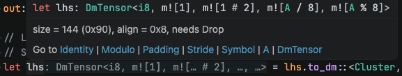

# Furiosa Optimizer

[](https://github.com/furiosa-ai/furiosa-opt/actions/workflows/build.yml)
[](https://github.com/furiosa-ai/furiosa-opt/actions/workflows/deploy.yml)
[](https://developer.furiosa.ai/furiosa-opt/book/)
[](https://developer.furiosa.ai/furiosa-opt/rustdoc/furiosa_visa_std/)

Crates for the Furiosa NPU optimizer.

## Repository Structure

```
furiosa-opt/
├── furiosa-mapping/
├── furiosa-mapping-macro/
├── furiosa-opt-macro/
├── furiosa-visa-std/
├── furiosa-visa-examples/
└── docs/
```

## Setup

`cargo-furiosa-opt` is a [rustc driver](https://rustc-dev-guide.rust-lang.org/rustc-driver/intro.html) and is ABI-locked to a specific rustc nightly. Install the matching toolchain (also pinned in [`rust-toolchain.toml`](rust-toolchain.toml)) and the binary via [`cargo-binstall`](https://github.com/cargo-bins/cargo-binstall):

```bash
rustup toolchain install nightly-2025-12-12
cargo binstall cargo-furiosa-opt
```

Then invoke as a cargo subcommand (rustup sets `LD_LIBRARY_PATH` so the driver finds `librustc_driver-*.so`):

```bash
cargo furiosa-opt test --test mnist_tests
```

## Build and Test

```bash
make check    # cargo check --workspace --all-targets
make fmt      # cargo fmt --all -- --check
make clippy   # cargo clippy --workspace --all-targets -- -D warnings
make test     # cargo test --workspace --release
```

## Documentation

```bash
make mdbook-install   # install mdbook + plugins
make mdbook-serve     # serve docs locally
make mdbook-build     # build static HTML
make mdbook-test      # test code blocks in mdbook
```

## Tooling

### `furiosa-rust-analyzer-proxy`

A rust-analyzer wrapper that rewrites mapping types like `Pair<Stride<Symbol<K, _>, 8>, Modulo<Symbol<N, _>, 128>>` into the more readable `m![K / 8, N % 128]`. Download the [release binary](https://github.com/furiosa-ai/furiosa-opt/releases) and point your IDE at it; e.g. in VSCode `settings.json`:

```jsonc
{
  "rust-analyzer.server.path": "/usr/local/bin/furiosa-rust-analyzer-proxy",
  "rust-analyzer.inlayHints.maxLength": null  // recommended
}
```

The proxy delegates to `rust-analyzer` from `PATH` by default; override with `FURIOSA_RUST_ANALYZER_PROXY_UPSTREAM`.



## License

Apache 2.0 — see [LICENSE](LICENSE) and [NOTICE](NOTICE).
