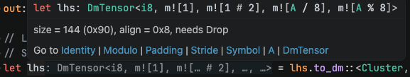

# Furiosa Optimizer

[](https://github.com/furiosa-ai/furiosa-opt/actions/workflows/build.yml)
[](https://github.com/furiosa-ai/furiosa-opt/actions/workflows/deploy.yml)
[](https://developer.furiosa.ai/furiosa-opt/book/)
[](https://docs.rs/furiosa-opt-std)

Crates for the Furiosa NPU optimizer.

## Repository Structure

```
furiosa-opt/
├── furiosa-mapping/
├── furiosa-mapping-macro/
├── furiosa-opt-macro/
├── furiosa-opt-std/
├── furiosa-opt-examples/
└── docs/
```

## Setup

### Prerequisites

`x86_64-unknown-linux-gnu` is the only supported host, for every backend. The
`cargo-furiosa-opt` binary and the static libraries that `furiosa-mapping` and
`furiosa-opt-lower` fetch during build are published for that target alone.

#### Ubuntu (jammy / noble / resolute)

22.04 is the oldest usable release: `cargo-furiosa-opt` and `furiosa-opt-driver` need `GLIBC_2.34`,
and 20.04 ships 2.31, so they do not start there.

```bash
sudo apt install build-essential libclang-dev   # every backend
sudo apt install gcc-aarch64-linux-gnu          # only for the NPU build (cargo furiosa-opt)
```

- `build-essential` — rustc links host binaries with the system `cc`, which the Rust toolchain does not supply.
- `libclang-dev` — `furiosa-opt-std/build.rs` runs `bindgen`, which loads `libclang.so`.
- `gcc-aarch64-linux-gnu` — `aarch64-linux-gnu-{gcc,as,ld,objcopy}` are invoked when the compiler produces NPU device binaries (`*.bin`).

#### macOS (Apple silicon)

macOS is not yet supported. Work inside a Linux **x86-64** container; arm64
containers are not supported either, as artifacts are published for x86-64 only.

```bash
docker run --platform linux/amd64 -it ubuntu:22.04
```

On Apple silicon, enable the container runtime's Rosetta backend for near-native
x86-64 speed. Then follow the Ubuntu steps inside the container.

### Install

`cargo-furiosa-opt` is a [rustc driver](https://rustc-dev-guide.rust-lang.org/rustc-driver/intro.html) and is ABI-locked to a specific rustc nightly. Install the matching toolchain (also pinned in [`rust-toolchain.toml`](rust-toolchain.toml)) and the binary via [`cargo-binstall`](https://github.com/cargo-bins/cargo-binstall):

```bash
rustup toolchain install nightly-2026-05-01
cargo +nightly-2026-05-01 install cargo-binstall
cargo +nightly-2026-05-01 binstall cargo-furiosa-opt
```

Run as a cargo subcommand:

```bash
cargo furiosa-opt test --test mnist_tests
```

## Build and Test

```bash
make check    # cargo check --workspace --all-targets
make fmt      # cargo fmt --all -- --check
make clippy   # cargo clippy --workspace --all-targets -- -D warnings
make test     # cargo test --workspace --release
```

## Documentation

```bash
make mdbook-install   # install mdbook + plugins
make mdbook-serve     # serve docs locally
make mdbook-build     # build static HTML
make mdbook-test      # test code blocks in mdbook
```

## Tooling

### Language Server

`furiosa-rust-analyzer-proxy` is a proxy for `rust-analyzer` that provides standard Rust IDE features with enhanced support for mapping expressions.
It delegates regular Rust language-server behavior to `rust-analyzer` and rewrites editor-facing results so verbose types like `Stride<Symbol<A>, 8>` appear as readable mapping expressions like `m![A / 8]`.



For installation and configuration, see the [Language Server documentation](https://developer.furiosa.ai/furiosa-opt/book/appendix/language-server.html).

### Schedule Viewer

The Schedule Viewer visualizes the execution timeline to help identify performance bottlenecks.
Use `furiosa-opt` to export a schedule JSON file, then open it with `furiosa-schedule-viewer`.

For installation and usage, see the [Schedule Viewer documentation](https://developer.furiosa.ai/furiosa-opt/book/appendix/schedule-viewer.html).

## License

Apache 2.0 — see [LICENSE](LICENSE) and [NOTICE](NOTICE).
