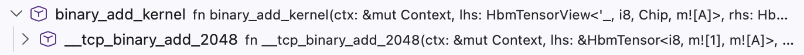
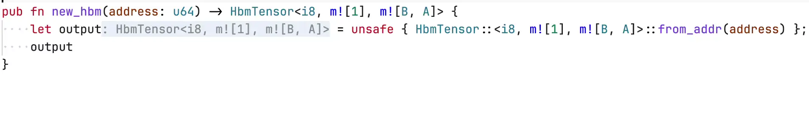
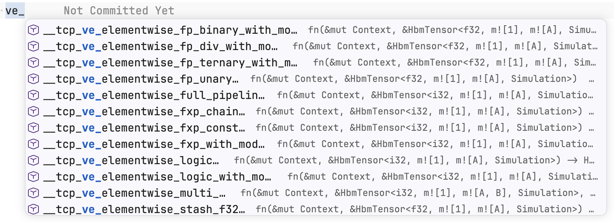
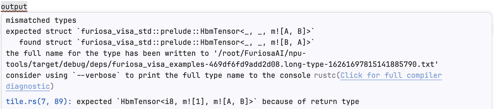
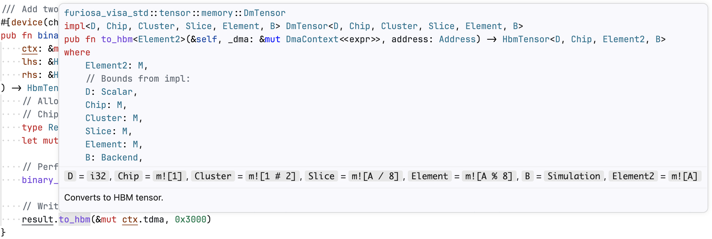
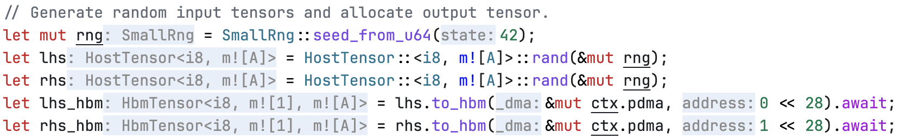

# Language Server

This appendix details the installation and configuration of `furiosa-rust-analyzer-proxy`, a proxy for `rust-analyzer` that provides IDE support for mapping expressions.
The proxy runs `rust-analyzer` underneath, forwards normal Rust language-server traffic to it, and rewrites editor-facing results so mapping types are displayed in `m![...]` notation.

## Installation

1. Ensure [`rust-analyzer`](https://rust-analyzer.github.io/book/rust_analyzer_binary.html) is installed and available in your `PATH`.
   The proxy launches this upstream `rust-analyzer` process to provide standard Rust IDE features.
2. Download the [latest binary](https://github.com/furiosa-ai/furiosa-opt/releases/latest/download/furiosa-rust-analyzer-proxy-x86_64-unknown-linux-gnu) and make it executable:

   ```bash
   curl -L -o furiosa-rust-analyzer-proxy \
     https://github.com/furiosa-ai/furiosa-opt/releases/latest/download/furiosa-rust-analyzer-proxy-x86_64-unknown-linux-gnu
   chmod +x furiosa-rust-analyzer-proxy
   ```

3. Configure your IDE to use the downloaded binary instead of the default language server.
   For example, in VSCode, update your `settings.json`:

   ```jsonc
   {
     "rust-analyzer.server.path": "/path/to/furiosa-rust-analyzer-proxy",
     "rust-analyzer.inlayHints.maxLength": null  // recommended to reduce '_' truncation
   }
   ```

## Environment variables

You can configure the language server using environment variables.
For example, in VSCode, update your `settings.json`:

```jsonc
{
  "rust-analyzer.server.extraEnv": {
    "ENV_NAME": "env_value"
  }
}
```

- `FURIOSA_RUST_ANALYZER_PROXY_UPSTREAM`: Custom path to the upstream `rust-analyzer` binary that the proxy launches.
  Defaults to `rust-analyzer` in `PATH`.

## Features

The proxy delegates standard Rust IDE features to `rust-analyzer` and rewrites mapping expressions in editor-facing results.

### Call Hierarchy

Provides incoming and outgoing call hierarchy views.
Function details shown in hierarchy entries are converted into mapping expressions.



### Code Actions

Provides quick fixes, refactors, and other editor actions.
Action title and text edits are converted into mapping expressions.



### Code Completions

Provides completion items for names, methods, functions, types, and snippets.
Completion labels, detail text, and text edits are converted into mapping expressions.



### Diagnostics

Provides diagnostics from `rust-analyzer` and `rustc`.
Diagnostic messages and related information are converted into mapping expressions.



### Hover

Shows additional information when hovering over a symbol.
Hover contents such as inferred types, function signatures, and documentation are converted into mapping expressions.



### Inlay Hints

Shows additional information inline with the source code.
Inlay hints are converted into mapping expressions.

> [!TIP]
> For the most accurate conversion, set [`rust-analyzer.inlayHints.maxLength`](https://rust-analyzer.github.io/book/configuration.html#inlayHints.maxLength) to `null` (unlimited length).
> This reduces how often long inlay hints are truncated into '_'.



### Signature Help

Shows function signatures and the active parameter while writing a call.
Signature labels, parameter labels, and documentation are rewritten to use mapping notation, including offset-based parameter labels returned by LSP clients.


## Caveats

The language server may incorrectly interpret user-defined types as mapping expressions if they share names with internal mapping components.
For instance, if you define a custom `Symbol<T>` struct, the language server might mistakenly display it as `m![T]` in your IDE.
This is purely a UI display issue and does not affect the other LSP behaviors.

