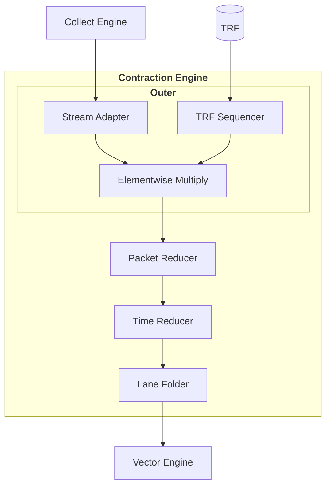

# Contraction Engine

The Contraction Engine performs binary tensor contractions such as matmul and convolution.
Recall from [Quick Start](../../quick-start.md):

- A tensor contraction takes two input tensors and reduces along their shared (contracted) axes.
  Dot product, GEMV, and GEMM are the canonical examples.
- A contraction decomposes into three steps: Broadcast, Multiply, Reduce.
- One operand streams from the [Collect Engine](../collect-engine.md), and the other sits in the TRF (Tensor Register File).
- Contraction runs in the [main context](../../scheduling.md).
  TRF preparation runs in the sub context via `.to_trf()`.

## Architecture

Four pipeline stages factor the workload: one for Broadcast and Multiply, three for Reduce.
Each stage handles its own non-overlapping dimension.



- **[Outer](./outer.md)** *(Broadcast and Multiply)*: broadcasts the two operands to a matching shape `[Chip, Cluster, Slice, Lane, Time, Packet]` and multiplies them elementwise into a single product tensor.
  `Chip` / `Cluster` / `Slice` pass through. `Lane` indexes the spatial parallelism shared by the TRF and downstream reducers. `Time` and `Packet` together represent [packet streams](../../mapping-tensors/spatial-temporal-dimensions.md).
  Three sub-stages run in series: the Stream Adapter broadcasts the streaming operand, the TRF Sequencer broadcasts the TRF operand, and the Multiplier widens to the contraction output type (`i4`/`i8` -> `i32`, `f8`/`bf16` -> `f32`) and multiplies them elementwise.
- **[Packet Reducer](./packet-reducer.md)** *(Reduce within `Packet`)*: reduces along contracted axes mapped to `Packet` via a parallel tree, one tree per lane.
- **[Time Reducer](./time-reducer.md)** *(Reduce across `Time`)*: accumulates per-cycle results in the shared accumulator.
- **[Lane Folder](./lane-folder.md)** *(Fold `Lane`)*: emits the buffer to the output stream, absorbing `Lane` into either `OutPacket` or `OutTime` depending on the mode.
  For reductions across slices or chips, the [Vector Engine](../vector-engine/index.md) handles the reduction downstream.

The Outer stage caps `Lane ≤ 8` and `Packet ≤ 64 B` (on RNGD); see [Packet Reducer](./packet-reducer.md) and [Time Reducer](./time-reducer.md) for more details.

For an end-to-end latency budget that stacks all four stages plus the Inter-Slice Reducer (e.g., 65,536 → 1 scalar in ~296 cycles), see [Kernel Examples: Chip/Cluster Reduce](../../kernel-examples/chip-cluster-reduce.md).

## Example: Batched MatMul

[Quick Start](../../quick-start.md) walks through dot product, GEMV, and GEMM.
Batched matmul extends GEMM with a leading batch axis V: \\(VMK, KN \rightarrow VMN\\).
For each of V independent (M × K) inputs and a shared (K × N) weight, the kernel produces the (M × N) product.

The three variants below classify kernels by which axis sits in `Time`.
The remaining axes are exploited as spatial parallelism.
They share these axes:

```rust
# #![feature(adt_const_params)]
# extern crate furiosa_opt_std;
# use furiosa_opt_std::prelude::*;
axes![V = 32, M = 32, N = 8, K = 32];   // V batch, M×N output, K contraction
```

(See [2D Convolution](./2d-convolution.md) for another example, which uses a separate set of Stream Adapter machinery.)


### K in Time

K (the contraction axis) sits in `Time`. M splits across `Cluster` and `Slice`, and V splits as well: `V % 16` joins `Slice` while `V / 16 = 2` joins `Time` alongside K (V × M = 1024 doesn't fit the 512 spatial cells per chip on RNGD, so V's outer chunk must iterate). `Packet` pads to `1 # 32` and the reduction proceeds sequentially across cycles instead of via the Packet Reducer's spatial tree, so only 1 of 32 multipliers does useful work per cycle (1/32 MAC utilization for bf16). The result is a degenerate kernel, shown only as an educational baseline.

```rust
# #![feature(adt_const_params)]
# extern crate furiosa_opt_std;
# use furiosa_opt_std::prelude::*;
axes![V = 32, M = 32, N = 8, K = 32];   // V batch, M×N output, K contraction

type Chip    = m![1];                   // single chip
type Cluster = m![M / 16];              // outer M split across clusters (M / 16 = 2)
type Slice   = m![M % 16, V % 16];      // inner M × inner V = 16 × 16 = 256 slices per cluster
type Lane     = m![N];                   // N (output channels) partitions the 8 hardware lanes

/// Batched matmul with K placed in Time.
fn bmatmul_k_in_time<'l, const T: Tu>(
    // Streaming operand: V outer + K in Time, with a one-element Packet m![1].
    input: CollectTensor<'l, T, bf16, Chip, Cluster, Slice, m![V / 16, K], m![1]>,
    // TRF operand: N in Lane, K in Element. Stored into TRF by a prior .to_trf() call.
    trf: &TrfTensor<bf16, Chip, Cluster, Slice, Lane, m![K]>,
    // Output: one (M × N) f32 matrix per (slice, V-outer) pair.
) -> ContractTensor<'l, T, f32, Chip, Cluster, Slice, m![V / 16], m![N]> {
    input
         // Outer: Lane = m![N] (inferred from trf), OutTime = m![V / 16, K], OutPacket = m![1 # 32].
         // input: 1 K-element broadcast across all N lanes.
         // trf:   1 K-element per lane, advancing one K-step per cycle.
         .contract_outer::<m![V / 16, K], m![1 # 32], _, _>(trf)
         // Packet Reducer: OutPacket = m![1]. Nothing to reduce.
         .contract_packet::<m![1]>()
         // Time Reducer: OutTime = m![V / 16]. K iterates over Time and accumulates; V outer survives.
         .contract_time::<m![V / 16]>()
         // Lane Folder: Lane folds into OutPacket. Interleaved mode emits 8 lanes per cycle.
         .contract_lane::<m![V / 16], m![N]>(LaneMode::Interleaved)
}
```

To avoid this pathological case, keep K in `Packet` (parallel reduction via the Packet Reducer's tree) and spread the surviving axes (V, M, N) across `Cluster`, `Slice`, and `Lane` to maximize spatial parallelism.
The two strategies below apply this principle, each with one axis per class for simplicity; real kernels may split a single axis across multiple classes when sizes demand.

### M in Time

V (batch) distributes across `Cluster` and `Slice` (one batch element per slice). M in `Time`, K in `Packet`. This strategy is applicable when (1) the slice count covers the batch, (2) N fits in `Lane`, and (3) K fits in a single `Packet`. When K is larger than `Packet`, split K across `Packet` (spatial) and `Time` (temporal). It maximizes MAC utilization across lanes.

```rust
# #![feature(adt_const_params)]
# extern crate furiosa_opt_std;
# use furiosa_opt_std::prelude::*;
axes![V = 32, M = 32, N = 8, K = 32];   // V batch, M×N output, K contraction

type Chip    = m![1];                   // single chip
type Cluster = m![V / 16];              // outer V split across clusters (V / 16 = 2)
type Slice   = m![V % 16];              // inner V split across slices (V % 16 = 16 per cluster)
type Lane     = m![N];                   // N (output channels) partitions the 8 hardware lanes (N = 8 fills the cap)

/// Batched matmul: V slices × (M × K) · (K × N) → V × M × N.
fn bmatmul_m_in_time<'l, const T: Tu>(
    // Streaming operand: M in Time, K in Packet.
    // Element type can be i4, i8, f8, or bf16; integers widen to i32 output, floats to f32.
    input: CollectTensor<'l, T, bf16, Chip, Cluster, Slice, m![M], m![K]>,
    // TRF operand: N in Lane (one output channel per lane), K in Element.
    // Stored into TRF by a prior .to_trf() call in the sub context.
    trf: &TrfTensor<bf16, Chip, Cluster, Slice, Lane, m![K]>,
    // Output: one (M × N) f32 matrix per slice.
) -> ContractTensor<'l, T, f32, Chip, Cluster, Slice, m![M], m![N]> {
    input
         // Outer: broadcast input and trf, multiply elementwise.
         // Lane = m![N] (inferred from trf), OutTime = m![M], OutPacket = m![K].
         // input: K elements broadcast across all N lanes.
         // trf:   K elements per lane, broadcast across all M cycles.
         .contract_outer::<m![M], m![K], _, _>(trf)
         // Packet Reducer: OutPacket = m![1]. Sum K spatially via the reduction tree.
         .contract_packet::<m![1]>()
         // Time Reducer: OutTime = m![M]. Nothing to reduce.
         .contract_time::<m![M]>()
         // Lane Folder: Lane folds into OutPacket. Interleaved mode emits 8 lanes per cycle.
         .contract_lane::<m![M], m![N]>(LaneMode::Interleaved)
}
```

### V in Time

V (batch) in `Time`, K in `Packet`. M splits across `Cluster` and `Slice`. This strategy is applicable when (1) the slice count covers M (`M / 16` in `Cluster`, `M % 16` in `Slice`), (2) N fits in `Lane`, and (3) K fits in a single `Packet`. Useful when batch is the dominant axis (e.g., batched inference).

```rust
# #![feature(adt_const_params)]
# extern crate furiosa_opt_std;
# use furiosa_opt_std::prelude::*;
axes![V = 32, M = 32, N = 8, K = 32];   // V batch, M×N output, K contraction

type Chip    = m![1];                   // single chip
type Cluster = m![M / 16];              // outer M split across clusters (M / 16 = 2)
type Slice   = m![M % 16];              // inner M split across slices (M % 16 = 16 per cluster)
type Lane     = m![N];                   // N (output channels) partitions the 8 hardware lanes

/// Batched matmul with V (batch) placed in Time.
fn bmatmul_v_in_time<'l, const T: Tu>(
    // Streaming operand: V in Time, K in Packet.
    input: CollectTensor<'l, T, bf16, Chip, Cluster, Slice, m![V], m![K]>,
    // TRF operand: N in Lane, K in Element. Stored into TRF by a prior .to_trf() call.
    trf: &TrfTensor<bf16, Chip, Cluster, Slice, Lane, m![K]>,
    // Output: one (V × N) f32 matrix per slice.
) -> ContractTensor<'l, T, f32, Chip, Cluster, Slice, m![V], m![N]> {
    input
         // Outer: Lane = m![N] (inferred from trf), OutTime = m![V], OutPacket = m![K].
         // input: K elements broadcast across all N lanes.
         // trf:   K elements per lane, broadcast across all V cycles.
         .contract_outer::<m![V], m![K], _, _>(trf)
         // Packet Reducer: OutPacket = m![1]. Sum K spatially via the reduction tree.
         .contract_packet::<m![1]>()
         // Time Reducer: OutTime = m![V]. Nothing to reduce.
         .contract_time::<m![V]>()
         // Lane Folder: Lane folds into OutPacket. Interleaved mode emits 8 lanes per cycle.
         .contract_lane::<m![V], m![N]>(LaneMode::Interleaved)
}
```
