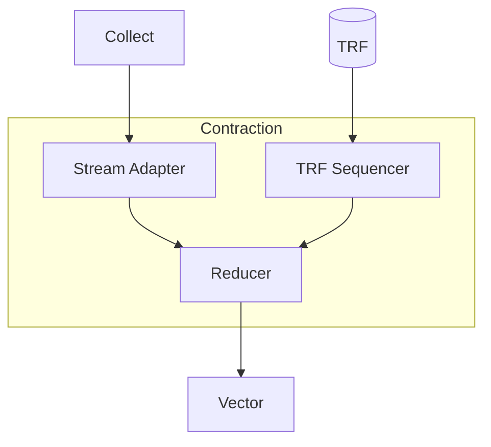

# Contraction Engine

<!-- > **TODO** (youseok.yang): Add "Kernel Writer's View" section: -->
<!-- > - Current examples show HW config details that users can't control — mark as "FYI: internal" -->

The Contraction Engine performs einsum operations — tensor contractions such as matrix multiplication, convolution, and attention — which are the dominant computations in deep learning workloads.

The key mental model is *weight-stationary* execution: one operand (weights) is loaded into TRF (Tensor Register File) once and held fixed while the other streams through the pipeline, so maximizing TRF reuse minimizes memory traffic.
As a kernel writer, you specify the einsum expression, input/output data types, and which tensor goes into the TRF as weights.
The compiler maps this to the hardware components described below.

The rest of this chapter explains how einsum operations decompose into hardware primitives across the Contraction Engine's two components: [Aligner](./aligner.md) ([Stream Adapter](./stream-adapter.md) + [TRF Sequencer](./trf-sequencer.md)) and [Reducer](./reducer.md).

## Einsum

**Einsum** (Einstein summation) generalizes matrix multiplication to arbitrary tensors by specifying which dimensions to contract. For background, see [Einsum Is All You Need](https://rockt.ai/2018/04/30/einsum).

```text
// AB, BC -> AC
// AC[i, j] = sum(AB[i, k] * BC[k, j] for k in 0..B)
```

Every einsum decomposes into four fundamental steps:

1. **Broadcast LHS**: Expand tensor `T0: [A, B]` to `T0_prime: [A, B, C]`
2. **Broadcast RHS**: Expand tensor `T1: [B, C]` to `T1_prime: [A, B, C]`
3. **Elementwise multiply**: Compute `T2 = T0_prime * T1_prime`
4. **Reduce-add**: Sum over contracted dimension `T3: [A, C]` where `T3[i, j] = sum(T2[i, k, j] for k in 0..B)`

## Overview



The einsum steps map to diagram components:

| Einsum Step | Component |
|-------------|-----------|
| LHS broadcast | [Switch Engine](../switch-engine.md) → [Collect Engine](../collect-engine.md) → [Aligner](./aligner.md): [Stream Adapter](./stream-adapter.md) |
| RHS broadcast | [Aligner](./aligner.md): [TRF Sequencer](./trf-sequencer.md) |
| Elementwise multiply | [Reducer](./reducer.md) |
| Reduce-add | [Reducer](./reducer.md) |

For reductions across slices or chips, the [Vector Engine](../vector-engine/index.md) handles the final aggregation.

The following sections present case studies showing how common operations map to the Contraction Engine.
Each case study shows a compiler-generated configuration dump; for the format definition, see [Aligner](./aligner.md) and [Reducer](./reducer.md).
For a beginner-friendly introduction, see the [Hello, Contraction! Tutorial](./introduction_hello-contraction.md).


## Case Studies

### Batched MatMul

This section demonstrates how batched matrix multiplication maps to the Contraction Engine using the einsum `VMK, VNK -> VMN`, where `V` is the batch axis, `M` and `N` are the output axes, and `K` is the contraction axis.

Choose a mapping based on which axis is largest: use K contraction when K is large (maximizes Reducer efficiency), V vectorized when the batch axis V is large (maximizes temporal parallelism), and N×M tiled when both output axes are large (distributes work across TRF rows and time).

### `K` contraction by Reducer

The [Reducer](./reducer.md) can perform the `K`-axis contraction directly, placing `K` in the temporal dimension.
The following dump shows the resulting input, TRF, computation, and accumulation mappings:

```text
// Configuration: input_type = bf16, trf_type = bf16, reduce_op = `Add`
//        Input mapping: [ H: [V=32, M=32, K=32] ] (1)
//          TRF mapping: [ Row: [N=8] | H: [V=5, N/8=3, K=32] ] (1)
//  Computation mapping: [ H: [V=32, M=32] | Row: [N=8] | T: [K=32] ] (1)
// Accumulation mapping: [ H: [V=32, M=32, N/8=3] | T: [N=8] ] (1)
```

### `V` - vectorized mapping

The batch axis `V` can be placed in the temporal dimension for vectorized computation.
The following dump shows how `V` moves into the temporal dimension while `M` and `K` remain in their respective positions:

```text
// Configuration: input_type = bf16, trf_type = bf16, reduce_op = `Add`
//        Input mapping: [ H: [M=5, K=32, V=32] ] (1)
//          TRF mapping: [ Row: [N=8] | H: [N/8=3, K=32, V=32] ] (1)
//  Computation mapping: [ H: [M=5, N/8=3, K=32] | Row: [N=8] | T: [V=32] ] (1)
// Accumulation mapping: [ H: [M=5, N=24] | T: [V=32] ] (1)
```

### `N x M` - tiled mapping

Both output axes `N` and `M` can be tiled across the hardware for maximum parallelism.
The following dump shows both output axes distributed across the TRF Row and temporal dimensions:

```text
// Configuration: input_type = bf16, trf_type = bf16, reduce_op = `Add`
//        Input mapping: [ H: [V=5, K=32, M=32] ] (1)
//          TRF mapping: [ Row: [N=8] | H: [V=5, N/8=3, K=32, M=32] ] (1)
//  Computation mapping: [ H: [V=5, N/8=3, K=32] | Row: [N=8] | T: [M=32] ] (1)
// Accumulation mapping: [ H: [V=5, N=24] | T: [M=32] ] (1)
```

Mixed configurations and constraints for these mappings are detailed in the [Reducer](./reducer.md) section.


### 2D Convolution

This section demonstrates 2D convolution mapping using the einsum `$(H + Fh)$(W + Fw)K, FhFwKC -> HWC`, where `H` and `W` are spatial output axes, `C` is the output channel axis, and `Fh`, `Fw`, `K` are contraction axes (filter height, filter width, and input channels). Variations covered in the batched matmul section are omitted.

### Filter-Stride 1

For stride-1 convolution, the [Stream Adapter](./stream-adapter.md) performs shift-reuse on the input to produce sliding windows. The `$(H+Fh)` sliding is done in the Fetch Engine before reaching the Stream Adapter, while the input `$(W+Fw)` undergoes shift-reuse in the Stream Adapter to produce `Fw, W` sliding in the computation. The example below uses shift-stride of 1 with two shifts:

```text
// Configuration: input_type = bf16, trf_type = bf16, reduce_op = `Add`
//        Input mapping: [ H: [H=30, Fh=3, K=32, $(W=30 + Fw=3)=32] ] (1)
//          TRF mapping: [ Row: [C=8] | H: [K=32, C=24, Fh=3, Fw=3] ] (1)
//  Computation mapping: [ H: [H=30, C/8=3, Fh=3, K=32, Fw=3] | Row: [C=8] | T: [W=30+2#] ] (1)
// Accumulation mapping: [ H: [H=30, C=32] | T: [W=30+2#] ] (1)
```


### Filter-Stride 2

For stride-2 convolution, shift-reuse with 1 shift and shift-stride of 2 extracts strided windows.

The transformation `$(W:2=15 + Fw=4)=32` produces `Fw/2=2, (W=15, Fw=2)`, conceptually extracting a size-2 axis with stride `:2` from a linear combination as an outer product: `$(W:2=15 + (Fw/2:2=2, Fw=2))=32` becomes `Fw/2=2, $(W:2=15, Fw=2)`.


```text
// Configuration: input_type = bf16, trf_type = bf16, reduce_op = `Add`
//        Input mapping: [ H: [H=15, Fh=4, K=32, $(W:2=15 + Fw=4)=32] ] (1)
//          TRF mapping: [ Row: [C=8] | H: [K=32, C=24, Fh=4, Fw=4] ] (1)
//  Computation mapping: [ H: [H=15, C/8=3, Fh=4, K=32, Fw/2=2] | Row: [C=8] | T: [W=15+1#, Fw=2] ] (1)
// Accumulation mapping: [ H: [H=15, C=32] | T: [W=15+1#] ] (1)
```

To fully utilize MACs, fill more flits in the shift buffer by increasing `feed_flits` from the default of 2 to 3. The transformation `$(W:2=16 + Fw=4)=34` then produces `Fw/2=2, (W=16, Fw=2)`:

```text
// Configuration: feed_flits = 3, input_type = bf16, trf_type = bf16, reduce_op = `Add`
//        Input mapping: [ H: [H=16, Fh=4, K=32, $(W:2=16 + Fw=4)=34] ] (1)
//          TRF mapping: [ Row: [C=8] | H: [K=32, C=24, Fh=4, Fw=4] ] (1)
//  Computation mapping: [ H: [H=16, C/8=3, Fh=4, K=32, Fw/2=2] | Row: [C=8] | T: [W=16, Fw=2] ] (1)
// Accumulation mapping: [ H: [H=16, C=32] | T: [W=16] ] (1)
```

### Dilation 2

For dilation-2 convolution, shift-reuse with 2 shifts and shift-stride of 2 extracts dilated filter positions.

The transformation `$(W=27 + Fw:2=3)=32` produces `Fw=3, W=27`, conceptually extracting a size-3 axis with stride `:2` from a linear combination as an outer product: `$(W=27 + Fw:2=3)=32` becomes `Fw=3, $(W=27)`.

```text
// Configuration: input_type = bf16, trf_type = bf16, reduce_op = `Add`
//        Input mapping: [ H: [H=27, Fh=3, K=32, $(W=27 + Fw:2=3)=32] ] (1)
//          TRF mapping: [ Row: [C=8] | H: [K=32, C=24, Fh=3, Fw=3] ] (1)
//  Computation mapping: [ H: [H=27, C/8=3, Fh=3, K=32, Fw=3] | Row: [C=8] | T: [W=27+5#] ] (1)
// Accumulation mapping: [ H: [H=27, C=32] | T: [W=27+5#] ] (1)
```

### Filter-Stride 2, Dilation 2

Combining stride-2 and dilation-2 requires shift operations similar to dilation 2 alone.

The transformation `$(W:2=14 + Fw:2=3)=31 + 1#` produces `Fw=3, W=14, 1+1#`, extracting a size-3 axis with stride `:2` from a linear combination as an outer product: `$(W:2=14 + Fw:2=3)=31` becomes `Fw=3, $(W:2=14)`.

The notation `1z` is similar to `1#` (dummy padding) but filled with zeros instead of arbitrary values. The TRF must contain zero-padded dummies so that `1+1#` contracted with `1+1z` yields 1. Note that `1+1#` contracted with `1+1#` would yield `1#`.

```text
// Configuration: input_type = bf16, trf_type = bf16, reduce_op = `Add`
//        Input mapping: [ H: [H=14, Fh=3, K=32, $(W:2=14 + Fw:2=3)=31+1#] ] (1)
//          TRF mapping: [ Row: [C=8] | H: [K=32, C=24, Fh=3, Fw=3, 1+1z] ] (1)
//  Computation mapping: [ H: [H=14, C/8=3, Fh=3, K=32, Fw=3] | Row: [C=8] | T: [W=14+2#, 1+1z] ] (1)
// Accumulation mapping: [ H: [H=14, C=32] | T: [W=14+2#] ] (1)
```


## Constraints

**Mapping alignment** *(compiler-enforced)*: The computation mapping from the Stream Adapter must exactly match the computation mapping from the TRF Sequencer. Misaligned mappings prevent the Reducer from operating correctly. The compiler ensures this alignment during code generation.

**TRF capacity** *(programmer responsibility)*: TRF storage limits constrain weight tensor size. Large weight tensors require tiling and multiple SRAM-to-TRF loads, adding overhead. The TRF Sequencer can broadcast weight data across time and head dimensions, enabling efficient reuse of loaded weights.

**Row utilization** *(programmer responsibility)*: The hardware provides 8 Rows. Operations should use all 8 Rows when possible to maximize throughput. Using fewer Rows (1, 2, 4) reduces parallelism and effective computational bandwidth.

**Stream Adapter buffer limits** *(compiler-enforced)*: The Stream Adapter has limited buffer capacity for shift operations and packet collection. Configurations exceeding these limits are invalid. See Stream Adapter documentation for specific capacity constraints.

**Data type support** *(compiler-enforced)*: Input data types are limited to i4, i8, f8, and bf16. Output types are widened automatically (i4/i8 → i32, f8/bf16 → f32). The Reducer does not support f32 input directly, though f32 can be processed in the Vector Engine after contraction.


## Performance

Contraction Engine performance depends on Row utilization, TRF reuse, and memory bandwidth:

**Row parallelism**: Using all 8 Rows achieves 8× parallelism. Configurations with fewer Rows proportionally reduce throughput. Configure tensor mappings to distribute work across all available Rows.

**TRF reuse through broadcasting**: Weight data loaded into TRF can be broadcast across time and head dimensions at no additional cost. Design tensor mappings to maximize weight reuse through broadcasting, minimizing SRAM-to-TRF transfers.

**Pipeline latency**: The Contraction Engine pipeline includes the Reducer (5-7 cycles for spatial reduction depending on data type, plus cycles proportional to time dimension size for temporal reduction). Total latency is the sum of these stages plus Stream Adapter/TRF Sequencer overhead.

**Memory bandwidth bottlenecks**: The Stream Adapter is limited by DM fetch bandwidth (256 B/cycle with proper interleaving). TRF bandwidth is typically not a bottleneck due to the broadcasting capability. Ensure fetch patterns interleave across DMNs and slices to maximize bandwidth utilization.
