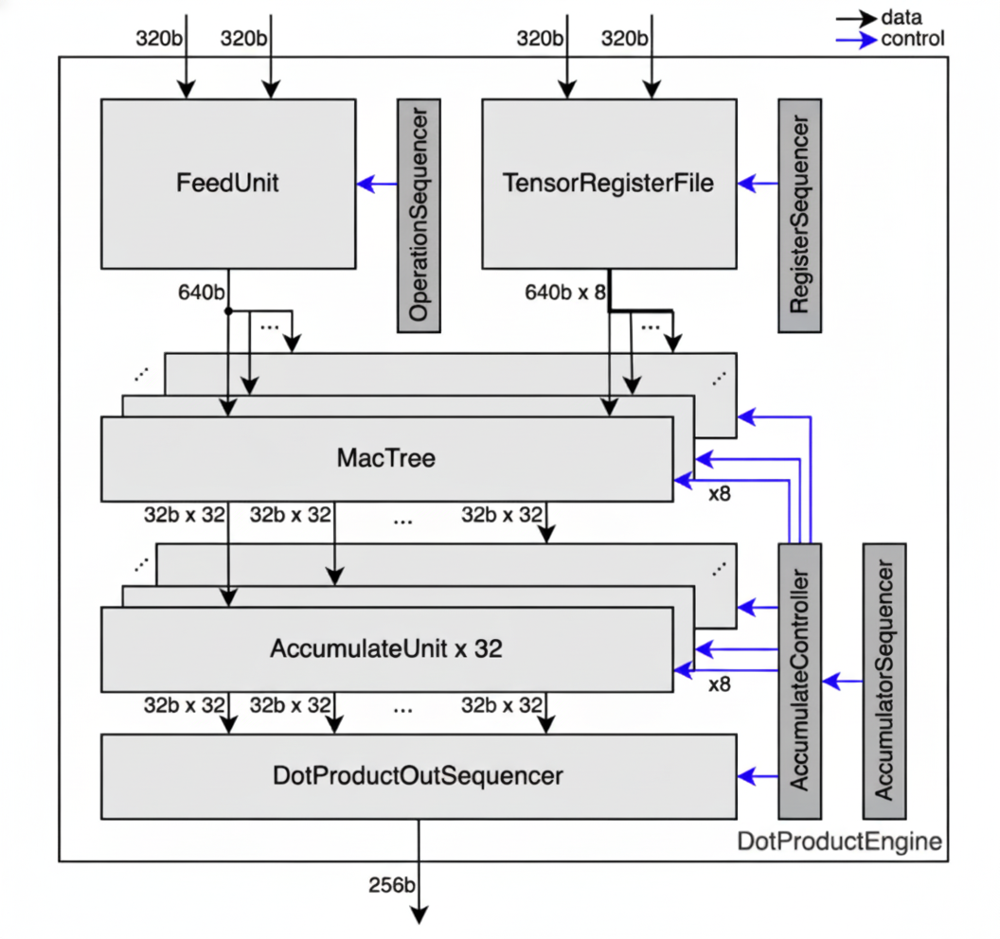
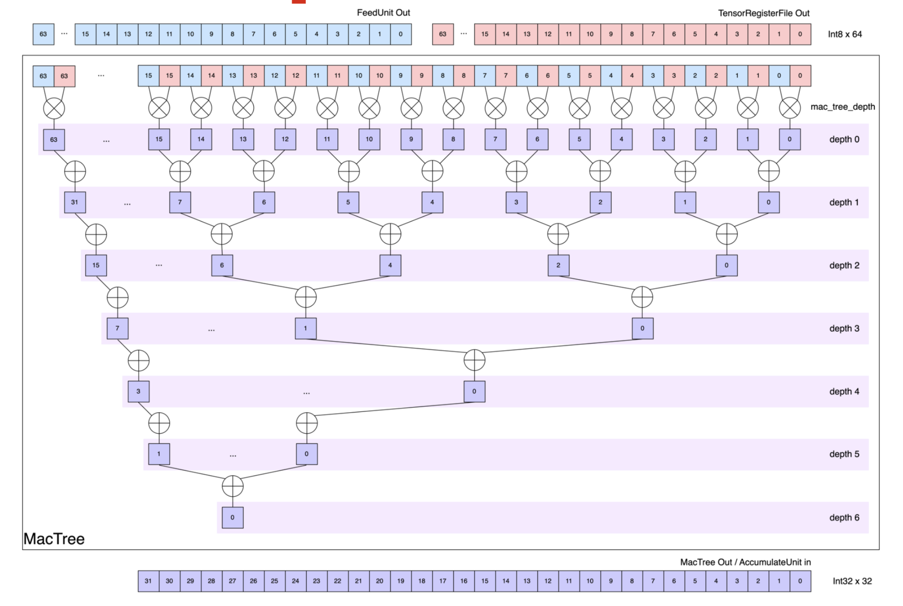
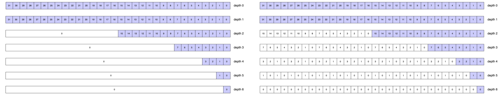

# Reducer

The Reducer performs elementwise multiplication followed by reduce-add.
Each slice's Reducer contains 8 independent *Rows*, which are parallel MAC lanes that each process a different weight channel.
It receives input data from the [Stream Adapter](./stream-adapter.md) and weight data from the [TRF Sequencer](./trf-sequencer.md).

## Interface

The Reducer is invoked via `.align()` followed by `.contract()` and `.accumulate()`:

```rust,ignore
# extern crate furiosa_visa_std;
# use furiosa_visa_std::prelude::*;
impl CollectTensor<'l, T, D, Chip, Cluster, Slice, Time, Packet> {
    /// Aligns input stream and TRF to computation mapping.
    pub fn align<OutTime: M, OutPacket: M, Row: M, TrfElement: M>(
        self,
        trf: &TrfTensor<D, Chip, Cluster, Slice, Row, TrfElement>,
    ) -> AlignedPair<'l, T, D, Chip, Cluster, Slice, Row, OutTime, OutPacket>;
}

impl AlignedPair<'l, T, D, Chip, Cluster, Slice, Row, Time, Packet> {
    /// Performs spatial reduction: elementwise multiplication followed by reduce-add
    /// across the Packet dimension via the hardware reduction tree.
    /// Data type is widened during contraction: i4/i8 -> i32, f8/bf16 -> f32.
    pub fn contract<OutPacket: M>(
        self,
    ) -> ContractionTensor<'l, T, OutD, Chip, Cluster, Slice, Row, Time, OutPacket>;
}

impl ContractionTensor<'l, T, D, Chip, Cluster, Slice, Row, Time, Packet> {
    /// Performs temporal accumulation: accumulates values over the Time dimension
    /// and produces the final contraction output.
    pub fn accumulate<OutTime: M, OutPacket: M>(
        self, kind: AccumulationKind,
    ) -> AccumulationTensor<'l, T, D, Chip, Cluster, Slice, OutTime, OutPacket>;
}
```

The Reducer computes the dot product of input stream \\(X\\) and TRF weights \\(W\\):

$$\text{output}[i] = \sum_{j} X[i, j] \times W[i, j]$$

The summation index \\(j\\) corresponds to axes removed during reduction:
- [**Spatial reduction**](#spatial-reduction) removes axes from the `Packet` dimension via the hardware reduction tree
- [**Temporal reduction**](#temporal-reduction) removes axes from the `Time` dimension via the accumulator buffer

The output mapping is determined by which axes survive reduction: `OutPacket` contains `Packet` axes after spatial reduction, and `OutTime` contains `Time` axes after temporal reduction.

## Examples

### Matrix Multiplication

Matrix multiplication with 8 Rows operating in parallel:

```rust
# #![feature(adt_const_params)]
# extern crate furiosa_visa_std;
# use furiosa_visa_std::prelude::*;
axes![A = 32, B = 32, C = 8];

fn matmul<'l, const T: Tu>(
    input: CollectTensor<'l, T, bf16, m![1], m![1], m![1], m![A, B / 16], m![B % 16]>,
    trf: &TrfTensor<bf16, m![1], m![1], m![1], m![C], m![B]>,
) -> AccumulationTensor<'l, T, f32, m![1], m![1], m![1], m![A], m![C]> {
    // Computation mapping: [
    //   Time: [A = 32],
    //   Row: [C = 8],
    //   Packet: [B = 32] (32 bf16 elements = 64 bytes)
    // ]
    //
    // Spatial reduction: tree depth 5 reduces 32 bf16 elements along B → f32
    // Output (Interleaved): Time = [A], Packet = [C]
    input.align::<m![A], m![B], _, _>(&trf)
         .contract::<m![1]>()
         .accumulate::<m![A], m![C]>(AccumulationKind::Interleaved)
}
```

At each Row, elementwise multiplication of `input * trf` occurs.
With tree depth 5, reduce-add sums over the 32 `bf16` elements of `B`, producing one `f32` per `A` position.

### Full Tensor Reduction

This example demonstrates a complete reduce-add over a tensor `m![A]` with `m![A]::SIZE = 65536`, showing how spatial and temporal reduction combine with slice-level reduction.

**Mapping:**
- `Slice = m![A / 256]` (256 slices process in parallel)
- `Time = m![A / 32 % 8]` (8 temporal iterations per slice)
- `Packet = m![A % 32]` (32 elements reduced spatially)

**Reduction breakdown:**

| Stage | Axes Reduced | Mechanism | Cycles |
|-------|--------------|-----------|--------|
| Spatial | `A % 32` | Reducer tree (depth 5) | 5 |
| Temporal | `A / 32 % 8` | Reducer accumulator (8 iterations) | 8 |
| Slice-level | `A / 256` | [Inter-Slice Block](../vector-engine/inter-slice-block.md) | 256 |

**Analysis:**
- Each slice processes `A / 256` (256) elements
- Within a slice: `A % 32` elements are reduced spatially by the tree (5 cycles for `bf16`)
- The temporal axis `A / 32 % 8` means 8 flits arrive sequentially, accumulated by the buffer
- After in-slice reduction completes (~40 cycles), 256 partial results exist across slices
- The [Inter-Slice Block](../vector-engine/inter-slice-block.md) reduces these 256 slice results (256 cycles)
- **Total: ~296 cycles** for reducing 65536 elements to a single scalar

## Architecture

The Reducer consists of 8 independent Rows operating in parallel. Data flows to the Rows from two sources:
- **StreamUnit data**: Broadcast to all Rows (same data to every row)
- **TRF data**: Read in parallel from 8 independent Row spaces (TRF Row \\(i\\) feeds Row \\(i\\) directly)

Each Row contains a reduction tree for [spatial reduction](#spatial-reduction), followed by a shared accumulator buffer for [temporal reduction](#temporal-reduction).



The diagram shows data widths at different stages. The 320b/640b corresponds to 64/128 elements for `i4`/`i5`, 32/64 elements for `i8`/`f8`/`i9`, 16/32 elements for `bf16`, and 8/16 elements for `f32`/`i32`.

### Spatial Reduction

Each Row contains a reduction tree that sums products hierarchically.



At depth 0, each Row multiplies the input stream from the [Stream Adapter](./stream-adapter.md), with the weight data from the [TRF Sequencer](./trf-sequencer.md) (each 64 bytes wide).
Each subsequent depth sums pairs of partial products, halving the element count from the previous depth.
The tree depth varies by data type to provide sufficient depth for reducing the full data width:
- `i4`: depth 7 (reduces 128 elements)
- `i8`/`f8`: depth 6 (reduces 64 elements)
- `bf16`: depth 5 (reduces 32 elements)

The output data type is widened to accommodate larger result values from contraction.
With `i8` input, `i8 * i8` multiplication occurs first, and up to 64 values can be summed across the 6-depth tree.
Inputs `i4`/`i8` produce `i32` outputs, and inputs `f8`/`bf16` produce `f32` outputs.

Given a computation mapping of `m![Row, Time, Packet]`, spatial reduction eliminates the innermost `m![Packet % 2^n]` axes (where `n` is the tree depth), producing an output mapping of `m![Row, Time, Packet / 2^n]`.

> [!NOTE]
> Spatial reduction in `addition` mode allows full 8-Row usage, but `max` mode only supports a single Row (Row 0).

### Resize

After spatial reduction, the output is resized to exactly 32 `i32`/`f32` elements per Row before being fed to the temporal accumulator.
When the tree depth is 0 (no spatial reduction), the 32 outer elements are truncated.
Otherwise, the spatial reduction output is padded or broadcast to fill the 32 columns of the temporal accumulator, depending on the output mode.

The Reducer supports two output modes that determine how the resize is performed:
- **Sequential**: Rows are sequentially ordered. The spatial reduction output is padded with zeros.
- **Interleaved**: Rows are interleaved. The spatial reduction output is repeated across the 32 columns.

The figure below illustrates the output of spatial reduction for various `i8` reduction depths.
The left side shows Sequential mode adding zero-padding; the right shows Interleaved mode replicating the output to fill 32 element positions.



### Temporal Reduction

After resizing, each Row feeds its output to a shared temporal accumulator.

The temporal accumulator stores intermediate results in a buffer and accumulates values that arrive sequentially over time, enabling reduce operations even when the reduce axis is not contiguous in the innermost dimension.

The buffer has 1024 slots total: 8 rows × 32 columns × 4 registers/column.

Consider `axes![A = 2048, B = 8]` and a tensor with mapping `m![A, B]`, where we want to reduce along axis `B`.
With mapping `Time = m![B / 4, A % 8]` and `Packet = m![B % 4]`, the spatial reduction stage outputs 16 flits (since `Time::SIZE = m![B / 4, A % 8]::SIZE = 2 * 8 = 16`).

The accumulator uses 8 buffer slots (one per `A % 8` value) to accumulate across the `B / 4` (2) iterations:

| flit # | `B / 4` | `A % 8` | Buffer Slot | Operation |
|--------|-------|-------|-------------|-----------|
| 0      | 0     | 0     | 0           | Store |
| 1      | 0     | 1     | 1           | Store |
| 2      | 0     | 2     | 2           | Store |
| 3      | 0     | 3     | 3           | Store |
| 4      | 0     | 4     | 4           | Store |
| 5      | 0     | 5     | 5           | Store |
| 6      | 0     | 6     | 6           | Store |
| 7      | 0     | 7     | 7           | Store |
| 8      | 1     | 0     | 0           | Accumulate with flit #0 |
| 9      | 1     | 1     | 1           | Accumulate with flit #1 |
| 10     | 1     | 2     | 2           | Accumulate with flit #2 |
| 11     | 1     | 3     | 3           | Accumulate with flit #3 |
| 12     | 1     | 4     | 4           | Accumulate with flit #4 |
| 13     | 1     | 5     | 5           | Accumulate with flit #5 |
| 14     | 1     | 6     | 6           | Accumulate with flit #6 |
| 15     | 1     | 7     | 7           | Accumulate with flit #7, then output |

The first 8 flits are stored in buffer slots 0-7. When flits 8-15 arrive, they accumulate with the stored values. After flit 15, the buffer contains the final reduced results and outputs them.

For buffered reduction to work, the product of all axis sizes inner to the reduce axis must be at most 1024, in order to fit the accumulator buffer.

The temporal accumulator supports two operation modes: [`Sequential`](#sequential-mode) and [`Interleaved`](#interleaved-mode).

Interleaved provides a greater buffer capacity of 128 for the axes inner to the reduce axis, compared to the Sequential 32-element capacity.
However, Interleaved changes the output packet structure.
Choose the mode based on buffer constraints and whether the desired output ordering matches downstream requirements.
See [Constraints](#constraints) for the full buffer capacity rules.

#### Interleaved Mode

In Interleaved mode, the Reducer outputs data element-by-element across all Rows.
The output bus carries one value from each of the 8 Rows, per beat.

- **Packet Slicing**: In Interleaved mode, not all of `Packet` is fed to the accumulator. Since the reduction tree broadcasts \\(m\\) partial sums across all 32 column positions (via replication), only the first \\(m\\) columns get written to accumulator entries, slicing `Packet` from 32 down to \\(m\\).

> [!NOTE]
> User-specified slicing should only slice padded `Packet` axes.

- **Column Interleaving**: To achieve maximum accumulator utilization, all of the 32 accumulator columns are filled by interleaving \\(\frac{32}{m}\\) column groups over successive cycles. For \\(m = 4\\), the first cycle writes to columns 0–3, the next to columns 4–7, and so on, giving 8 interleave steps to fill all 32 columns.

- **Full Row Utilization**: Additionally, all 8 accumulator rows are always active regardless of the actual input Row count: if `Row < 8`, the data is padded to occupy all 8 Rows.

- **Output**: `OutTime: m![Time', Packet / 2^n = m]`, `OutPacket: m![Row # 8]`.
  - `OutTime` preserves the order of `Time, Packet`, but with some axes from `Time` removed. The removed axes undergo reduce-add, yielding `Time'`.
  - `OutPacket` equals `Row` padded with dummies to align to 8, as all Rows are utilized.

> [!NOTE]
> `Interleaved` mode has reduced accumulator utilization when `Row` < 8: only `Row` out of 8 rows store meaningful data, while the output bus always sends all 8 Rows together.
> Effective accumulator capacity is `Row` × 32 × 4 instead of the full 8 × 32 × 4 = 1024 slots. This limitation is most severe at `Row = 1` (128 useful slots), but applies to `Row = 2` and `Row = 4` as well.

##### Example

This example performs a contraction where `K` is partially reduced spatially (`K % 4` in `Packet`) and temporally (`K / 16` in `Time`), with `K % 16 / 4` surviving in the output:

```rust
# #![feature(adt_const_params)]
# extern crate furiosa_visa_std;
# use furiosa_visa_std::prelude::*;
axes![M = 4, N = 8, K = 64];

fn interleaved<'l, const T: Tu>(
    input: CollectTensor<'l, T, bf16, m![1], m![1], m![1], m![K / 16, M], m![K % 16]>,
    trf: &TrfTensor<bf16, m![1], m![1], m![1], m![N], m![K]>,
) -> AccumulationTensor<'l, T, f32, m![1], m![1], m![1], m![M, K % 16 / 4], m![N]> {
    // Computation mapping:
    //   Time: [K / 16, M], Row: [N], Packet: [K % 16]
    //   16 bf16 elements per packet = 32 bytes
    //
    // Spatial: tree depth 2 reduces groups of 4 bf16 -> 1 f32,
    //          leaving K % 16 / 4 (4) columns
    // Temporal: K / 16 (4) iterations accumulated in buffer
    //
    // Interleaved output:
    //   m = 4 valid columns, 16 / 4 = 4 column groups interleaved
    //   OutTime = [M, K % 16 / 4] (K / 16 reduced, surviving Packet appended)
    //   OutPacket = [N] (Row, already 8)
    input.align::<m![K / 16, M], m![K % 16 # 32], _, _>(&trf)
         .contract::<m![K % 16 / 4]>()
         .accumulate::<m![M, K % 16 / 4], m![N]>(AccumulationKind::Interleaved)
}
```

The axes inner to the reduce axis (`K / 16`) are `M` and `K % 16 / 4`, with a total size of `4 × 4 = 16`.
This satisfies the [Interleaved buffer constraint](#constraints) (≤ 128).

#### Sequential Mode

In Sequential mode, the Reducer outputs the reduced data in each Row sequentially.
The output bus carries up to 8 elements from `Packet`, per beat.

- **Full Packet Utilization**: In Sequential mode, all 32 columns of `Packet / 2^n` are fed to the accumulator. Unlike in Interleaved mode, no packet slicing occurs. Each cycle writes all 32 columns simultaneously, with zeros padding any unused positions.

- **Row Interleaving**: To achieve maximum accumulator utilization, all 8 accumulator rows are filled by interleaving \\(\frac{8}{\texttt{Row}}\\) row groups over successive cycles. With `Row::SIZE = 4`, the first 4 rows of the temporal accumulator store rows 0–3, and, in the next cycle, the next 4 rows store in rows 4–7.

- **Output**: `OutTime: m![Time', Row, Packet_outer]`, `OutPacket: m![Packet_inner]`.
  - `OutTime` preserves the order of `Time, Row`, but with some axes from `Time` removed. The removed axes undergo reduce-add, yielding `Time'`.
  - Since the output bus is 8 elements-wide, only multiples of 8 elements (8, 16, 24, or 32) can be output. `Packet` is split accordingly: `Packet_outer = m![Packet / 2^n / 8]` (number of beats per row) and `Packet_inner = m![Packet / 2^n % 8]` (elements per beat).

##### Example

The same computation mapping as the `Interleaved` example above, but with `Sequential` output:

```rust
# #![feature(adt_const_params)]
# extern crate furiosa_visa_std;
# use furiosa_visa_std::prelude::*;
axes![M = 4, N = 8, K = 64];

fn sequential<'l, const T: Tu>(
    input: CollectTensor<'l, T, bf16, m![1], m![1], m![1], m![K / 16, M], m![K % 16]>,
    trf: &TrfTensor<bf16, m![1], m![1], m![1], m![N], m![K]>,
) -> AccumulationTensor<'l, T, f32, m![1], m![1], m![1], m![M, N], m![K % 16 / 4 # 8]> {
    // Computation mapping:
    //   Time: [K / 16, M], Row: [N], Packet: [K % 16]
    //   16 bf16 elements per packet = 32 bytes
    //
    // Spatial: tree depth 2 reduces groups of 4 bf16 -> 1 f32,
    //          leaving K % 16 / 4 (4) columns
    // Temporal: K / 16 (4) iterations accumulated in buffer
    //
    // Sequential output:
    //   Packet'' = K % 16 / 4, padded to 8:
    //     - Packet_outer = [1],
    //     - Packet_inner = [K % 16 / 4 # 8]
    //   OutTime = [M, N] (K / 16 reduced, Row appended)
    //   OutPacket = [K % 16 / 4 # 8] (surviving Packet padded to 8)
    input.align::<m![K / 16, M], m![K % 16 # 32], _, _>(&trf)
         .contract::<m![K % 16 / 4]>()
         .accumulate::<m![M, N], m![K % 16 / 4 # 8]>(AccumulationKind::Sequential)
}
```

The axes inner to the reduce axis (`K / 16`) are `M` and `N`, with a total size of `4 × 8 = 32`.
This satisfies the [Sequential buffer constraint](#constraints) (≤ 32).

> [!NOTE]
> `Sequential` mode has reduced accumulator utilization when `Packet` is spatially reduced: only `Packet / 2^n` out of 32 elements store meaningful data per Row.
> Effective accumulator capacity is 8 × 1 × 4 = 32 slots instead of the full 1024. This limitation applies whenever the non-padded portion of `Packet / 2^n` is fewer than 32 elements.

## Constraints

- **Row count:** The hardware provides exactly 8 Rows. Operations can use 1, 2, 4, or 8 rows, but the `Row` dimension size must match one of these values.
- **Tree depth:** Determines how many elements can be reduced spatially. Depth 7 for `i4` (128 elements), depth 6 for `i8`/`f8` (64 elements), depth 5 for `bf16` (32 elements). The input packet size must not exceed the maximum elements reducible at the given depth.
- **Spatial output limit:** For a tree depth of 0 (no spatial reduction), the Reducer outputs at most 32 `i32`/`f32` elements. Configurations that would produce more than 32 output elements per cycle are invalid.
- **Data types:** Input types must be `i4`, `i8`, `f8`, or `bf16`. Output types are automatically widened to `i32` (from `i4`/`i8`) or `f32` (from `f8`/`bf16`). The type widening is mandatory.
- **Reduce-max:** Only supports using a single Row (Row 0), limiting reduce-max throughput to 1/8th of reduce-add capacity.
- **Buffer capacity:** The accumulator has 1024 buffer slots (8 rows × 32 columns × 4 registers/column). The product of axes inner to the outermost reduce axis must fit within this capacity.
  - **Interleaved constraints:** Requires axes inner to outermost reduce in `OutTime` to be at most 128. Full constraint: `align_up(Row, 8) * (axes inner to reduce)` ≤ 1024.
  - **Interleaved utilization:** When `Row` < 8, effective capacity is reduced to `Row` × 32 × 4 slots, preventing full buffer utilization.
  - **Sequential constraints:** Requires axes inner to outermost reduce in `OutTime` to be at most 32. Full constraint: `align_up(reduced_packet.len(), 32) * (axes inner to reduce)` ≤ 1024.
  - **Sequential utilization:** When `Packet` is reduced, full buffer utilization cannot be achieved. For instance, when reducing `Packet` totally, only one column of each Row is used, wasting 31/32 of the buffer capacity.


## Performance

- **Spatial latency:** Tree depth determines spatial reduction latency: `i4` depth 7 (128 elements in 7 cycles), `i8`/`f8` depth 6 (64 elements in 6 cycles), `bf16` depth 5 (32 elements in 5 cycles). Shallower trees complete faster, but larger data types require less depth due to narrower data paths.
- **Temporal latency:** Each accumulation cycle processes one packet. For a reduction axis of size `N` in the time dimension, the accumulator requires approximately `N` cycles to complete the reduction.
- **Parallelism:** Using all 8 Rows maximizes throughput. Each Row operates independently, so 8 rows achieve 8× parallelism compared to a single row.
- **Type widening:** Output data types are widened to prevent overflow (`i4`/`i8` → `i32`, `f8/bf16` → `f32`). This widening is automatic and adds minimal latency, but downstream components must handle 32-bit data.
- **Reduce-max:** Only supports single Row (Row 0) usage, limiting parallelism to 1/8th of reduce-add throughput.
- **Truncation:** When tree depth is 0, the Reducer can output at most 32 elements spatially. Larger packets are truncated.
- **Pipeline integration:** The Reducer sits between Stream Adapter/TRF Sequencer and Vector Engine, adding latency proportional to tree depth plus time dimension size.
