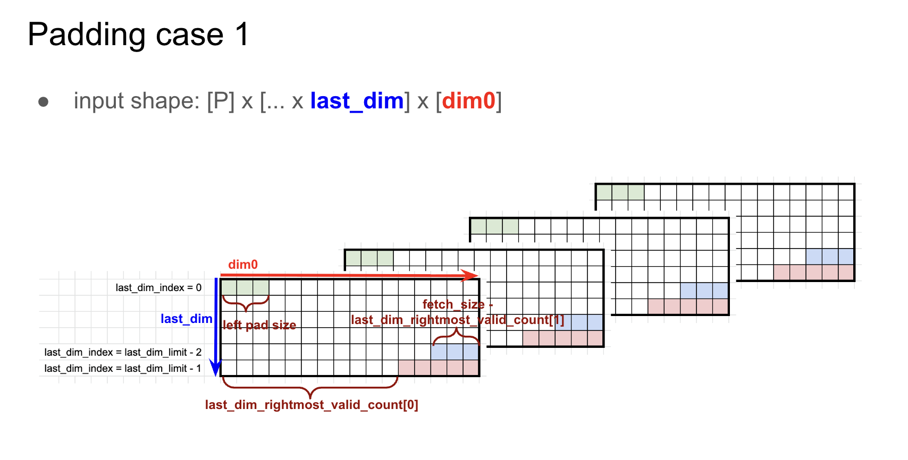
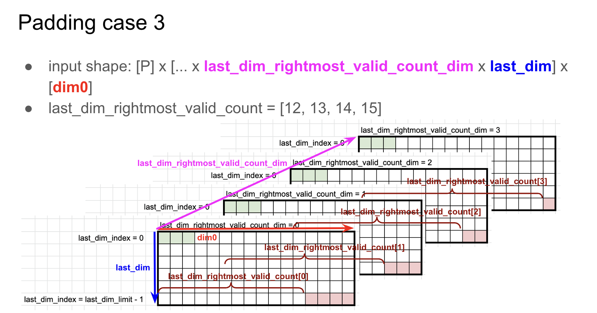

# Fetch Adapter

The Fetch Adapter applies element-wise transformations (type casting, masking, table lookup, zero-point subtraction) to the packet stream emitted by the [Fetch Engine](../moving-tensors/fetch-engine.md), before the [Switch Engine](./switch-engine.md) routes it across slices.
The Fetch Engine itself does not run any of these transforms; they live here under Computing Tensors and are applied as separate stages between the Fetch Engine and the Switch Engine.
The kernel writer composes the per-stage methods directly on a `FetchTensor`, and each call advances to the next stage.

The adapter has four stages, each optional and invoked by calling its method on the stream in hardware pipeline order.
A `FetchTensor` may flow directly into the [Switch Engine](./switch-engine.md) or the [Collect Engine](./collect-engine.md) with no adapter call at all.

- [Masking](#masking) zeros the padded slots of the sequencer's right pad.
- [Table Lookup](#table-lookup) replaces values via a hardware lookup table.
- [Type Casting](#type-casting) converts the element type.
- [Zero-Point Subtraction](#zero-point-subtraction) subtracts a quantization zero point, widening an integer stream to the [Contraction Engine](./contraction-engine/index.md)'s staging type (`i4` to `i5`, `i8` to `i9`).

The [main-context](./index.md#execution-context) adapter supports all four stages, while the [sub-context](./index.md#execution-context) adapter supports only `fetch_cast`.


The example below pads 63 elements to 64, masks the 64th slot to zero, then casts `i8` → `i32`.
The two stages are chained as two method calls on the `FetchTensor` produced by `fetch()`, in the mask → cast order matching the hardware pipeline.

```rust,ignore
# #![feature(adt_const_params)]
# extern crate furiosa_opt_std;
# use furiosa_opt_std::prelude::*;
axes![A = 63];

fn fetch_mask_then_cast<'l, const T: Tu>(
    input: BeginTensor<'l, T, i8, m![1], m![1], m![1], m![1], m![A]>,
) -> FetchCastTensor<'l, T, i32, m![1], m![1], m![1], m![1], m![A # 64]> {
    input
        .fetch::<m![1], m![A # 64]>()
        //   Time      = m![1]
        //   Packet    = m![A # 64]
        //   OutTime   = m![1]
        //   OutPacket = m![A # 64]    (#{0} cannot yet ride the type, see UC below)
        .fetch_mask::<m![1], m![A # 64]>()
        .fetch_cast::<i32>()
}
#
# let mut ctx = Context::acquire();
# let x: BeginTensor<'_, _, i8, m![1], m![1], m![1], m![1], m![A]> = BeginTensor::new(&mut ctx.main, Tensor::zero());
# let _o = fetch_mask_then_cast(x);
```

## Masking

The Tensor Unit's internal data paths operate on fixed-width units (32-byte flits of 8 elements at 32 bits each), so axes whose sizes do not align must be padded (for example, 63 rounds up to 64).
The padded slots in `m![A # 64]` hold arbitrary values, which corrupts downstream computations.
Masking overwrites those slots with zero, tightening the mapping from `A # 64` to `A #{0} 64`.

```rust,ignore
{{#include ../../../furiosa-opt-std/src/engine/fetch_adapter.rs:fetch_mask_impl}}
```

The padded `# m` annotations on the input become `#{0} m` on the output.
`fetch_mask` takes no runtime argument. The compiler derives the mask config (`FetchMaskConfig`, holding `last_axis`, `valid_count_dim`, and `rightmost_valid_count`) from the difference between the input and output mappings.


The three cases below walk through the configuration the compiler will eventually emit for each mapping shape, using the same `B`-axis pattern under three different sequencer layouts.


### Contiguous right mask

This case shows the basic shape: one contiguous right pad sits along the innermost axis, and the DM tensor's `B # 96` carries 4 trailing slots of arbitrary values.

```rust,ignore
# #![feature(adt_const_params)]
# extern crate furiosa_opt_std;
# use furiosa_opt_std::prelude::*;
axes![A = 32, B = 92];

fn fetch_mask_contiguous_right<'l, const T: Tu>(
    input: BeginTensor<'l, T, i8, m![1], m![1], m![1], m![1], m![A, B # 96]>,
) -> FetchMaskTensor<'l, T, i8, m![1], m![1], m![1], m![A, B #{0} 96 / 32], m![B #{0} 96 % 32]> {
    input
        .fetch::<m![A, B # 96 / 32], m![B # 96 % 32]>()
        //   Time      = m![A, B # 96 / 32]
        //   Packet    = m![B # 96 % 32]
        //   OutTime   = m![A, B #{0} 96 / 32]   (chunk axis tightens to #{0})
        //   OutPacket = m![B #{0} 96 % 32]      (packet axis inherits #{0})
        .fetch_mask::<m![A, B #{0} 96 / 32], m![B #{0} 96 % 32]>()
}
#
# let mut ctx = Context::acquire();
# let x: BeginTensor<'_, _, i8, m![1], m![1], m![1], m![1], m![A, B # 96]> = BeginTensor::new(&mut ctx.main, Tensor::zero());
# let _o = fetch_mask_contiguous_right(x);
```

The diagram below shows the intent: the chunk axis `B # 96 / 32` carries the pad, and the mask zeroes its last 4 slots.



From the input and output mappings the compiler emits these sequencer loops (innermost first):

```text
[
    B # 96 % 32 = 32 : 1,    // loop 0: packet axis
    B # 96 / 32 = 3 : 32,    // loop 1: chunk axis (carries the pad)
    A = 32 : 96,             // loop 2: outer
] : 32 @ base_addr = 0
```

It then programs the hardware mask with these parameters:

- `last_axis` = the chunk axis `B # 96 / 32` (recorded as an axis, not a raw loop index, since the sequencer optimizer may merge entries).
- `valid_count_dim = Rightmost` (only the rightmost cell of `last_axis` is masked).
- `rightmost_valid_count = [4, 0, 0, 0, 0, 0, 0, 0]` (4 slots zeroed at the tail of the rightmost iteration).

At run time the hardware streams every packet untouched until the chunk axis hits its last iteration, where it zeroes the trailing 4 slots of that final packet.
The output type therefore tightens from `B # 96` to `B #{0} 96`.

### Split right mask

This case keeps the same right pad as the previous case, but a non-padded axis splits the padded region across the stream.

```rust,ignore
# #![feature(adt_const_params)]
# extern crate furiosa_opt_std;
# use furiosa_opt_std::prelude::*;
axes![A = 32, B = 92];

fn fetch_mask_split_right<'l, const T: Tu>(
    input: BeginTensor<'l, T, i8, m![1], m![1], m![1], m![1], m![A, B # 96]>,
) -> FetchMaskTensor<'l, T, i8, m![1], m![1], m![1], m![B #{0} 96 / 32, A], m![B #{0} 96 % 32]> {
    input
        .fetch::<m![B # 96 / 32, A], m![B # 96 % 32]>()
        //   Time      = m![B # 96 / 32, A]
        //   Packet    = m![B # 96 % 32]
        //   OutTime   = m![B #{0} 96 / 32, A]
        //   OutPacket = m![B #{0} 96 % 32]   (innermost packet axis tightens)
        .fetch_mask::<m![B #{0} 96 / 32, A], m![B #{0} 96 % 32]>()
}
#
# let mut ctx = Context::acquire();
# let x: BeginTensor<'_, _, i8, m![1], m![1], m![1], m![1], m![A, B # 96]> = BeginTensor::new(&mut ctx.main, Tensor::zero());
# let _o = fetch_mask_split_right(x);
```

The diagram below shows the intent: `A` now sits between `B # 96 / 32` and `B # 96 % 32`, so the pad lives on the innermost packet axis instead of an outer chunk axis.


The compiler emits these sequencer loops:

```text
[
    B # 96 % 32 = 32 : 1,    // loop 0: packet axis (carries the pad)
    A = 32 : 96,              // loop 1: non-padded axis splits the chunks
    B # 96 / 32 = 3 : 32,    // loop 2: outer chunk axis
] : 32 @ base_addr = 0
```

It then programs the hardware mask with these parameters:

- `last_axis` = the innermost packet axis (the only axis carrying the pad in this layout).
- `valid_count_dim = Rightmost` (a single cell at the tail of the outermost iteration covers the pad).
- `rightmost_valid_count = [4, 0, 0, 0, 0, 0, 0, 0]` (4 slots zeroed per affected packet).

While the outermost `B # 96 / 32` loop runs its final iteration, the hardware zeroes the last 4 elements of every packet it emits.
The input keeps `B # 96` and the masked return type is the same `B #{0} 96` as the previous case, with only the Time-axis order differing.

### Variable per-chunk mask

This case lifts the per-cell cap (255 for 4-bit data, 31 for `f32`) by giving each chunk its own valid count.
The DM tensor's `B # 128` carries 31 trailing pad slots split across 8 chunks of 16, so the cap does not suffice on its own.

```rust,ignore
# #![feature(adt_const_params)]
# extern crate furiosa_opt_std;
# use furiosa_opt_std::prelude::*;
axes![A = 32, B = 97];

fn fetch_mask_variable_per_chunk<'l, const T: Tu>(
    input: BeginTensor<'l, T, f32, m![1], m![1], m![1], m![1], m![A, B # 128]>,
) -> FetchMaskTensor<'l, T, f32, m![1], m![1], m![1], m![A, B #{0} 128 / 16, 1], m![B #{0} 128 % 16]> {
    input
        .fetch::<m![A, B # 128 / 16, 1], m![B # 128 % 16]>()
        //   Time      = m![A, B # 128 / 16, 1]
        //   Packet    = m![B # 128 % 16]
        //   OutTime   = m![A, B #{0} 128 / 16, 1]
        //   OutPacket = m![B #{0} 128 % 16]
        .fetch_mask::<m![A, B #{0} 128 / 16, 1], m![B #{0} 128 % 16]>()
}
#
# let mut ctx = Context::acquire();
# let x: BeginTensor<'_, _, f32, m![1], m![1], m![1], m![1], m![A, B # 128]> = BeginTensor::new(&mut ctx.main, Tensor::zero());
# let _o = fetch_mask_variable_per_chunk(x);
```

The diagram below shows the intent: 8 chunks each get their own valid count, so the per-chunk cap no longer constrains the pad.



The compiler emits these sequencer loops:

```text
[
    B # 128 % 16 = 16 : 1,    // loop 0: packet axis
    1 = 1 : 0,                 // loop 1: unit loop (placeholder)
    B # 128 / 16 = 8 : 16,    // loop 2: chunk axis (one count per iteration)
    A = 32 : 128,              // loop 3: outer
] : 16 @ base_addr = 0
```

It then programs the hardware mask with these parameters:

- `last_axis` = the `B # 128 / 16` chunk axis.
- `valid_count_dim = Iterator(2)` (the count array indexes along the same loop, so entry `i` covers chunk `i`; the only variant that consumes more than one array entry).
- `rightmost_valid_count = [16, 16, 16, 16, 16, 16, 1, 0]` (counts sum to 97, the valid `B` length: chunks 0-5 fully live, chunk 6 keeps only its first element, chunk 7 is fully zeroed).

The hardware applies one cell's count per chunk iteration, in lockstep with the loop.
The output type's `B #{0} 128` records the remaining 31 trailing slots as zero.

### Left Padding


Left padding zeroes the first few elements when `last_axis` is the innermost axis.
The sequencer's `base_addr` is shifted by `-left_pad` so reads start in pre-data memory, which the mask then overwrites.
This is the only place where masking depends on the sequencer configuration.

#### Contiguous left+right mask

This case combines one contiguous left pad with one contiguous right pad along the innermost axis.
Input `(# 2 + B) # 96` has 2 arbitrary head slots and 4 arbitrary tail slots.

```rust,ignore
axes![A = 32, B = 90];

fn fetch_mask_contiguous_left_right<'l, const T: Tu>(
    input: BeginTensor<'l, T, i8, m![1], m![1], m![1], m![1], m![A, (# 2 + B) # 96]>,
) -> FetchMaskTensor<'l, T, i8, m![1], m![1], m![1], m![A, (#{0} 2 + B) #{0} 96 / 32], m![(#{0} 2 + B) #{0} 96 % 32]> {
    input
        .fetch::<m![A, (# 2 + B) # 96 / 32], m![(# 2 + B) # 96 % 32]>()
        //   Time      = m![A, (# 2 + B) # 96 / 32]
        //   Packet    = m![(# 2 + B) # 96 % 32]
        //   OutTime   = m![A, (#{0} 2 + B) #{0} 96 / 32]
        //   OutPacket = m![(#{0} 2 + B) #{0} 96 % 32]
        .fetch_mask::<m![A, (#{0} 2 + B) #{0} 96 / 32], m![(#{0} 2 + B) #{0} 96 % 32]>()
}
```

The diagram below shows the intent.


The sequencer shape matches the contiguous-right case, but the base address shifts:

```text
[
    (# 2 + B) # 96 % 32 = 32 : 1,    // loop 0: packet axis
    (# 2 + B) # 96 / 32 = 3 : 32,    // loop 1: chunk axis (carries the right pad)
    A = 32 : 96,                       // loop 2: outer
] : 32 @ base_addr = -2
```

It then programs the hardware mask with these parameters:

- `last_axis` = the chunk axis carrying the right pad (same as the contiguous-right case).
- `valid_count_dim = Rightmost` (one cell at the tail of the rightmost iteration covers the right pad).
- `rightmost_valid_count = [4, 0, 0, 0, 0, 0, 0, 0]` (4 slots zeroed at the tail of the rightmost iteration).
- `left_pad = 2` (planned; zero the first 2 slots of every packet).

`base_addr = -2` reads 2 bytes earlier so the head pad enters the stream, and `left_pad = 2` overwrites those leading slots before they reach the consumer.
The return type tightens to `(#{0} 2 + B) #{0} 96`.

#### Split left+right mask

This case combines a left pad and a right pad whose regions are split across the stream by a non-padded axis.

```rust,ignore
axes![A = 32, B = 90];

fn fetch_mask_split_left_right<'l, const T: Tu>(
    input: BeginTensor<'l, T, i8, m![1], m![1], m![1], m![1], m![A, (# 2 + B) # 96]>,
) -> FetchMaskTensor<'l, T, i8, m![1], m![1], m![1], m![(#{0} 2 + B) #{0} 96 / 32, A], m![(#{0} 2 + B) #{0} 96 % 32]> {
    input
        .fetch::<m![(# 2 + B) # 96 / 32, A], m![(# 2 + B) # 96 % 32]>()
        //   Time      = m![(# 2 + B) # 96 / 32, A]
        //   Packet    = m![(# 2 + B) # 96 % 32]
        //   OutTime   = m![(#{0} 2 + B) #{0} 96 / 32, A]
        //   OutPacket = m![(#{0} 2 + B) #{0} 96 % 32]
        .fetch_mask::<m![(#{0} 2 + B) #{0} 96 / 32, A], m![(#{0} 2 + B) #{0} 96 % 32]>()
}
```

The diagram below shows the intent.


The sequencer shape matches the split-right case, but the base address shifts:

```text
[
    (# 2 + B) # 96 % 32 = 32 : 1,    // loop 0: packet axis (carries both pads)
    A = 32 : 96,                       // loop 1: non-padded axis splits the chunks
    (# 2 + B) # 96 / 32 = 3 : 32,    // loop 2: outer chunk axis
] : 32 @ base_addr = -2
```

It then programs the hardware mask with these parameters:

- `last_axis` = the innermost packet axis, carrying both head and tail pads.
- `valid_count_dim = Rightmost` (one cell at the tail of the outermost iteration covers the right pad).
- `rightmost_valid_count = [4, 0, 0, 0, 0, 0, 0, 0]` (4 slots zeroed at the tail of every affected packet).
- `left_pad = 2` (planned; zero the first 2 slots of every packet).

The masked return type is the same `(#{0} 2 + B) #{0} 96` as the previous case, with only the Time-axis order differing.

## Table Lookup

Table lookup provides hardware-accelerated lookup tables during the fetch stage.
Each value is treated as an index into a pre-configured table, and the corresponding table entry is output instead.
This is useful for operations that cannot be efficiently implemented with standard arithmetic, such as non-linear activation functions like Sigmoid and GeLU, or quantization schemes that use custom encoding tables.
This enables:

- **Non-linear activations**: Implements Sigmoid, GeLU, and other functions through pre-computed lookup tables.
- **Custom type casting**: Translates specialized encodings like `MXFP4` / `NVFP4` to standard formats using conversion tables.

Sigmoid and GeLU can also be expressed directly in the [Vector Engine](./vector-engine/index.md), so table lookup is one option among several for these activations rather than the only path.

```rust,ignore
{{#include ../../../furiosa-opt-std/src/engine/fetch_adapter.rs:fetch_table_lookup_impl}}
```

The decode table is selected by the input scalar type (via the `TableLookup` trait), not by a runtime argument, exactly as `fetch_cast` selects its conversion by the input type.
The hardware paired-key table for 4-bit keys supports only a 4-bit to 8-bit decode, so the sole implemented decode is `f4e2m1 -> f8e4m3`.
Widen to `bf16` / `f32` with a following `fetch_cast`, and apply any NVFP4 / MXFP4 per-block scale downstream in the Vector Engine (it is intentionally not folded into the table, which stays a static 16-entry, block-independent decode).

The table for the `f4e2m1` decode is a compile-time constant baked into the fetch-sequencer configuration, so the `f4e2m1` weight stream is the only data input to the stage; there is no per-invocation table staging. The 16-entry e2m1 decode is block-independent, which is why the per-block scale stays out of it: folding the scale in would need a distinct table per block and defeat the shared static table.

The hardware sequencer walks byte-aligned keys (1 or 2 bytes), never a raw 4-bit nibble, and a 4-bit key must use a *paired* table. The `f4e2m1` decode therefore runs as a 256-entry byte-indexed table: each byte carries two nibbles and one lookup yields the pair of decoded `f8e4m3` values, decoding at two elements per key. The `f4e2m1` scalar is modelled accordingly as a byte holding two nibbles, with `BITS = 4` so the fetch mapping accounts elements rather than bytes.

```rust,ignore
# #![feature(adt_const_params)]
# extern crate furiosa_opt_std;
# use furiosa_opt_std::prelude::*;
axes![A = 8];

/// Decodes an e2m1 (NVFP4 / MXFP4) weight stream to f8e4m3 via the hardware table,
/// then widens to f32 with a following fetch_cast.
fn fetch_decode_e2m1<'l, const T: Tu>(
    input: BeginTensor<'l, T, f4e2m1, m![1], m![1], m![1], m![1], m![A]>,
) -> FetchCastTensor<'l, T, f32, m![1], m![1], m![1], m![1], m![A]> {
    input
        .fetch::<m![1], m![A]>()
        .fetch_table_lookup::<f8e4m3>()
        .fetch_cast::<f32>()
}
```


## Type Casting

`fetch_cast::<OutD>()` converts the element type from `D` to `OutD`, preserving the `Time` and `Packet` mapping.
Type casting adds 1 to 2 cycles of latency.
`fetch_cast` performs only the type conversion; the integer widenings that hold a zero-point offset (`i4` to `i5`, `i8` to `i9`) are a separate stage, [Zero-Point Subtraction](#zero-point-subtraction), so `fetch_cast` never produces an `i5`/`i9`.

```rust,ignore
{{#include ../../../furiosa-opt-std/src/engine/fetch_adapter.rs:fetch_cast_impl}}
```

RNGD supports the following `fetch_cast` conversions (the `i4` to `i5` and `i8` to `i9` widenings are [Zero-Point Subtraction](#zero-point-subtraction), not type casts):

| Input | Output |
|-------|--------|
| `i4` | `i32` |
| `i8` | `i32` |
| `i16` | `i32` |
| `f8e4m3` | `f32` |
| `f8e5m2` | `f32` |
| `bf16` | `f32` |
| `f16` | `f32` |
| `f32` | `bf16` |

The example below fetches an 8-element `i8` stream and casts it to `i32`.
The `Time` and `Packet` mapping is unchanged across the call.

```rust,ignore
# #![feature(adt_const_params)]
# extern crate furiosa_opt_std;
# use furiosa_opt_std::prelude::*;
axes![A = 8];

/// Fetches with type casting: converts i8 storage to i32 for computation.
/// Input:   i8 [0, 1, 2, 3, 4, 5, 6, 7]
/// Output: i32 [0, 1, 2, 3, 4, 5, 6, 7]
fn fetch_with_type_cast<'l, const T: Tu>(
    input: BeginTensor<'l, T, i8, m![1], m![1], m![1], m![1], m![A]>,
) -> FetchCastTensor<'l, T, i32, m![1], m![1], m![1], m![1], m![A]> {
    input.fetch::<m![1], m![A]>().fetch_cast::<i32>()
}
#
# let mut ctx = Context::acquire();
# let x: BeginTensor<'_, _, i8, m![1], m![1], m![1], m![1], m![A]> = BeginTensor::new(&mut ctx.main, Tensor::zero());
# let _o = fetch_with_type_cast(x);
```

Type casting adds an additional limit on `read_size`.
The cast output per fetch must fit in a single 32-byte flit (see [Collect Engine](./collect-engine.md)).

- Valid:
  - `i4` -> `i32`, `read_size = 8 (4 bytes)`: produces 8 × 4 = 32 B
  - `i8` -> `i32`, `read_size = 8 (8 bytes)`: produces 8 × 4 = 32 B
- Invalid:
  - `i4` -> `i32`, `read_size = 16 (8 bytes)`: produces 16 × 4 = 64 B
  - `i8` -> `i32`, `read_size = 16 (16 bytes)`: produces 16 × 4 = 64 B

## Zero-Point Subtraction

`fetch_zero_point_sub::<OutD>(zero_point)` subtracts the quantization `zero_point` from each element and widens the stream to the [Contraction Engine](./contraction-engine/index.md)'s staging type: `i4` to `i5`, `i8` to `i9`.
It is the only stage that produces an `i5`/`i9`.

```rust,ignore
{{#include ../../../furiosa-opt-std/src/engine/fetch_adapter.rs:fetch_zero_point_sub_impl}}
```

### Why the extra bit

Subtracting the zero point turns an unsigned-around-`zero_point` quantized value into a signed residual whose range no longer fits the input width.
For a symmetric-signed input the residual is a difference of two same-width values:

- `i4` residual: `[-8, 7] - [-8, 7] = [-15, 15]`, which needs `i5`'s `[-16, 15]`.
- `i8` residual: `[-128, 127] - [-128, 127] = [-255, 255]`, which needs `i9`'s `[-256, 255]`.

The subtraction therefore produces one more bit than it consumes. The conversion checks this at runtime: a residual outside the `i5`/`i9` range (an out-of-range `zero_point` or input) is rejected rather than silently wrapped.

### Contraction Engine specification

`i5` and `i9` exist only as Contraction Engine operands. The engine multiplies operand pairs drawn from the same integer precision family and accumulates in `i32`:

| Stream (activation) | Weight (TRF) | Accumulator |
|---------------------|--------------|-------------|
| `i4` or `i5` | `i4` or `i5` | `i32` |
| `i8` or `i9` | `i8` or `i9` | `i32` |

Either operand may be the raw form (`i4`/`i8`) or its zero-point-subtracted staging (`i5`/`i9`); the two operands need not match within a family, but they may not cross families (no `i4` against `i8`) or kinds (no integer against float).
Floating-point contraction pairs (`bf16`, `f8e4m3`, `f8e5m2`) must match exactly and are never zero-point-subtracted.

### Staging is contraction-only

An `i5`/`i9` stream may flow through the [Switch Engine](./switch-engine.md) and [Collect Engine](./collect-engine.md), but from there its **only** legal consumer is `contract_outer`.
It cannot be committed to memory, stored to a register file (`to_trf`/`to_vrf`), transposed, or fed to any other engine.

This restriction is enforced at compile time, not by a runtime check: passing an `i5`/`i9` stream to any consumer other than `contract_outer` is a compile error.

