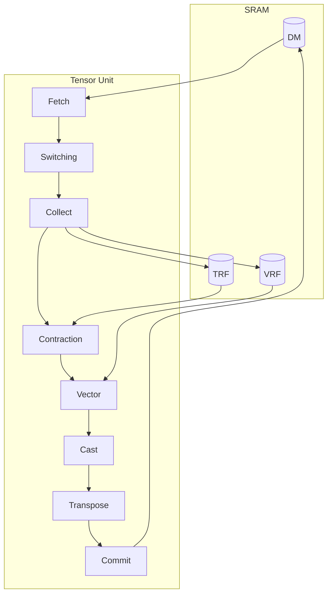

# Computing Tensors

<!-- > **TODO** (youseok.yang): -->
<!-- > 1. **Show dimension flow through pipeline**: How `[Chip, Cluster, Slice, Time, Packet]` transforms at each stage -->

The Tensor Unit transforms data through a pipeline of eight specialized engines.
Data flows from DM, through the engine pipeline, and back to DM.
After the Collect Engine normalizes packets to **flits** (32-byte flow control units), all downstream engines — Contraction, Vector, Cast, Transpose, and Commit — operate on flits. (See [Collect Engine](./collect-engine.md) for the normalization details.)

Two register files serve distinct roles: TRF (Tensor Register File; see [hello-tcp memory overview](../hello-tcp.md)) holds weights for the Contraction Engine (load once, reuse across many cycles), while VRF (Vector Register File) holds operands for the Vector Engine.
The Collect Engine loads data into TRF via `.to_trf()` and VRF via `.to_vrf()`.

Fetch and Commit are part of the Tensor Unit pipeline but interface directly with DM; see [Moving Tensors](../moving-tensors/index.md).

| Engine | Function | Key Constraint |
|--------|----------|----------------|
| [Fetch](../moving-tensors/fetch-engine.md) | Load data from DM into the pipeline | Packet must be 8-byte aligned; `Slice` is unchanged |
| [Switching](./switch-engine.md) | Redistribute data across slices | Ring network topology; `Slice` can change |
| [Collect](./collect-engine.md) | Normalize packets to 32-byte flits | Output = exactly one flit |
| [Contraction](./contraction-engine/index.md) | Einsum: matmul, convolution, attention | Weight-stationary via TRF |
| [Vector](./vector-engine/index.md) | Elementwise, binary, reduce operations | Only i32/f32 input |
| [Cast](./cast-engine.md) | Precision lowering with batching | Output = exactly one flit |
| [Transpose](./transpose-engine.md) | Reorder elements within a flit | Within-flit only |
| [Commit](../moving-tensors/commit-engine.md) | Write results back to DM | Flit-aligned writes |

As a kernel writer, you specify data types, tensor mapping expressions, and computations in einsum form.
The compiler translates these into per-engine hardware configurations.

## Execution Contexts

Two execution contexts enable *double-buffering* (preparing the next operand batch while the current one is being computed) to hide memory latency:

| Context | Compute Engines | Fetch/Commit | Typical Use |
|---------|-----------------|--------------|-------------|
| Main | Exclusive access | Dedicated units | Computation |
| Sub | Idle only | Lower bandwidth | Prefetching to TRF/VRF |

While the main context computes, the sub context prefetches the next operand batch into TRF/VRF.
When the sub context is unused, the main and sub Switch Engine channels combine into *dual channel mode* (see [Switch Engine](./switch-engine.md)), doubling bandwidth.
See [Scheduling](./scheduling.md) for how the scheduler coordinates the two contexts and the DMA Engine.

The following sections cover each engine in detail.
