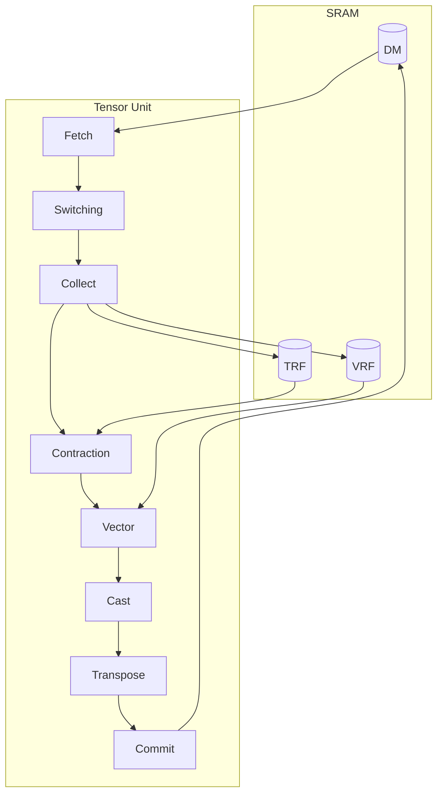

# Computing Tensors

## Tensor Unit

The Tensor Unit is the on-chip compute pipeline.
It reads tensor data from DM, transforms it through eight engines, and writes results back to DM.

Each tensor flows through the pipeline as a stream of packets, one packet per cycle.
The engines consume and produce these streams, reshaping the per-cycle layout and the iteration order along the way.
The Collect Engine normalizes incoming packets to 32-byte *flits*.
Every downstream engine ([Contraction](./contraction-engine/index.md), [Vector](./vector-engine/index.md), [Cast](./cast-engine.md), [Transpose](./transpose-engine.md), [Commit](../moving-tensors/commit-engine.md)) operates on these flits.

| Engine | Function | Key Constraint |
|--------|----------|----------------|
| [Fetch](../moving-tensors/fetch-engine.md) | Load data from DM into the pipeline | Packet must be 8-byte aligned; `Slice` is unchanged |
| [Switching](./switch-engine.md) | Move data across slices | Ring network, `Slice` can change |
| [Collect](./collect-engine.md) | Normalize packets to 32-byte flits | Output = exactly one flit |
| [Contraction](./contraction-engine/index.md) | Einsum: matmul, convolution, attention | One operand resident in TRF; the other streams |
| [Vector](./vector-engine/index.md) | Elementwise, binary, reduce operations | Only i32/f32 input |
| [Cast](./cast-engine.md) | Precision lowering with batching | Output = exactly one flit |
| [Transpose](./transpose-engine.md) | Reorder elements within a flit | Within-flit only |
| [Commit](../moving-tensors/commit-engine.md) | Write results back to DM | Flit-aligned writes |

Each tensor stream inside the Tensor Unit carries five dimensions, `[Chip, Cluster, Slice, Time, Packet]`, that split into two groups.
`Chip`, `Cluster`, and `Slice` are spatial dimensions: each slice runs its own pipeline instance, with slices grouped by cluster and clusters grouped by chip.
`Time` and `Packet` describe the per-slice stream (see [Spatial and Temporal Dimensions](../mapping-tensors/spatial-temporal-dimensions.md) for the definitions).
The engines above reshape `Time` / `Packet` along the pipeline.
The spatial dimensions are preserved by every engine except two: [Switch](./switch-engine.md) changes `Slice` by moving data across slices, and [Vector](./vector-engine/index.md)'s [inter-slice reducer](./vector-engine/inter-slice-reducer.md) collapses `Slice` by aggregating across the 256 slices in a cluster.

The Contraction and Vector Engines each take one operand from the pipeline stream and the other operand from a dedicated per-slice register file.
TRF (Tensor Register File) feeds the Contraction Engine, and VRF (Vector Register File) feeds the Vector Engine.
The Collect Engine writes into TRF via `.to_trf()` and into VRF via `.to_vrf()`.
For an end-to-end example using both files, see [Quick Start](../quick-start.md).

Fetch reads from DM and Commit writes back to DM.
Their detailed sequencer behavior is documented in [Moving Tensors](../moving-tensors/index.md) rather than here.

## Scheduling Execution Contexts

The [Scheduler](../scheduler.md) treats each *execution context* as an independent stream of operations.
The hardware exposes three:

- **Main** drives the Tensor Unit pipeline for the kernel's primary computation.
- **Sub** drives a subset of the same pipeline, typically prefetching operands into TRF / VRF while main computes.
- **DMA** drives the DMA Engine alone, external to the Tensor Unit (HBM ↔ DM, HBM ↔ SPM, DM ↔ SPM).

The main context can drive every Tensor Unit engine.
The sub context drops the Contraction Engine and a handful of other features; everything else carries over from main.

Operations serialize within a single context but run in parallel across different contexts.
For example, sub prefetches the next operand batch into TRF / VRF while main computes the current one (*double-buffering*), and the DMA Engine moves bulk data between HBM and DM / SPM independently of either Tensor Unit context (*overlap*).

Some Tensor Unit engines form a single unit of scheduling that can be driven by only one context at a time.
For example, the Vector Engine and the Cast Engine form one such unit of scheduling.
So when sub is running Vector Engine work, main runs its type casting through [Commit Engine type casting](../moving-tensors/commit-engine.md#type-casting) instead of the Cast Engine, to avoid serializing with sub.

The scheduler may also assign a Tensor Unit operation to the DMA context defensively when its DM access pattern would otherwise risk a hardware-level memory conflict (see [Memory Performance](../moving-tensors/memory-performance.md) for the rules that trigger this).

