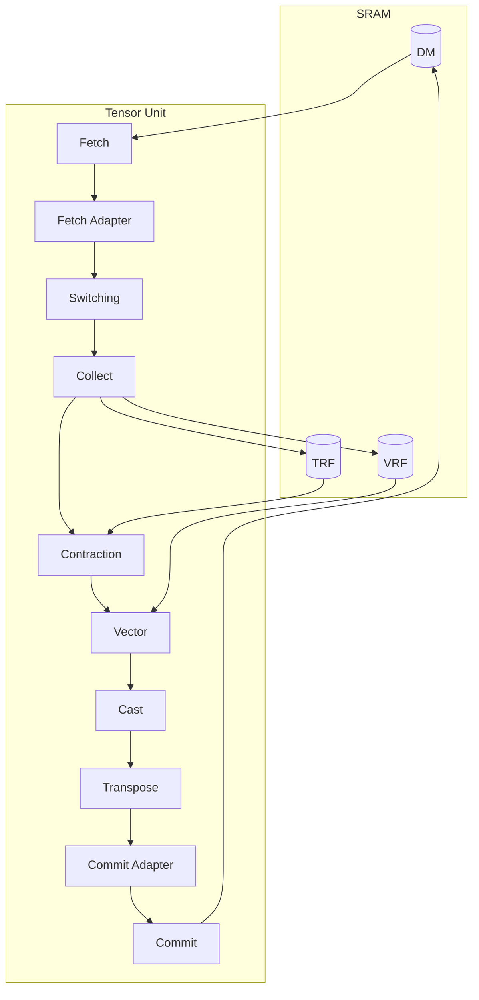

# Computing Tensors

Computing Tensors explains how a valid Tensor Unit stream reaches the Vector or Contraction Engine.
A stationary operand stays in a register file while the other operand streams through the engine.
The Tensor Register File (TRF) stores contraction operands, and the Vector Register File (VRF) stores vector operands.
This chapter explains the engine behavior that places operands and preserves stream dimensions.

## Selecting a Compute Route

| Kernel need | Select | Behavior to read next |
| --- | --- | --- |
| Elementwise operation or reduction | Vector Engine | Vector stream and reduction contracts |
| Contraction such as matmul or convolution | Tensor Register File (TRF) plus Contraction Engine | TRF layout and contraction mapping |
| Cross-slice redistribution or reduction | Switch Engine or Inter-Slice Reducer | Slice movement and reducer contracts |
| Layout or precision change | Fetch/Commit Adapter, Cast Engine, or Transpose Engine | Adapter stage and output mapping contracts |

## Tensor Unit

The Tensor Unit is the on-chip compute pipeline.
It reads tensor data from DM, transforms it through ten engines, and writes results back to DM.

Each tensor flows through the pipeline as a stream of packets, one packet per cycle.
The engines consume and produce these streams, reshaping the per-cycle layout and the iteration order along the way.
The Collect Engine normalizes incoming packets to 32-byte *flits*.
Every downstream engine operates on these flits.
The pipeline includes Contraction, Vector, Cast, Transpose, Commit Adapter, and Commit.
See the linked engine pages for [Contraction](./contraction-engine/index.md), [Vector](./vector-engine/index.md), [Cast](./cast-engine.md), [Transpose](./transpose-engine.md), [Commit Adapter](./commit-adapter.md), and [Commit](../moving-tensors/commit-engine.md).

```mermaid
flowchart TB
    subgraph SRAM
        DM[(DM)] & TRF[(TRF)] & VRF[(VRF)]
    end

    subgraph TU[Tensor Unit]
        direction LR
        FE[Fetch] --> FA[Fetch Adapter] --> SW[Switching] --> CO[Collect] --> CE[Contraction] --> VE[Vector] --> CA[Cast] --> TR[Transpose] --> CMA[Commit Adapter] --> CM[Commit]
    end

    DM --> FE
    CM --> DM
    CO --> TRF --> CE
    CO --> VRF --> VE

    click FE "../moving-tensors/fetch-engine.html" "Fetch Engine"
    click FA "./fetch-adapter.html" "Fetch Adapter"
    click SW "./switch-engine.html" "Switch Engine"
    click CO "./collect-engine.html" "Collect Engine"
    click CE "./contraction-engine/index.html" "Contraction Engine"
    click VE "./vector-engine/index.html" "Vector Engine"
    click CA "./cast-engine.html" "Cast Engine"
    click TR "./transpose-engine.html" "Transpose Engine"
    click CMA "./commit-adapter.html" "Commit Adapter"
    click CM "../moving-tensors/commit-engine.html" "Commit Engine"
```

| Engine | Function | Key Constraint |
|--------|----------|----------------|
| [Fetch](../moving-tensors/fetch-engine.md) | Load data from DM into the pipeline | Packet must be 8-byte aligned. `Slice` is unchanged |
| [Fetch Adapter](./fetch-adapter.md) | Per-element transforms after fetch (table lookup, cast) | Optional. Identity if skipped |
| [Switching](./switch-engine.md) | Move data across slices | Ring network, `Slice` can change |
| [Collect](./collect-engine.md) | Normalize packets to 32-byte flits | Output = exactly one flit |
| [Contraction](./contraction-engine/index.md) | Einsum: matmul, convolution, attention | One operand resident in TRF. The other streams |
| [Vector](./vector-engine/index.md) | Elementwise, binary, reduce operations | Only i32/f32 input |
| [Cast](./cast-engine.md) | Precision lowering with batching | Output = exactly one flit |
| [Transpose](./transpose-engine.md) | Reorder elements within a flit | Within-flit only |
| [Commit Adapter](./commit-adapter.md) | Per-element transforms before commit (cast, ReLU, trim) | Optional. Chained before `.commit()` |
| [Commit](../moving-tensors/commit-engine.md) | Write results back to DM | Flit-aligned writes |

Each tensor stream inside the Tensor Unit carries five dimensions, `[Chip, Cluster, Slice, Time, Packet]`, that split into two groups.
`Chip`, `Cluster`, and `Slice` are spatial dimensions: each slice runs its own pipeline instance, with slices grouped by cluster and clusters grouped by chip.
`Time` and `Packet` describe the per-slice stream (see [Spatial and Temporal Dimensions](../mapping-tensors/spatial-temporal-dimensions.md) for the definitions).
The engines above reshape `Time` / `Packet` along the pipeline.
Most engines preserve the spatial dimensions.
[Switch](./switch-engine.md) moves data across slices.
The [Vector inter-slice reducer](./vector-engine/inter-slice-reducer.md) combines the 256 slices in a cluster.

The Contraction and Vector Engines each take one operand from the pipeline stream and the other operand from a dedicated per-slice register file.
TRF (Tensor Register File) feeds the Contraction Engine, and VRF (Vector Register File) feeds the Vector Engine.
The Collect Engine writes into TRF via `.to_trf()` and into VRF via `.to_vrf()`.
For an end-to-end example using both files, see [Quick Start](../quick-start.md).

Fetch reads from DM and Commit writes back to DM.
Their detailed sequencer behavior is documented in [Moving Tensors](../moving-tensors/index.md) rather than here.

## Execution Context

The [scheduler](../scheduling/schedule.md#execution-contexts) treats each *execution context* as an independent stream of operations.
The hardware exposes three:

- **Main** drives the Tensor Unit pipeline for the kernel's primary computation.
- **Sub** drives a subset of the same pipeline, typically prefetching operands into TRF / VRF while main computes.
- **DMA** drives the DMA Engine alone, external to the Tensor Unit.

The main context can drive every Tensor Unit engine.
The sub context drops the Contraction Engine and a handful of other features.
Everything else carries over from main.

Context ordering, overlap, resource conflicts, and memory-rule scheduling are defined in [Schedule](../scheduling/schedule.md).
