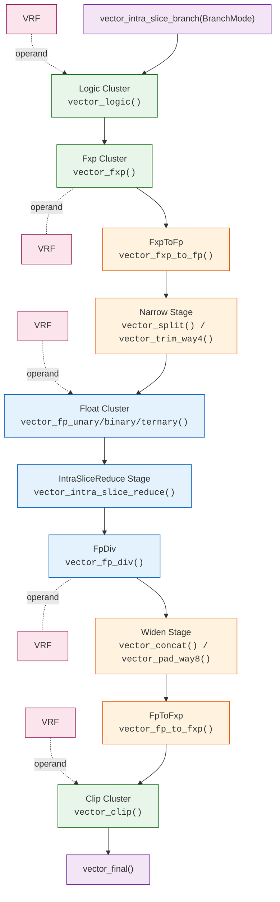

# Intra-Slice Block

The Intra-Slice Block performs elementwise, binary, and intra-slice reduce operations on tensor data.

After the Contraction Engine completes matrix multiplication, the Intra-Slice Block applies activation functions, normalization, and other elementwise transformations to produce the final result.
For example, computing `sigmoid(X * W + b)` requires the Contraction Engine for `X * W`, then the Intra-Slice Block for addition and sigmoid activation.

## Interface

```rust,ignore
{{#include ../../../../furiosa-visa-std/src/stream_tensor.rs:collect_vector_init}}

{{#include ../../../../furiosa-visa-std/src/vector_engine/tensor/vector_tensor.rs:vector_intra_slice_branch}}

{{#include ../../../../furiosa-visa-std/src/vector_engine/tensor/vector_tensor.rs:vector_intra_slice_unzip}}
```

The same `vector_init()` entry point is available regardless of whether the input comes from the Collect Engine (when contraction is skipped) or the Contraction Engine (for post-contraction processing).
After `vector_init()`, enter the intra-slice block with either `vector_intra_slice_branch(...)` or `vector_intra_slice_unzip(...)`.
For the paired path entered through `vector_intra_slice_unzip(...)`, see [Two-Group Mode](#two-group-mode).

After entry, operations are chained stage by stage:

```rust
# #![feature(adt_const_params)]
# extern crate furiosa_visa_std;
# use furiosa_visa_std::prelude::*;
axes![A = 512];

fn staged_pipeline<'l, const T: Tu>(
    input: CollectTensor<'l, T, i32, m![1], m![1 # 2], m![A / 2], m![1], m![A % 2 # 8]>,
) -> VectorFinalTensor<'l, T, i32, m![1], m![1 # 2], m![A / 2], m![1], m![A % 2 # 8]> {
    input
    .vector_init()
    .vector_intra_slice_branch(BranchMode::Unconditional)
    .vector_fxp(FxpBinaryOp::AddFxp, 100)
    .vector_fxp_to_fp(31)
    .vector_trim_way4::<m![A % 2 # 4]>()
    .vector_fp_unary(FpUnaryOp::Sigmoid)
    .vector_pad_way8::<m![A % 2 # 8]>()
    .vector_fp_to_fxp(31)
    .vector_clip(ClipBinaryOpI32::Max, 0)
    .vector_final()
}
```

Each method corresponds to a hardware pipeline stage. The type system enforces valid stage transitions at compile time. For example, `vector_fp_unary` is only available after the pipeline has been narrowed with `vector_split` or `vector_trim_way4`.

## Architecture



## Quick Reference

### Entry and Transition

Before the stage-by-stage table, it helps to separate the ways you can enter or resume the intra-slice block:

| Current state | Method | Result |
|---------------|--------|--------|
| Fresh VE input after `vector_init()` | `vector_intra_slice_branch(BranchMode)` | Enters the single-stream intra-slice path |
| Fresh VE input after `vector_init()` | `vector_intra_slice_unzip()` | Enters the two-group intra-slice path |
| Tensor after `vector_inter_slice_reduce()` | `vector_intra_slice_branch(BranchMode)` | Continues with intra-slice work after inter-slice reduction |

The stage table below describes the single-stream path after `vector_intra_slice_branch()`.
For the paired path after `vector_intra_slice_unzip()`, see [Two-Group Mode](#two-group-mode).

### Stages

Every stage is optional; you can skip directly from Branch to any downstream stage.
Recall from [Vector Engine](./index.md) that Way8 processes 8 elements per cycle and Way4 processes 4.
The ALU column is shown only where the API exposes multiple competing ALUs inside one stage. Stages such as `FxpToFp`, `Narrow`, `IntraSliceReduce`, `FpDiv`, `Widen`, `FpToFxp`, `Filter`, and `Output` do not require a user-visible ALU choice here.

| Stage | Method | Data Type | Mode | ALUs | Notes |
|-------|--------|-----------|------|------|-------|
| [Branch](#branch-vector_intra_slice_branch) | [`vector_intra_slice_branch(BranchMode)`](#branch-vector_intra_slice_branch) | i32, f32 | Way8 | | Single-stream entry after `vector_init()`, or continuation after `vector_inter_slice_reduce()` |
| [Logic](#logic-cluster-vector_logic) | [`vector_logic(op, operand)`](#logic-cluster-vector_logic) | i32, f32 | Way8 | LogicAnd, LogicOr, LogicXor, LogicLshift, LogicRshift | |
| [Fxp](#fxp-cluster-vector_fxp) | [`vector_fxp(op, operand)`](#fxp-cluster-vector_fxp) | i32 | Way8 | FxpAdd, FxpLshift, FxpMul, FxpRshift | |
| [FxpToFp](#fxptofp-conversion-vector_fxp_to_fp) | [`vector_fxp_to_fp(int_width)`](#fxptofp-conversion-vector_fxp_to_fp) | i32 → f32 | Way8 | | |
| [Narrow](#narrow-vector_split-vector_trim_way4) | [`vector_split()` / `vector_trim_way4()`](#narrow-vector_split-vector_trim_way4) | f32 | Way8 → Way4 | | |
| [Float](#float-cluster-vector_fp_unary-vector_fp_binary-vector_fp_ternary) | [`vector_fp_unary/binary/ternary(op, ...)`](#float-cluster-vector_fp_unary-vector_fp_binary-vector_fp_ternary) | f32 | Way4 | FpFma, FpFpu, FpExp, FpMul0, FpMul1 | |
| [IntraSliceReduce](#intraslicereduce-vector_intra_slice_reduce) | [`vector_intra_slice_reduce(op)`](#intraslicereduce-vector_intra_slice_reduce) | i32, f32 | Way4 | | |
| [FpDiv](#fpdiv-vector_fp_div) | [`vector_fp_div(op, operand)`](#fpdiv-vector_fp_div) | f32 | Way4 | | |
| [Widen](#widen-vector_concat-vector_pad_way8) | [`vector_concat()` / `vector_pad_way8()`](#widen-vector_concat-vector_pad_way8) | f32 | Way4 → Way8 | | |
| [FpToFxp](#fptofxp-conversion-vector_fp_to_fxp) | [`vector_fp_to_fxp(int_width)`](#fptofxp-conversion-vector_fp_to_fxp) | f32 → i32 | Way8 | | |
| [Clip](#clip-cluster-vector_clip) | [`vector_clip(op, operand)`](#clip-cluster-vector_clip) | i32, f32 | Way8 | ClipAdd, ClipMax, ClipMin | |
| [Filter](#filter-vector_filter) | [`vector_filter(mode)`](#filter-vector_filter) | i32, f32 | Way8 | | |
| [Output](#output-vector_final) | [`vector_final()`](#output-vector_final) | i32, f32 | Way8 | | |

`vector_intra_slice_branch()` is both the initial single-stream intra-slice entry after `vector_init()` and the continuation point after `vector_inter_slice_reduce()`.
`vector_intra_slice_unzip()` is only available directly from `vector_init()`.

Within a stage, each ALU can only be used once per pass. This matters mainly in `Logic`, `Fxp`, `Fp`, and `Clip`, where multiple operators share a stage-local ALU pool. For example, `tanh(sqrt(x))` is impossible in a single pass because both `tanh` and `sqrt` require the `FpFpu` ALU. Such operations require multiple Tensor Unit invocations with intermediate results stored in DM or TRF.

`vector_stash()` is not a pipeline stage. It can be called at any `Stashable` point in the chain to snapshot the current tensor for later use as an operand. See [Stash](#stash-vector_stash) for details.

## Examples

### `i32` Pipeline Example

```rust
# #![feature(adt_const_params)]
# extern crate furiosa_visa_std;
# use furiosa_visa_std::prelude::*;
axes![A = 512];

fn add_constant<'l, const T: Tu>(
    input: CollectTensor<'l, T, i32, m![1], m![1 # 2], m![A / 2], m![1], m![A % 2 # 8]>,
) -> VectorFinalTensor<'l, T, i32, m![1], m![1 # 2], m![A / 2], m![1], m![A % 2 # 8]> {
    input
        .vector_init()
        .vector_intra_slice_branch(BranchMode::Unconditional)
        .vector_fxp(FxpBinaryOp::AddFxp, 100)
        .vector_final()
}
```

### `f32` Pipeline Example

In this example, `vector_trim_way4()` is the `Narrow` step: it changes the tensor from `Way8` to `Way4` before the float operation.
Later, `vector_pad_way8()` is the `Widen` step: it changes the tensor from `Way4` back to `Way8` after the float operation.

```rust
# #![feature(adt_const_params)]
# extern crate furiosa_visa_std;
# use furiosa_visa_std::prelude::*;
axes![A = 512];

fn sigmoid<'l, const T: Tu>(
    input: CollectTensor<'l, T, f32, m![1], m![1 # 2], m![A / 2], m![1], m![A % 2 # 8]>,
) -> VectorFinalTensor<'l, T, f32, m![1], m![1 # 2], m![A / 2], m![1], m![A % 2 # 8]> {
    input
        .vector_init()
        .vector_intra_slice_branch(BranchMode::Unconditional)
        .vector_trim_way4::<m![A % 2 # 4]>() // Narrow: Way8 -> Way4
        .vector_fp_unary(FpUnaryOp::Sigmoid)
        .vector_pad_way8::<m![A % 2 # 8]>() // Widen: Way4 -> Way8
        .vector_final()
}
```

For stash usage, see [Stash](#stash-vector_stash).

## Stage Details

### Branch (`vector_intra_slice_branch`)

Enters the pipeline and configures conditional execution via `BranchMode`.
Each 32-bit element in a flit is assigned a 4-bit `ExecutionId` (0-15) that determines which operations to apply.

| Mode | Description |
|------|-------------|
| `Unconditional` | All elements get ExecutionId 0 |
| `AxisToggle { axis }` | Toggle group based on axis index (`group_id = axis_index % 2`) |
| `ValidCount` | Via Valid Count Generator |
| `Comparison([InputCmp; 4])` | Set branch bits via comparison operations on input values |
| `Vrf` | Load ExecutionIds from VRF (pre-written by Branch Logger in prior TuExec) |

### Logic Cluster (`vector_logic`)

Bitwise operations on `i32` or `f32` (bit-level). Requires **Way8** mode.

This stage has multiple ALUs, so operator choice matters for fusion: `LogicAnd`, `LogicOr`, `LogicXor`, `LogicLshift`, and `LogicRshift` can each be used at most once per pass.

`i32` operations:

| Op | ALU | Note |
|----|-----|------|
| `BitAnd` | `LogicAnd` | bitwise and |
| `BitOr` | `LogicOr` | bitwise or |
| `BitXor` | `LogicXor` | bitwise xor |
| `LeftShift` | `LogicLshift` | logical left shift |
| `LogicRightShift` | `LogicRshift` | logical right shift |
| `ArithRightShift` | `LogicRshift` | arithmetic right shift |

`f32` operations:

| Op | ALU | Note |
|----|-----|------|
| `BitAnd` | `LogicAnd` | bitwise and on fp bit patterns |
| `BitOr` | `LogicOr` | bitwise or on fp bit patterns |
| `BitXor` | `LogicXor` | bitwise xor on fp bit patterns |

### Fxp Cluster (`vector_fxp`)

Integer and fixed-point arithmetic on `i32`. Requires **Way8** mode.

This stage has four reusable ALU classes: `FxpAdd`, `FxpLshift`, `FxpMul`, and `FxpRshift`. Operators sharing the same class cannot be fused in one pass.

| Op | ALU | Note |
|----|-----|------|
| `AddFxp` | `FxpAdd` | wrapping add |
| `AddFxpSat` | `FxpAdd` | saturating add |
| `SubFxp` | `FxpAdd` | wrapping subtract |
| `SubFxpSat` | `FxpAdd` | saturating subtract |
| `LeftShift` | `FxpLshift` | logical left shift |
| `LeftShiftSat` | `FxpLshift` | saturating left shift |
| `MulFxp` | `FxpMul` | fixed-point multiply |
| `MulInt` | `FxpMul` | integer multiply |
| `LogicRightShift` | `FxpRshift` | logical right shift |
| `ArithRightShift` | `FxpRshift` | arithmetic right shift |
| `ArithRightShiftRound` | `FxpRshift` | arithmetic right shift with rounding |

### FxpToFp Conversion (`vector_fxp_to_fp`)

Converts `i32` to `f32`. The `int_width` parameter specifies the integer bit width for the conversion.

| Method | Effect |
|--------|--------|
| `vector_fxp_to_fp(int_width)` | convert `i32` stream to `f32` |

### Narrow (`vector_split`, `vector_trim_way4`)

`Way8` and `Way4` are the two packet modes of the intra-slice pipeline.
In `Way8`, one packet carries 8 active lanes (`Packet = m![... # 8]`).
In `Way4`, one packet carries 4 active lanes (`Packet = m![... # 4]`).
`Narrow` switches the pipeline from `Way8` to `Way4`, floating-point and intra-slice reduce stages run in `Way4`, and `Widen` switches back to `Way8`.

This usually halves throughput for the float / reduce path, because the same logical tensor shape now takes twice as many packets or passes.

| Method | Use When | Effect |
|--------|----------|--------|
| `vector_split()` | both halves contain real data | split one 8-way flit into two 4-way packets, updating `Time` and `Packet` |
| `vector_trim_way4()` | upper 4 lanes are already padding or irrelevant | keep only the lower 4 lanes |

Shape semantics:

```rust
# #![feature(adt_const_params)]
# extern crate furiosa_visa_std;
# use furiosa_visa_std::prelude::*;
axes![S = 64, A = 512];

fn split_semantics<'l, const T: Tu>(
    input: VectorBranchTensor<'l, T, i32, m![1], m![1 # 2], m![S # 16 / 4], m![S # 16 % 4], m![A % 8], i32, NoTensor, { stage::VeOrder::IntraFirst }>,
) -> VectorNarrowTensor<'l, T, i32, m![1], m![1 # 2], m![S # 16 / 4], m![S # 16 % 4, A / 4 % 2], m![A % 4], i32, NoTensor, { stage::VeOrder::IntraFirst }>
{
    input.vector_split::<m![S # 16 % 4, A / 4 % 2], m![A % 4]>()
    // shape semantics: [T], [P] -> [T, P / 2], [P % 4]
}

fn trim_way4_semantics<'l, const T: Tu>(
    input: VectorBranchTensor<'l, T, f32, m![1], m![1 # 2], m![A / 2], m![1], m![A % 2 # 8], f32, NoTensor, { stage::VeOrder::IntraFirst }>,
) -> VectorNarrowTensor<'l, T, f32, m![1], m![1 # 2], m![A / 2], m![1], m![A % 2 # 4], f32, NoTensor, { stage::VeOrder::IntraFirst }>
{
    input.vector_trim_way4::<m![A % 2 # 4]>()
    // shape semantics: [T], [P] -> [T], [P = 4]
}
```

### Float Cluster (`vector_fp_unary`, `vector_fp_binary`, `vector_fp_ternary`)

Floating-point operations on `f32`. Requires **Way4** mode.
That is, the input must already have passed through `Narrow`, so each packet carries 4 active lanes rather than 8.

This is the stage where ALU planning matters most. It exposes five independent ALUs, `FpFma`, `FpFpu`, `FpExp`, `FpMul0`, and `FpMul1`, and each can be used once per pass.

Unary ops:

| Op | ALU | Note |
|----|-----|------|
| `Exp` | `FpExp` | exponential |
| `NegExp` | `FpExp` | negative exponential |
| `Sqrt` | `FpFpu` | square root |
| `Tanh` | `FpFpu` | hyperbolic tangent |
| `Sigmoid` | `FpFpu` | sigmoid |
| `Erf` | `FpFpu` | error function |
| `Log` | `FpFpu` | natural logarithm |
| `Sin` | `FpFpu` | sine |
| `Cos` | `FpFpu` | cosine |

Binary ops:

| Op | ALU | Note |
|----|-----|------|
| `AddF` | `FpFma` | floating-point add |
| `SubF` | `FpFma` | floating-point subtract |
| `MulF(FpMulAlu::Mul0)` | `FpMul0` | multiply using mul lane 0 |
| `MulF(FpMulAlu::Mul1)` | `FpMul1` | multiply using mul lane 1 |
| `MaskMulF(FpMulAlu::Mul0)` | `FpMul0` | masked multiply |
| `MaskMulF(FpMulAlu::Mul1)` | `FpMul1` | masked multiply |
| `DivF` | `FpFpu` | division inside `Fp` stage |

Ternary ops:

| Op | ALU | Note |
|----|-----|------|
| `FmaF` | `FpFma` | fused multiply-add |
| `MaskFmaF` | `FpFma` | masked fused multiply-add |

**Example**: To compute `exp(sqrt(((x + 1) * 2) * 3))`:
- `x1 = x + 1` via FpFma (`FpBinaryOp::AddF`)
- `x2 = x1 * 2` via FpMul0 (`FpBinaryOp::MulF(FpMulAlu::Mul0)`)
- `x3 = x2 * 3` via FpMul1 (`FpBinaryOp::MulF(FpMulAlu::Mul1)`)
- `x4 = sqrt(x3)` via FpFpu (`FpUnaryOp::Sqrt`)
- `x5 = exp(x4)` via FpExp (`FpUnaryOp::Exp`)

### IntraSliceReduce (`vector_intra_slice_reduce`)

Reduces axes within a single slice. Requires **Way4** mode.
This stage uses a dedicated reduction resource rather than a user-selectable ALU set.

| Data Type | Supported Ops |
|-----------|---------------|
| `i32` | `AddSat`, `Max`, `Min` |
| `f32` | `Add`, `Max`, `Min` |

See [Intra-Slice Reduce](./intra-slice-reduce.md) for details.

### FpDiv (`vector_fp_div`)

Floating-point division. Requires **Way4** mode.
The public API exposes only division here, so there is no operator-level ALU choice to plan in normal use.

| Op | Note |
|----|------|
| `FpDivBinaryOp::DivF` | dedicated division stage after `IntraSliceReduce` |

### Widen (`vector_concat`, `vector_pad_way8`)

These APIs enter the `Widen` stage and transition from **Way4** back to **Way8**.
After `Widen`, later stages such as `FpToFxp`, `Clip`, `Filter`, and `Output` see 8-lane packets again.

| Method | Use When | Effect |
|--------|----------|--------|
| `vector_concat()` | reversing a prior `vector_split()` | merge two 4-way packets back into one 8-way flit |
| `vector_pad_way8()` | reversing a prior `vector_trim_way4()` | pad a 4-way packet back to 8 lanes with invalid elements |

Shape semantics:

```rust
# #![feature(adt_const_params)]
# extern crate furiosa_visa_std;
# use furiosa_visa_std::prelude::*;
axes![S = 64, A = 512];

fn concat_semantics<'l, const T: Tu>(
    input: VectorIntraSliceReduceTensor<'l, T, i32, m![1], m![1 # 2], m![S # 16 / 4], m![A / 4 % 2], m![A % 4], i32, NoTensor, { stage::VeOrder::IntraFirst }>,
) -> VectorWidenTensor<'l, T, i32, m![1], m![1 # 2], m![S # 16 / 4], m![1], m![A % 8], i32, NoTensor, { stage::VeOrder::IntraFirst }>
{
    input.vector_concat::<m![1], m![A % 8]>()
    // shape semantics: [T, P / 2], [P % 4] -> [T], [P]
}

fn pad_way8_semantics<'l, const T: Tu>(
    input: VectorFpTensor<'l, T, f32, m![1], m![1 # 2], m![A / 2], m![1], m![A % 2 # 4], f32, NoTensor, { stage::VeOrder::IntraFirst }>,
) -> VectorWidenTensor<'l, T, f32, m![1], m![1 # 2], m![A / 2], m![1], m![A % 2 # 8], f32, NoTensor, { stage::VeOrder::IntraFirst }>
{
    input.vector_pad_way8::<m![A % 2 # 8]>()
    // shape semantics: [T], [P] -> [T], [P # 8]
}
```

### FpToFxp Conversion (`vector_fp_to_fxp`)

Converts `f32` back to `i32`. The `int_width` parameter specifies the integer bit width.

| Method | Effect |
|--------|--------|
| `vector_fp_to_fxp(int_width)` | convert `f32` stream back to `i32` |

### Clip Cluster (`vector_clip`)

Clamping and comparison operations. Requires **Way8** mode.

This stage exposes three ALU classes, `ClipAdd`, `ClipMax`, and `ClipMin`, and each can be used once per pass.

`i32` operations:

| Op | ALU | Note |
|----|-----|------|
| `Min` | `ClipMin` | minimum |
| `Max` | `ClipMax` | maximum |
| `AbsMin` | `ClipMin` | absolute minimum |
| `AbsMax` | `ClipMax` | absolute maximum |
| `AddFxp` | `ClipAdd` | wrapping add |
| `AddFxpSat` | `ClipAdd` | saturating add |

`f32` operations:

| Op | ALU | Note |
|----|-----|------|
| `Min` | `ClipMin` | minimum |
| `Max` | `ClipMax` | maximum |
| `AbsMin` | `ClipMin` | absolute minimum |
| `AbsMax` | `ClipMax` | absolute maximum |
| `Add` | `ClipAdd` | floating-point add |

### Filter (`vector_filter`)

Applies an execution mask based on a branch condition to filter output flits.

### Output (`vector_final`)

Exits the Vector Engine pipeline. The result can continue to the [Cast Engine](../cast-engine.md), [Transpose Engine](../transpose-engine.md), or [Commit Engine](../../moving-tensors/commit-engine.md).

## Stash (`vector_stash`)

Saves the current tensor data for later use as an operand via the `Stash` marker.

Key points:
- `vector_stash()` snapshots the current tensor for later use. Later binary or ternary ops can read it as `Stash`.
- The stash is typed. An `f32` stash can be consumed only by later `f32` ops, and an `i32` stash only by later `i32` ops.
- The stash follows the current tensor mapping. When it is read later, the implementation reinterprets or transposes it to the current mapping as needed.
- It is available only at `Stashable` stages: `Branch`, `Logic`, `Fxp`, `Narrow`, `Fp`, `FpDiv`, and `Clip`.
- It is not available after a binary op consumes the stash.
- It is a single slot per pass. The type system exposes at most one live stash in the chain.

See also:
- [Operands](#operands), for how `Stash` is consumed as an operand
- [Two-Group Mode](#two-group-mode), for the paired context where `stash()` is intentionally unavailable

Typical use:

```rust
# #![feature(adt_const_params)]
# extern crate furiosa_visa_std;
# use furiosa_visa_std::prelude::*;
axes![A = 512];

fn residual_max<'l, const T: Tu>(
    input: CollectTensor<'l, T, f32, m![1], m![1 # 2], m![A / 2], m![1], m![A % 2 # 8]>,
) -> VectorFinalTensor<'l, T, f32, m![1], m![1 # 2], m![A / 2], m![1], m![A % 2 # 8]> {
    input
        .vector_init()                                      // enter VE
        .vector_intra_slice_branch(BranchMode::Unconditional) // start the intra-slice path
        .vector_stash()                                      // save x
        .vector_trim_way4::<m![A % 2 # 4]>()                // narrow to Way4
        .vector_fp_binary(FpBinaryOp::MulF(FpMulAlu::Mul0), 2.0f32)  // compute 2x
        .vector_pad_way8::<m![A % 2 # 8]>()                 // widen back to Way8
        .vector_clip(ClipBinaryOpF32::Max, Stash)            // max(2x, x)
        .vector_final()
}
```

### Stash: Fxp-Only Path

Stash at an early stage, then use it later in a Clip operation. This implements `max(x + bias, x)`:

```rust
# #![feature(adt_const_params)]
# extern crate furiosa_visa_std;
# use furiosa_visa_std::prelude::*;
axes![A = 512];

fn stash_at_fxp<'l, const T: Tu>(
    input: CollectTensor<'l, T, i32, m![1], m![1 # 2], m![A / 2], m![1], m![A % 2 # 8]>,
) -> VectorFinalTensor<'l, T, i32, m![1], m![1 # 2], m![A / 2], m![1], m![A % 2 # 8]> {
    input
        .vector_init()                                      // enter VE
        .vector_intra_slice_branch(BranchMode::Unconditional) // start the intra-slice path
        .vector_stash()                                     // save original x
        .vector_fxp(FxpBinaryOp::AddFxp, 100)               // compute x + bias
        .vector_clip(ClipBinaryOpI32::Max, Stash)           // compute max(x + bias, x)
        .vector_final()
}
```

### Stash: Read/Write Across Narrow and Widen

Stash before narrowing, consume after widening. This computes `max(sigmoid(x), x)`:

```rust
# #![feature(adt_const_params)]
# extern crate furiosa_visa_std;
# use furiosa_visa_std::prelude::*;
axes![A = 512];

fn stash_across_narrow_widen<'l, const T: Tu>(
    input: CollectTensor<'l, T, f32, m![1], m![1 # 2], m![A / 2], m![1], m![A % 2 # 8]>,
) -> VectorFinalTensor<'l, T, f32, m![1], m![1 # 2], m![A / 2], m![1], m![A % 2 # 8]> {
    input
        .vector_init()                                      // enter VE
        .vector_intra_slice_branch(BranchMode::Unconditional) // start the intra-slice path
        .vector_stash()                                    // save x (Way8)
        .vector_trim_way4::<m![A % 2 # 4]>()               // narrow to Way4
        .vector_fp_unary(FpUnaryOp::Sigmoid)               // compute sigmoid(x) in Way4
        .vector_pad_way8::<m![A % 2 # 8]>()                // widen back to Way8
        .vector_clip(ClipBinaryOpF32::Max, Stash)          // compute max(sigmoid(x), x)
        .vector_final()
}
```

## Operands

Operations (excluding unary and reduce) take operands specifying the second (or third) input.
The `IntoOperands` trait accepts multiple types:

| Operand Type | Example | Description |
|--------------|---------|-------------|
| Constant | `100`, `2.5f32` | Scalar broadcast to all elements |
| VRF tensor | `VeRhs::vrf(&vrf_tensor)` | Pre-loaded via `.to_vrf()` before entering the Vector Engine |
| Stash | `Stash` | Value saved by a prior `vector_stash()` call |

For ternary operations (`FmaF`), use `(operand0, operand1)` pairs or `TernaryOperand`.

Operands can be conditioned per `ExecutionId` group using `VeBranchOperand`:
- `VeBranchOperand::always(operand)`, applied to all groups
- `VeBranchOperand::group(operand, GroupId::Zero)`, applied only to group 0

### VRF Input

Using pre-loaded VRF data as an operand:

```rust
# #![feature(adt_const_params)]
# extern crate furiosa_visa_std;
# use furiosa_visa_std::prelude::*;
axes![A = 512, B = 256];

fn vrf_add<'l, const T: Tu>(
    input: CollectTensor<'l, T, i32, m![1], m![1 # 2], m![A / 2], m![B], m![A % 2 # 8]>,
    vrf: &VrfTensor<i32, m![1], m![1 # 2], m![A / 2], m![A % 2 # 8]>,
) -> VectorFinalTensor<'l, T, i32, m![1], m![1 # 2], m![A / 2], m![B], m![A % 2 # 8]> {
    input
        .vector_init()
        .vector_intra_slice_branch(BranchMode::Unconditional)
        .vector_fxp(FxpBinaryOp::AddFxp, VeRhs::vrf(vrf))
        .vector_final()
}
```

## Argument Modes

Unary, binary, and ternary ops can select how the operator arguments are sourced.

For single-stream operations, "stream" refers to the tensor value carried by the `self` input of the method chain.

`UnaryArgMode`:

| Mode | Meaning | Computation |
|------|---------|-------------|
| `Mode0` | stream | `op(stream)` (default) |
| `Mode1` | operand | `op(operand)` |

`BinaryArgMode`:

| Mode | Meaning | Computation |
|------|---------|-------------|
| `Mode00` | stream / stream | `op(stream, stream)` |
| `Mode01` | stream / operand | `op(stream, operand)` (default) |
| `Mode10` | operand / stream | `op(operand, stream)` |
| `Mode11` | operand / operand | `op(operand, operand)` |

`TernaryArgMode`:

| Mode | Meaning | Computation |
|------|---------|-------------|
| `Mode012` | stream / operand0 / operand1 | `op(stream, operand0, operand1)` (default) |
| `Mode002` | stream / stream / operand1 | `op(stream, stream, operand1)` |
| `Mode102` | operand0 / stream / operand1 | `op(operand0, stream, operand1)` |
| `Mode112` | operand0 / operand0 / operand1 | `op(operand0, operand0, operand1)` |
| `Mode020` | stream / operand1 / stream | `op(stream, operand1, stream)` |
| `Mode021` | stream / operand1 / operand0 | `op(stream, operand1, operand0)` |
| `Mode120` | operand0 / operand1 / stream | `op(operand0, operand1, stream)` |

In two-group mode, `BinaryArgMode` has two interpretations:
- For per-group ops such as `vector_fxp_with_mode(...)` or `vector_fp_binary_with_mode(...)`, the mode is interpreted independently inside each group. `0` means that group's stream and `1` means that group's operand.
- For `_zip` ops such as `vector_fxp_zip_with_mode(...)` or `vector_fp_zip_with_mode(...)`, the mode refers to the two grouped streams directly. `0` means Group 0 and `1` means Group 1.

For `_zip` ops, `BinaryArgMode` maps to the grouped streams as follows:

| Mode | Meaning | Computation |
|------|---------|-------------|
| `Mode00` | group0 / group0 | `op(group0, group0)` |
| `Mode01` | group0 / group1 | `op(group0, group1)` (default) |
| `Mode10` | group1 / group0 | `op(group1, group0)` |
| `Mode11` | group1 / group1 | `op(group1, group1)` |

Single-stream example:

```rust
# #![feature(adt_const_params)]
# extern crate furiosa_visa_std;
# use furiosa_visa_std::prelude::*;
axes![A = 512];

fn bias_minus_x<'l, const T: Tu>(
    input: CollectTensor<'l, T, i32, m![1], m![1 # 2], m![A / 2], m![1], m![A % 2 # 8]>,
) -> VectorFinalTensor<'l, T, i32, m![1], m![1 # 2], m![A / 2], m![1], m![A % 2 # 8]> {
    input
        .vector_init()
        .vector_intra_slice_branch(BranchMode::Unconditional)
        .vector_fxp_with_mode(FxpBinaryOp::SubFxp, BinaryArgMode::Mode10, 7) // compute 7 - x
        .vector_final()
}
```

Two-group `_zip` example:

```rust
# #![feature(adt_const_params)]
# extern crate furiosa_visa_std;
# use furiosa_visa_std::prelude::*;
axes![A = 512, I = 2];

fn pair_sub_reverse<'l, const T: Tu>(
    input: CollectTensor<'l, T, f32, m![1], m![1 # 2], m![A / 2], m![I], m![A % 2 # 8]>,
) -> VectorFinalTensor<'l, T, f32, m![1], m![1 # 2], m![A / 2], m![1], m![A % 2 # 8]> {
    input
        .vector_init()
        .vector_intra_slice_unzip::<I, m![1 # 2], m![1]>()
        .vector_trim_way4::<m![A % 2 # 4]>()
        .vector_fp_zip_with_mode(FpBinaryOp::SubF, BinaryArgMode::Mode10) // compute group1 - group0
        .vector_pad_way8::<m![A % 2 # 8]>()
        .vector_final()
}
```

## Two-Group Mode

Enter via `vector_intra_slice_unzip()` to process two interleaved groups in parallel.
This is the API used after `begin_interleaved(...)`, where the collected tensor carries a 2-way grouping axis that should be treated as "group 0" and "group 1".

The high-level flow is:
1. `vector_intra_slice_unzip()` splits the grouped input into two parallel streams.
2. Per-group stages run in lock-step on both groups.
3. A `_zip` op merges the pair back into a single stream.
4. The merged result can continue to `vector_final()`.

There are two kinds of operations in this mode:
- Common stages apply to both groups together: `vector_fxp_to_fp`, `vector_split`, `vector_trim_way4`, `vector_concat`, `vector_pad_way8`, `vector_fp_to_fxp`.
- Per-group ops take one argument per group. Use `()` to skip one side, or pass different operands to each side.
See [Argument Modes](#argument-modes) for how `BinaryArgMode` is interpreted in per-group ops and `_zip` ops.

Minimal example, zip two interleaved groups with integer add:

```rust
# #![feature(adt_const_params)]
# extern crate furiosa_visa_std;
# use furiosa_visa_std::prelude::*;
axes![A = 512, I = 2];

fn pair_add<'l, const T: Tu>(
    input: CollectTensor<'l, T, i32, m![1], m![1 # 2], m![A / 2], m![I], m![A % 2 # 8]>,
) -> VectorFinalTensor<'l, T, i32, m![1], m![1 # 2], m![A / 2], m![1], m![A % 2 # 8]> {
    input
        .vector_init()
        .vector_intra_slice_unzip::<I, m![1 # 2], m![1]>()
        .vector_clip_zip(ClipBinaryOpI32::AddFxp)
        .vector_final()
}
```

With asymmetric preprocessing, only group 0 is scaled before zip:

```rust
# #![feature(adt_const_params)]
# extern crate furiosa_visa_std;
# use furiosa_visa_std::prelude::*;
axes![A = 512, I = 2];

fn pair_preprocess_one_side<'l, const T: Tu>(
    input: CollectTensor<'l, T, i32, m![1], m![1 # 2], m![A / 2], m![I], m![A % 2 # 8]>,
) -> VectorFinalTensor<'l, T, i32, m![1], m![1 # 2], m![A / 2], m![1], m![A % 2 # 8]> {
    input
        .vector_init()
        .vector_intra_slice_unzip::<I, m![1 # 2], m![1]>()
        .vector_fxp(FxpBinaryOp::MulInt, 10, ())   // group 0 only
        .vector_clip_zip(ClipBinaryOpI32::AddFxp)
        .vector_final()
}
```

For float pipelines, both groups must narrow together before `vector_fp_*`, then zip in `Way4`, then widen again if later stages need `Way8`.

Important constraints:
- While the two groups are still paired (before `_zip`), `stash()` and `filter()` are not available.
- After `_zip` merges the pair, the result can continue downstream, but `stash()` and `filter()` remain unavailable on the merged tensor.
- ALU usage is shared across both groups. If either group uses an ALU in a stage, that ALU is consumed for the whole pair pass.

See also:
- [Quick Reference](#quick-reference), for the single-stream stage order that resumes after `_zip`
- [Stash](#stash-vector_stash), for the snapshot path (unavailable in two-group mode)

### Float Pipeline with Zip

Both groups go through the float path (narrow -> fp -> zip -> widen):

```rust
# #![feature(adt_const_params)]
# extern crate furiosa_visa_std;
# use furiosa_visa_std::prelude::*;
axes![A = 512, I = 2];

fn pair_fp_mul_zip<'l, const T: Tu>(
    input: CollectTensor<'l, T, f32, m![1], m![1 # 2], m![A / 2], m![I], m![A % 2 # 8]>,
) -> VectorFinalTensor<'l, T, f32, m![1], m![1 # 2], m![A / 2], m![1], m![A % 2 # 8]> {
    input
        .vector_init()
        .vector_intra_slice_unzip::<I, m![1 # 2], m![1]>()
        .vector_trim_way4::<m![A % 2 # 4]>()               // both groups: Way8 -> Way4
        .vector_fp_zip(FpBinaryOp::MulF(FpMulAlu::Mul0))   // group0 * group1 (Way4)
        .vector_pad_way8::<m![A % 2 # 8]>()                // Way4 -> Way8
        .vector_final()
}
```

### Per-Group Preprocessing

Apply different operations to each group before zipping:

```rust
# #![feature(adt_const_params)]
# extern crate furiosa_visa_std;
# use furiosa_visa_std::prelude::*;
axes![A = 512, I = 2];

fn pair_asymmetric_preprocess<'l, const T: Tu>(
    input: CollectTensor<'l, T, f32, m![1], m![1 # 2], m![A / 2], m![I], m![A % 2 # 8]>,
) -> VectorFinalTensor<'l, T, f32, m![1], m![1 # 2], m![A / 2], m![1], m![A % 2 # 8]> {
    input
        .vector_init()
        .vector_intra_slice_unzip::<I, m![1 # 2], m![1]>()
        .vector_trim_way4::<m![A % 2 # 4]>()
        .vector_fp_unary(FpUnaryOp::Exp, true, false)         // group 0: exp(x), group 1: skip
        .vector_fp_zip(FpBinaryOp::MulF(FpMulAlu::Mul0))   // exp(group0) * group1
        .vector_pad_way8::<m![A % 2 # 8]>()
        .vector_final()
}
```

## Constraints

| Constraint | Detail |
|------------|--------|
| ALU single-use | Each ALU usable once per pass. Same-ALU operations require separate TU invocations. |
| Data types | `i32`/`f32` only. Lower-precision data must be converted at fetch or after contraction. |
| ExecutionId range | 4-bit (0-15), limiting conditional paths to 16 branches per element. |
| VRF capacity | Limited capacity; binary/ternary operands must be pre-loaded via `.to_vrf()`. |
| Narrow/Widen overhead | Float operations halve throughput due to the Way8→Way4→Way8 path. |
| Stash single-use | Only one `vector_stash()` snapshot can be live in a pass, and it is unavailable after binary ops. |
| Two-group context | `stash()` and `filter()` are unavailable while paired (before `_zip`) and after `_zip`. |

### ALU Conflict Example

Each ALU can only be used once. This example panics because `AddFxp` and `SubFxp` both use the `FxpAdd` ALU:

```rust,ignore
// PANICS: "FxpAdd is already in use"
input
    .vector_init()
    .vector_intra_slice_branch(BranchMode::Unconditional)
    .vector_fxp(FxpBinaryOp::AddFxp, 10)    // uses FxpAdd
    .vector_fxp(FxpBinaryOp::MulInt, 2)     // uses FxpMul ✓
    .vector_fxp(FxpBinaryOp::SubFxp, 5)     // uses FxpAdd again ✗
    .vector_final()
```

## Performance

### Throughput

- **Logic, Fxp, Clip Clusters**: Full 8-way throughput (8 elements per cycle)
- **Float Cluster**: 4-way throughput (typically requires Narrow/Widen around the float path, effectively halving throughput)

### Pipeline Latency

Each ALU introduces one cycle of latency.
Operations requiring multiple ALUs accumulate latencies.
For example, `exp(sqrt(x))` adds 2 cycles (FpFpu for sqrt + FpExp for exp).
