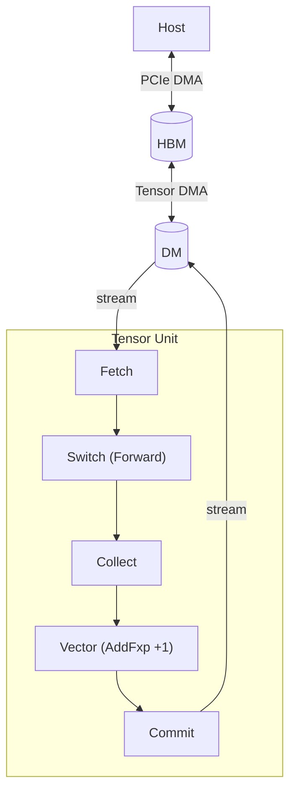
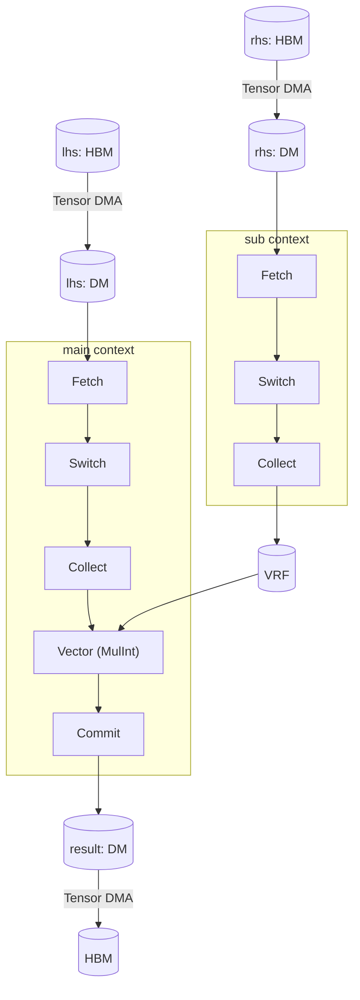

# Hello, TCP!

This chapter introduces TCP programming through worked examples.
Each example builds a mental model of how computation maps to hardware, making the rest of this book easier to follow.
The first two examples cover element-wise operations; the remaining three cover tensor contractions (dot product, GEMV, and GEMM), each adding one new hardware concept.
Two additional examples (Blocked GEMM and Flash Attention) are outlined as stubs.

## Mathematical Background

This section defines the two mathematical concepts that TCP is built to accelerate: tensors and their contractions.

### Tensor

A **tensor** is a mapping from tensor index to its corresponding value.

To understand this, we must first define tensor's shape.
Unlike other libraries where axis order encodes meaning (e.g., NumPy's [`ndarray`](https://numpy.org/doc/stable/reference/generated/numpy.ndarray.html)), we define tensor's shape as an **unordered set** of named axes.
The shapes \\(\\{\texttt{N} = 4, \texttt{C} = 3\\}\\) and \\(\\{\texttt{C} = 3, \texttt{N} = 4\\}\\) identify the same tensor; axis names carry the meaning, not the position.

A **tensor index** is formed by specifying index value for each axes.
For a tensor with shape \\(\\{\texttt{N} = 4, \texttt{C} = 3\\}\\), the valid indices will be: \\(\\{\texttt{N}: 0, \texttt{C}: 0\\}\\), \\(\\{\texttt{N}: 0, \texttt{C}: 1\\}\\), \\(\\{\texttt{N}: 0, \texttt{C}: 2\\}\\), \\(\\{\texttt{N}: 1, \texttt{C}: 0\\}\\), etc.

A tensor can behave like a multi-dimensional array of numbers. For example:

- 0D Tensor (Scalar): a single number like \\(5.2\\)
- 1D Tensor (Vector): a sequence like \\([1, 2, 3]\\) with one axis
- 2D Tensor (Matrix): a \\(2 \times 4\\) grid with two axes
- 4D Tensor: a batch of RGB images with shape \\(\\{\texttt{N} = 4, \texttt{C} = 3, \texttt{H} = 256, \texttt{W} = 512\\}\\)

### Tensor Contraction

A **tensor contraction** is a operation on a tensor that takes two tensors, pair up specific axes that appears in both inputs, then sums the products of their elements along those axes.  
**Einsum notation** is a compact way to write contractions: each input tensor is listed by its axis labels, and output axes follow the `→` arrow; any axis that appears in both inputs but not in the output is summed over.

| Operation | Formula | Einsum notation |
|-----------|---------|-----------------|
| Dot product | \\(\sum_i x_i y_i\\) | \\(I, I \rightarrow 1\\) |
| GEMV | \\(y_i = \sum_j A_{ij} x_j\\) | \\(IJ, J \rightarrow I\\) |
| GEMM | \\(C_{ij} = \sum_k A_{ik} B_{kj}\\) | \\(IK, KJ \rightarrow IJ\\) |

Every contraction can be decomposed into three steps: Broadcast, Multiply, and Reduce.

| Step | Dot Product (\\(I, I \rightarrow 1\\)) | GEMV (\\(IJ, J \rightarrow I\\)) | GEMM (\\(IK, KJ \rightarrow IJ\\)) |
|------|----------------------------------------|----------------------------------|-------------------------------------|
| **Broadcast** | none (axes match) | \\(x\\) broadcasts across \\(I\\) | \\(A\\) across \\(J\\); \\(B\\) across \\(I\\) |
| **Multiply** | \\(x_i \cdot y_i\\) | \\(A_{ij} \cdot x_j\\) | \\(A_{ik} \cdot B_{kj}\\) |
| **Reduce** | \\(\sum_i x_i y_i\\) | \\(y_i = \sum_j A_{ij} x_j\\) | \\(C_{ij} = \sum_k A_{ik} B_{kj}\\) |

## Tensor Contraction Processor

This section covers the hardware concepts needed to understand the examples: the processing unit hierarchy, memory tiers, tensor mapping types, and execution contexts.

### Processing Units

The TCP architecture accelerates these contractions by streaming tensor data through a hierarchy of parallel processing units.

| Level | Count (RNGD) | Role |
|-------|-------------|------|
| `Chip` | (system-dependent) | Top-level unit; holds HBM |
| `Cluster` | 2 per chip | Groups 256 slices |
| `Slice` | 256 per cluster | Runs one **Tensor Unit**: a Fetch → Switching → Collect → Contraction → Vector → Cast → Transpose → Commit pipeline |
| `Row` | 8 per slice | One row of the Contraction Engine's MAC (multiply-accumulate) array |

The Switch Engine connects slices, enabling data redistribution across the slice array.

### Memory

| Type | Location | Capacity (RNGD) | Role |
|------|----------|-----------------|------|
| `HbmTensor` | On-package | 48 GB, 1.5 TB/s | Long-term weight and activation storage |
| `DmTensor` | On-chip SRAM | 256 MB total; 512 KB/slice | Primary working memory for computations |
| `TrfTensor` | On-chip SRAM | 8 KB × 8 MAC rows / slice | Weight register file for Contraction Engine |
| `VrfTensor` | On-chip SRAM | 8 KB / slice | Operand register file for Vector Engine |

Most alignment and capacity constraints in this book derive from the counts and capacities in these tables.

<!-- > TODO(visual): All diagrams in this chapter need designer-produced figures. -->
<!-- > Priority: (1) block diagram of a single RNGD chip showing the Chip → Cluster → Slice → Row nesting with physical counts labelled, (2) hardware-mapping figures for each kernel example replacing the Mermaid placeholders. -->

### Tensor Mapping

TCP's Virtual ISA exposes the hardware hierarchy through its type system.
Each tensor type encodes the element type and how each logical axis distributes across the hardware hierarchy.
For example, `DmTensor<bf16, m![1], m![1 # 2], m![A / 8 # 256], m![A % 8]>` (with `axes![A = 2048]`) represents a `bf16` tensor on one chip, one of two clusters, distributed across 256 slices with 8 elements per slice.
TCP also introduces two kernel-specific parameters: `Time` indexes pipeline iterations; `Packet` indexes elements within each iteration.

The mapping expression (`m![]` macro and its operators) is used to express this distribution:

- `/` splits by stride: `A / 8` gives 2048 / 8 = 256 indices, the "which slice" index.
- `%` gives the inner count: `A % 8` gives the 8 indices for each element the slice holds.
- `#` pads to the hardware unit count: `# 256` makes the slice count explicit.

Together, each element of `A` is mapped to a well-defined position within exactly one slice.

### Execution Contexts

Every device kernel has two execution contexts running concurrently on separate hardware resources: `ctx.main` and `ctx.sub`.
`main` runs the primary computation; `sub` runs a concurrent pipeline, typically used to prefetch operands into TRF or VRF while `main` computes.
If `main` needs operands that `sub` is still fetching, `main` automatically waits for `sub`'s execution to ensure synchronization.

Because both contexts share the flat on-chip SRAM, the programmer must explicitly assign DM addresses (e.g. the `addr` argument in `.to_dm()`, `.commit()`) to prevent tensors from overlapping.
Addresses must not collide, but they can be non-contiguous.

## Examples

The first two examples cover element-wise operations by using the [Vector Engine](./computing-tensors/vector-engine/index.md); the remaining three cover tensor contractions by using the [Contraction Engine](./computing-tensors/contraction-engine/index.md).

### Constant Addition

The first kernel takes a vector of integers and adds the constant `1` to each element.
It uses one chip, one of two clusters, and all 256 slices in that cluster, with one 8-element group per slice.
The Vector Engine processes integers using fixed-point operations, so we use `vector_fxp(FxpBinaryOp::AddFxp, 1)` to add the constant value.



This example demonstrates the full Tensor Unit pipeline.
`to_dm` moves data from HBM to DM, splitting the flat tensor across 256 slices.
The `begin → fetch → collect → vector_init → vector_intra_slice_branch → vector_fxp → vector_final → commit` chain processes each slice in one pass, and `vector_fxp(FxpBinaryOp::AddFxp, 1)` adds the integer constant `1` to every element in parallel across all 256 slices.
`BranchMode::Unconditional` configures the pipeline to execute on every cycle.

```rust
# #![feature(register_tool)]
# #![register_tool(tcp)]
# extern crate furiosa_visa_std;
# extern crate tokio;
# extern crate rand;
use rand::SeedableRng;
use rand::rngs::SmallRng;
use furiosa_visa_std::prelude::*;

axes![A = 2048];  // declare named axis A with size 2048; used in all tensor types below

type Chip    = m![1];
type Cluster = m![1 # 2];            // 1 active cluster; hardware has 2 per chip
type Slice   = m![A / 8 # 256];      // distribute A across 256 slices, 8 elements each

#[tokio::main]
async fn main() {
    let mut ctx = Context::acquire();

    // Create input on the host and transfer to HBM
    let mut rng = SmallRng::seed_from_u64(42);
    let input  = HostTensor::<i32, m![A]>::rand(&mut rng);
    let in_hbm = input.to_hbm(&mut ctx.pdma, 0).await;

    // Launch the device kernel
    let out_hbm = launch(kernel, (&mut ctx, &in_hbm)).await;

    // Transfer result back to host
    let _out = out_hbm.to_host::<m![A]>(&mut ctx.pdma).await;
}

#[device(chip = 1)]
fn kernel(ctx: &mut Context, input: &HbmTensor<i32, Chip, m![A]>) -> HbmTensor<i32, Chip, m![A]> {
    // HBM → DM: split 2048 elements across 256 slices (8 elements per slice)
    let dm = input.to_dm::<Cluster, Slice, m![A % 8]>(&mut ctx.tdma, 0);

    let result = ctx
        .main
        .begin(dm.view())
        // Fetch: stream 8-element packets from DM into the pipeline
        .fetch::<i32, m![1], m![A % 8]>()
        // Collect: normalize the stream into 32-byte flits (8 × i32)
        .collect::<m![1], m![A % 8]>()
        // Vector Engine: enter pipeline and arm unconditionally
        .vector_init()
        .vector_intra_slice_branch(BranchMode::Unconditional)
        // Add the scalar constant 1 to every element
        .vector_fxp(FxpBinaryOp::AddFxp, 1)
        // Exit VE and commit: write results back to DM
        .vector_final()
        .commit::<m![A % 8]>(1 << 12);

    // DM → HBM
    result.to_hbm(&mut ctx.tdma, 1 << 28)
}
```

### Elementwise Multiplication

The second kernel multiplies two same-shape vectors element-wise.
Because the Vector Engine's fixed-point multiply unit (`FxpMul`) takes a second operand per element, that operand must come from the **VRF** (Vector Register File).
The VRF is a small per-slice register file that the Vector Engine reads every cycle; it is loaded in the `sub` context while the main computation streams.



This example adds the VRF and the `sub` context.
`rhs_dm` is allocated at a different base address (`1 << 12`) to avoid overlapping with `lhs_dm`.
The `sub` context loads `rhs_dm` into the VRF through the Fetch → Switch → Collect → `.to_vrf(0)` pipeline.
The `main` context then streams `lhs_dm` and multiplies each element by its VRF counterpart using `MulInt`; the hardware runs both contexts concurrently where possible.

```rust
# #![feature(register_tool)]
# #![register_tool(tcp)]
# extern crate furiosa_visa_std;
# extern crate tokio;
# extern crate rand;
use rand::SeedableRng;
use rand::rngs::SmallRng;
use furiosa_visa_std::prelude::*;

axes![A = 2048];

type Chip    = m![1];
type Cluster = m![1 # 2];
type Slice   = m![A / 8 # 256];

#[tokio::main]
async fn main() {
    let mut ctx = Context::acquire();

    let mut rng = SmallRng::seed_from_u64(42);
    let lhs = HostTensor::<i32, m![A]>::rand(&mut rng);
    let rhs = HostTensor::<i32, m![A]>::rand(&mut rng);

    let lhs_hbm = lhs.to_hbm(&mut ctx.pdma, 0).await;
    let rhs_hbm = rhs.to_hbm(&mut ctx.pdma, 1 << 28).await;

    let out_hbm = launch(kernel, (&mut ctx, &lhs_hbm, &rhs_hbm)).await;

    let _out = out_hbm.to_host::<m![A]>(&mut ctx.pdma).await;
}

#[device(chip = 1)]
fn kernel(
    ctx: &mut Context,
    lhs: &HbmTensor<i32, Chip, m![A]>,
    rhs: &HbmTensor<i32, Chip, m![A]>,
) -> HbmTensor<i32, Chip, m![A]> {
    // Move both operands from HBM to DM; use distinct base addresses to avoid overlap
    let lhs_dm = lhs.to_dm::<Cluster, Slice, m![A % 8]>(&mut ctx.tdma, 0);
    let rhs_dm = rhs.to_dm::<Cluster, Slice, m![A % 8]>(&mut ctx.tdma, 1 << 12);

    // Sub context: load rhs into VRF (runs concurrently with the main context below).
    // VRF holds a per-slice operand that the Vector Engine reads every cycle.
    let rhs_vrf: VrfTensor<i32, Chip, Cluster, Slice, m![A % 8]> = ctx
        .sub
        .begin(rhs_dm.view())
        .fetch::<i32, m![1], m![A % 8]>()
        .collect::<m![A % 8 / 8], m![A % 8 % 8]>()
        .to_vrf(0);

    // Main context: multiply every lhs element by its rhs counterpart from VRF
    let result = ctx
        .main
        .begin(lhs_dm.view())
        .fetch::<i32, m![1], m![A % 8]>()
        .collect::<m![1], m![A % 8]>()
        .vector_init()
        .vector_intra_slice_branch(BranchMode::Unconditional)
        // Each slice multiplies its 8 lhs elements by the matching 8 rhs elements in VRF
        .vector_fxp(FxpBinaryOp::MulInt, &rhs_vrf)
        .vector_final()
        .commit::<m![A % 8]>(1 << 13);

    result.to_hbm(&mut ctx.tdma, 1 << 28)
}
```

The following three examples implement the contractions from the table above, each introducing a different Switch Engine topology.

### Dot Product

The dot product \\(I, I \rightarrow 1\\) is the simplest contraction: there is no broadcast step, and both operands reduce along the same axis.
The `sub` context loads `rhs` into the TRF, the on-chip register file that holds one operand stationary while the other streams through, via Fetch → Collect → `.to_trf()`.
`TrfAddress::Full` dedicates the entire TRF to this tensor.
`.align()` pairs the streaming LHS flits with the stationary RHS, doubling the packet width.
`.contract()` multiplies and reduce-adds along `A` spatially via the hardware reduction tree; `.accumulate()` then performs temporal accumulation across the time axis, producing a scalar per slice; `.cast()` converts the `f32` accumulator output back to `bf16`.

<!-- > **TODO** (jeongmin.park): (1) Why does `.align()` require explicit type annotations? (2) The type annotation on `.contract()` needs a brief prose explanation. -->

```rust
# #![feature(register_tool)]
# #![register_tool(tcp)]
# extern crate furiosa_visa_std;
# extern crate tokio;
# extern crate rand;
use rand::SeedableRng;
use rand::rngs::SmallRng;
use furiosa_visa_std::prelude::*;

axes![A = 2048];

type Chip = m![1];
type Cluster = m![1 # 2];
type Slice = m![1 # 256];  // 1 active slice; m![A / 8 # 256] would distribute across all 256
type Time = m![1];         // No temporal iteration
type Row = m![1];          // No row parallelism

#[tokio::main]
async fn main() {
    let mut ctx = Context::acquire();

    let mut rng = SmallRng::seed_from_u64(42);
    let lhs = HostTensor::<bf16, m![A]>::rand(&mut rng);
    let rhs = HostTensor::<bf16, m![A]>::rand(&mut rng);

    let lhs_hbm = lhs.to_hbm(&mut ctx.pdma, 0).await;
    let rhs_hbm = rhs.to_hbm(&mut ctx.pdma, 1 << 28).await;

    let out_hbm = launch(kernel, (&mut ctx, &lhs_hbm, &rhs_hbm)).await;

    let out = out_hbm.to_host::<m![1]>(&mut ctx.pdma).await;
}

#[device(chip = 1)]
fn kernel(
    ctx: &mut Context,
    lhs: &HbmTensor<bf16, Chip, m![A]>,
    rhs: &HbmTensor<bf16, Chip, m![A]>,
) -> HbmTensor<bf16, Chip, m![1]> {
    // HBM → DM
    let lhs: DmTensor<bf16, Chip, Cluster, Slice, m![A]> = lhs.to_dm(&mut ctx.tdma, 0);
    let rhs: DmTensor<bf16, Chip, Cluster, Slice, m![A]> = rhs.to_dm(&mut ctx.tdma, 1 << 12);

    // Sub context: load rhs into TRF (TrfAddress::Full dedicates the entire TRF to this tensor)
    let rhs: TrfTensor<bf16, Chip, Cluster, Slice, Row, m![A]> = ctx
        .sub
        .begin(rhs.view())
        .fetch::<bf16, Time, m![A]>()
        .collect::<m![{Time}, A / 16], m![A % 16]>()
        .to_trf(TrfAddress::Full);

    // Main context: stream lhs through the Contraction Engine, reduce along A
    let result: DmTensor<bf16, Chip, Cluster, Slice, m![1 # 8]> = ctx
        .main
        .begin(lhs.view())
        .fetch::<bf16, Time, m![A]>()
        .collect::<m![A / 16], m![A % 16]>()
        // Pair consecutive 32-byte flits into 64-byte packets, halving time steps (A/16 → A/32)
        .align::<m![A / 32], m![A % 32], _, _>(&rhs)
        .contract::<m![1]>()
        .accumulate::<m![1], m![1 # 8]>(AccumulationKind::Interleaved)
        .cast::<bf16, m![1 # 16]>()  // cast f32 accumulator output back to bf16
        .commit::<m![1 # 8]>(1 << 13);

    // DM → HBM
    result.to_hbm(&mut ctx.tdma, 2 << 28)
}
```

The dot product reduces along a single axis with no redistribution needed, so the Switch Engine is skipped and `collect()` is called directly on the `FetchTensor`.
The pseudocode below describes this behavior:

```rust
# #![feature(adt_const_params)]
# extern crate furiosa_visa_std;
# use furiosa_visa_std::prelude::*;
axes![A = 2048];

// Dot product: both operands reduce along A; no slice redistribution needed.
fn collect_dot_product<'l, const T: Tu>(
    input: FetchTensor<'l, T, bf16, m![1], m![1], m![1 # 256], m![1], m![A]>,
) -> CollectTensor<'l, T, bf16, m![1], m![1], m![1 # 256], m![A / 16], m![A % 16]> {
    input.collect()
}
```

### GEMV

GEMV \\(IJ, J \rightarrow I\\) extends the dot product by requiring the [Switch Engine](./computing-tensors/switch-engine.md) (which redistributes data across slices between Fetch and Collect) to broadcast the vector across all `I` slices, so each slice can independently compute its row of the output \\(y_i = \sum_j A_{ij} x_j\\).

The reduced dimension `J` splits into `Time` (one iteration per tile) and `Packet` (elements within each tile).
The preserved output dimension `I` maps to `Slice`, distributing output elements across slices for spatial parallelism.

GEMV requires broadcasting the vector to all `I` slices, which the Switch Engine handles with `Broadcast01`.
The pseudocode below describes this behavior:

```rust
# #![feature(adt_const_params)]
# extern crate furiosa_visa_std;
# use furiosa_visa_std::prelude::*;
axes![I = 256, J = 2048];

// GEMV: broadcast the vector across all I slices.
fn switch_gemv<'l, const T: Tu>(
    input: FetchTensor<'l, T, bf16, m![1], m![1], m![1 # 256], m![1], m![J]>,
) -> SwitchTensor<'l, T, bf16, m![1], m![1], m![I], m![1 # 256], m![J]> {
    input.switch(SwitchConfig::Broadcast01 {
        slice1: 256,
        slice0: 1,
        time0: 1,
    })
}
```

```rust
# #![feature(register_tool)]
# #![register_tool(tcp)]
# extern crate furiosa_visa_std;
# extern crate rand;
# use rand::SeedableRng;
# use rand::rngs::SmallRng;
# use furiosa_visa_std::prelude::*;
axes![I = 256, J = 2048];

type Chip = m![1];
type Cluster = m![1 # 2];
type Slice = m![I];        // Distribute output dimension across slices
type Time = m![J / 32];    // Temporal iterations for reduction dimension
type Packet = m![J % 32];  // Packet size for reduction dimension
type Row = m![1];

async fn run() {
    let mut ctx = Context::acquire();

    // Create matrix and vector on host
    let mut rng = SmallRng::seed_from_u64(42);
    let matrix = HostTensor::<bf16, m![I, J]>::rand(&mut rng);
    let vector = HostTensor::<bf16, m![J]>::rand(&mut rng);

    // Transfer to HBM
    let matrix_hbm = matrix.to_hbm(&mut ctx.pdma, 0 << 28).await;
    let vector_hbm = vector.to_hbm(&mut ctx.pdma, 1 << 28).await;
    // Launch kernel
    let out_hbm = launch(kernel, (&mut ctx, &matrix_hbm, &vector_hbm)).await;

    // Transfer result back
    // > TODO(jeongmin.park): Consider adding a type annotation here.
    let out = out_hbm.to_host::<m![I]>(&mut ctx.pdma).await;
}

#[device(chip = 1)]
fn kernel(
    ctx: &mut Context,
    matrix: &HbmTensor<bf16, Chip, m![I, J]>,
    vector: &HbmTensor<bf16, Chip, m![J]>,
) -> HbmTensor<bf16, Chip, m![I]> {
    // Move data from HBM to DM
    let matrix: DmTensor<bf16, Chip, Cluster, Slice, m![J]> = matrix.to_dm(&mut ctx.tdma, 0);
    let vector: DmTensor<bf16, Chip, Cluster, Slice, m![J]> = vector.to_dm(&mut ctx.tdma, 1 << 12);

    // Load vector into TRF
    // The Switch Engine automatically broadcasts the vector to all `I` slices
    let vector_trf: TrfTensor<bf16, Chip, Cluster, Slice, Row, m![J]> = ctx
        .sub
        .begin(vector.view())
        .fetch::<bf16, m![1], m![J]>()
        // Collect Engine: split into 32-byte flits.
        .collect::<m![J / 16], m![J % 16]>()
        .to_trf(TrfAddress::Full);

    // Compute GEMV: matrix × vector
    // Key difference: `I` maps to slice (preserved), `J` gets reduced
    let result: DmTensor<bf16, Chip, Cluster, Slice, m![1]> = ctx
        .main
        .begin(matrix.view())
        .fetch::<bf16, Time, Packet>()
        .collect::<Time, Packet>()
        .align::<Time, Packet, _, _>(&vector_trf)
        .contract::<m![1]>()
        .accumulate::<m![1], m![1 # 8]>(AccumulationKind::Interleaved)
        .cast::<bf16, m![1 # 16]>()
        .commit(0);

    // Transfer result to HBM
    result.to_hbm(&mut ctx.tdma, 2 << 28)
}
```

### GEMM

GEMM \\(IK, JK \rightarrow IJ\\) computes \\(C_{ij} = \sum_k A_{ik} B_{jk}\\).
Each matrix broadcasts along its missing output dimension: \\(A\\) broadcasts across \\(J\\), \\(B\\) broadcasts across \\(I\\).
Then the shared dimension \\(K\\) is reduced.

The main change from the GEMV example is that two output dimensions \\(I\\) and \\(J\\) are jointly mapped to `Slice`, so each slice computes a 2D tile of the output matrix.
The slice mapping now covers both dimensions, and the contraction output preserves both.

This example introduces `type Slice = m![I / 32, J / 32]`, which decomposes two output dimensions jointly and assigns each slice a 16 × 16 output tile.
The Switch Engine distributes each tile of `B` to the matching slice, so each slice sees only its portion of `J`.
`.contract::<m![1]>()` reduces along `K` spatially, and `.accumulate::<m![I], m![J # 8]>(AccumulationKind::Interleaved)` accumulates over time, preserving both `I` and `J` in the output.

```rust
# #![feature(register_tool)]
# #![register_tool(tcp)]
# extern crate furiosa_visa_std;
# use furiosa_visa_std::prelude::*;
axes![I = 512, J = 512, K = 2048];

type Chip = m![1];
type Cluster = m![1 # 2];
// Distribute output dimensions `I` and `J` across slices
type Slice = m![I / 32, J / 32]; // Each slice handles a 16 × 16 output tile
type Row = m![J % 8];

// Host code similar to previous examples:
// - Create matrix tensors A and B
// - Transfer to HBM
// - Launch kernel
// - Transfer result back

#[device(chip = 1)]
fn kernel(
    ctx: &mut Context,
    a: &HbmTensor<bf16, Chip, m![I, K]>,
    b: &HbmTensor<bf16, Chip, m![K, J]>,
) -> HbmTensor<bf16, Chip, m![I, J]> {
    // Move data from HBM to DM
    let a: DmTensor<bf16, Chip, Cluster, Slice, m![I % 32, K]> = a.to_dm(&mut ctx.tdma, 0);
    let b: DmTensor<bf16, Chip, Cluster, Slice, m![J % 32, K]> = b.to_dm(&mut ctx.tdma, 1 << 12);

    // Load matrix B into TRF
    // Switch Engine distributes B across 256 slices
    // Each slice gets the full `K` dimension but only its (16 × 16) output tile
    // See: Switch Engine topologies for details on distribution
    let b_trf: TrfTensor<bf16, Chip, Cluster, Slice, Row, m![J / 8 % 4, K]> = ctx
        .sub
        .begin(b.view())
        .fetch::<bf16, m![J % 8, J / 8 % 4], m![K]>()
        .collect::<m![J % 8, J / 8 % 4, K / 16], m![K % 16]>()
        .to_trf(TrfAddress::Full);

    // Compute GEMM: A × B
    // Switch Engine ensures matching (`I / 32`, `J / 32`) slice distribution
    // Contraction reduces along `K`, preserves `I` and `J`
    let result: DmTensor<bf16, Chip, Cluster, Slice, m![I % 32, J % 32]> = ctx
        .main
        .begin(a.view())
        .fetch::<bf16, m![I % 32, J / 8 % 4], m![K]>()
        .collect::<m![I % 32, J / 8 % 4, K / 16], m![K % 16]>()
        .align::<m![I % 32, J / 8 % 4, K / 32], m![K % 32], _, _>(&b_trf)
        .contract::<m![1]>()
        .accumulate::<m![I % 32, J / 8 % 4], m![J % 8]>(AccumulationKind::Interleaved)
        .cast::<bf16, m![J % 8 # 16]>()
        .commit(0);

    // Transfer result to HBM
    result.to_hbm(&mut ctx.tdma, 2 << 28)
}
```

### Blocked GEMM

> [!NOTE]
> This section is a work in progress.
> A complete example extending GEMM with blocking (tiling) for matrices that exceed on-chip DM capacity — covering temporal partitioning over the `K` dimension and spatial partitioning that distributes `I` and `J` tiles across multiple chips — will be added in a future release.

### Flash Attention

> [!NOTE]
> This section is a work in progress.
> A complete flash attention example combining GEMM-style contraction, softmax (Vector Engine), and the multi-pass main/sub prefetch pattern across a full transformer attention head will be added in a future release.

Together, the five complete examples above demonstrate every major hardware engine in TCP: the DMA engines (HBM to DM), the Vector Engine (element-wise ops), the Contraction Engine (multiply-reduce), and the Switch Engine (data redistribution across slices). (The Blocked GEMM and Flash Attention sections are stubs and will demonstrate additional patterns once complete.)

## Further Reading

The examples above process tensors that fit in a single hardware pass.
Real workloads often exceed the 512 KB/slice DM capacity and require partitioning into tiles.
The next chapters cover two complementary strategies: temporal partitioning, which processes tiles sequentially over time, and spatial partitioning, which distributes tiles across parallel hardware units.

Each construct introduced in this chapter is covered in depth in the reference chapters:

- `axes![]`, `m![]`, `HbmTensor`, `DmTensor` → [Mapping Tensors](./mapping-tensors/index.md)
- `.to_dm()`, `.to_hbm()`, `.fetch()`, `.commit()` → [Moving Tensors](./moving-tensors/index.md)
- `.contract()`, `.accumulate()`, `.cast()`, `.switch()`, `.vector_fxp()` → [Computing Tensors](./computing-tensors/index.md)
- `ctx.main`, `ctx.sub`, `launch()` → [Scheduling](./scheduling.md)
- End-to-end kernels combining all of the above → [Kernel Examples](./kernel-examples/index.md)
