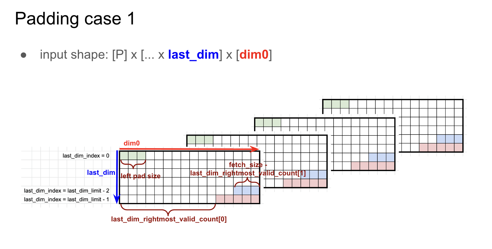
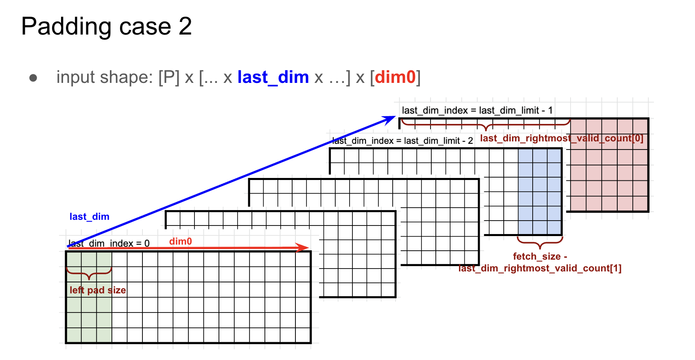
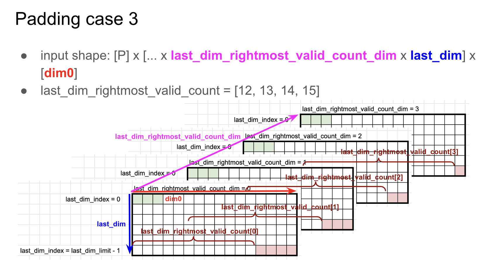

# Fetch Engine

The [Tensor Unit](../computing-tensors/index.md) is a pipeline of engines (Switching, Collect, Contraction, Vector, Cast, Transpose, Commit) that processes tensor data.
It cannot operate directly on tensors stored in DM: data must first be converted into a stream of fixed-size packets that flow through the compute pipeline.
The Fetch Engine performs this conversion: it reads tensor data from DM and produces packet streams for the rest of the Tensor Unit.

The Fetch Engine operates in two stages:
- **[Fetch Sequencer](#fetch-sequencer)**: Reads tensor data from DM using nested-loop configurations that define access patterns.
- **[Fetch Adapter](#fetch-adapter)**: Post-processes streams through masking, type conversion, and batching to produce computation-ready packets.

Additional sections cover the [interaction with the Switch Engine](#fetch-engine-and-switch-engine-interaction) and [performance guidelines](#performance).

As a kernel writer, you control the `Time` and `Packet` type parameters of `.fetch()`, which determine packet size and iteration count.
The compiler derives the sequencer loop configuration and stride calculation.
For performance implications of `Packet` choices, see [Memory Performance](./memory-performance.md).

<!-- > **TODO** (jeongmin.park): 지금 API에 fetch adapter를 실행할 수 있는 방법이 있나요? -> masking, table indexing, type casting, zero point sub, batc -->
<!-- hing 중에서, type casting/batching만 가능합니다. 나머지는 api 디자인이 필요합니다. -->

## Interface

The Fetch Engine implements a [logical tensor move](./index.md) from DM to tensor streams:

```rust,ignore
{{#include ../../../furiosa-visa-std/src/stream_tensor.rs:fetch_impl}}
```

The resulting `FetchTensor` represents a stream of packets flowing through the Tensor Unit pipeline.
The mapping `[Chip, Cluster, Slice, Time, Packet]` distributes data across hardware and time.

`Time2` represents the temporal iteration mapping, while `Packet2` is the packet shape within each cycle.
The output packet size must be 8-byte aligned (a multiple of the fetch sequencer's read granularity).
The output type `D2` supports type casting (such as `i8` to `i32`).

Notice that `.fetch()` does not have an output parameter for `Slice`: each slice independently reads its own DM data, so the Slice mapping is inherited unchanged from the input `BeginTensor`.
To redistribute data across slices, use the [Switch Engine](../computing-tensors/switch-engine.md).

## Examples

A matrix stored as 8-bit integers needs conversion to 32-bit integers for computation:

```rust
# #![feature(adt_const_params)]
# extern crate furiosa_visa_std;
# use furiosa_visa_std::prelude::*;
axes![A = 512, B = 32];

/// Fetches matrix data from DM, casting i8 to i32.
fn fetch_matrix_example<'l, const T: Tu>(
    input: BeginTensor<'l, T, i8, m![1], m![1], m![1], m![1], m![A, B]>,
) -> FetchTensor<'l, T, i32, m![1], m![1], m![1], m![A], m![B]> {
    input.fetch()
}
```

The input `BeginTensor` represents data in DM.
The output `FetchTensor` represents a packet stream: 512 rows over time, each containing 32 `i32` (128 bytes).
The compiler automatically configures the sequencer and adapter from the output type signature.
For the `StreamTensor` type hierarchy across pipeline stages, see [Memory and Stream](../mapping-tensors/memory-stream.md).

## Fetch Sequencer

The Fetch Sequencer defines the memory access pattern: which addresses to read, in what order, and how to package the data into packets.
Each slice executes its own sequencer independently, enabling parallel data movement.

Sequencers typically use homogeneous configurations: each slice processes the same pattern on its local data partition.
The hardware also supports heterogeneous configurations where different slices execute different access patterns simultaneously.

### Constraints

The sequencer has physical limits that must be respected:
- `Chip::SIZE` \\(=\\) number of chips in the system.
- `Cluster::SIZE` \\(=\\) 2 (clusters per chip).
- `Slice::SIZE` \\(=\\) 256 (slices per cluster).

> [!NOTE]
> These exact-match constraints are a current limitation: the runtime operates at chip granularity (`#[device(chip = N)]`), so partial chip or cluster usage is not yet supported.
> Use the `#` padding operator (e.g., `m![1 # 2]` for a single logical cluster) to fill unused positions.
> This may be relaxed in future releases.
- Fetch addresses must be `1`-byte aligned (minimal constraint), but `8`-byte alignment is required for certain DMA operations.
- Depending on the context, the `fetch_size` is restricted to certain values:
  - The main-context supports a `fetch_size` of 1, 2, 4, 8, 16, or 32 bytes (see [main-context](../computing-tensors/index.md#execution-contexts)).
  - The sub-context supports a `fetch_size` of 4 bytes (when casting from `i4` to `i32`), or 8 bytes (otherwise) (see [sub-context](../computing-tensors/index.md#execution-contexts)).
- `fetch_size` is determined as the largest supported divisor of `gcd(packet_size, contiguous_sram_access_size)`.
  - `fetch_size` must divide `packet_size` because data fetched in a single memory read cannot be split across different packets.
  - `fetch_size` must divide `contiguous_sram_access_size` because a single memory fetch can only read physically contiguous data.

The `contiguous_sram_access_size` represents the total byte size of contiguous elements in memory that can be accessed without stride discontinuities. It is derived from the sequencer configuration by multiplying the sizes of consecutive physically contiguous entries, from the innermost to the outermost level. Two adjacent entries---an outer `(n1 : s1)` and an inner `(n2 : s2)`---are physically contiguous if `s1 == n2 * s2`.

```rust
# #![feature(adt_const_params)]
# extern crate furiosa_visa_std;
# use furiosa_visa_std::prelude::*;
axes![N = 4, C = 3, H = 4, W = 8];

// Compiler-generated configuration: [
//   N -> 4 : 96,   (96 == 3 * 32,     contiguous)
//   C -> 3 : 32,   (32 == 4 * 8,      contiguous)
//   H -> 4 : 8,    (8  == 8 * 1,      contiguous)
//   W -> 8 : 1,    (packet dimension, contiguous)
// ] : 8
// contiguous_sram_access_size = 8 * 4 * 3 * 4 = 384
fn fully_contiguous<'l, const T: Tu>(
    input: BeginTensor<'l, T, i8, m![1], m![1], m![1], m![1], m![N, C, H, W]>,
) -> FetchTensor<'l, T, i8, m![1], m![1], m![1], m![N, C, H], m![W]> {
    input.fetch()
}

// Compiler-generated configuration: [
//   C -> 3 : 32,   (32 != 4 * 96,     NOT contiguous)
//   N -> 4 : 96,   (96 != 4 * 8,      NOT contiguous)
//   H -> 4 : 8,    (8  == 8 * 1,      contiguous)
//   W -> 8 : 1,    (packet dimension, contiguous)
// ] : 8
// contiguous_sram_access_size = 8 * 4 = 32
fn three_axes_non_contiguous<'l, const T: Tu>(
    input: BeginTensor<'l, T, i8, m![1], m![1], m![1], m![1], m![N, C, H, W]>,
) -> FetchTensor<'l, T, i8, m![1], m![1], m![1], m![C], m![N, H, W]> {
    input.fetch()
}

// Compiler-generated configuration: [
//   N -> 4 : 96,   (96 != 4 * 8,  NOT contiguous)
//   H -> 4 : 8,    (8  != 3 * 32, NOT contiguous)
//   C -> 3 : 32,   (32 != 8 * 1,  NOT contiguous)
//   W -> 8 : 1,    (packet dimension, contiguous)
// ] : 8
// contiguous_sram_access_size = 8
fn four_axes_non_contiguous<'l, const T: Tu>(
    input: BeginTensor<'l, T, i8, m![1], m![1], m![1], m![1], m![N, C, H, W]>,
) -> FetchTensor<'l, T, i8, m![1], m![1], m![1], m![1], m![N, H, C, W]> {
    input.fetch()
}
```

For detailed information on how packet size interacts with memory access patterns and sequencer configuration, see the [sequencer configuration](./sequencer.md#configuration).

> [!NOTE]
> The optimal sequencer configuration is automatically generated by the compiler based on the output type of `fetch()`.
> Users **do not** directly specify sequencer configurations in Virtual ISA.
> Similarly, `fetch_size` and `contiguous_sram_access_size` are automatically derived by the compiler, and not directly specified by users.

### Optimizations

Different configurations can achieve the same tensor move with varying efficiency.
Two key optimizations dramatically improve performance: padding packets to maximize bandwidth and interleaving tensors to combine operations.

#### Padding Packets

Padding packets to full hardware bandwidth drastically reduces fetch cycles.
The increased packet size allows the compiler to increase `fetch_size`, which reduces the number of fetch cycles needed to transfer the same amount of data.
The following example demonstrates this effect:

```rust
# #![feature(adt_const_params)]
# extern crate furiosa_visa_std;
# use furiosa_visa_std::prelude::*;
axes![A = 3, B = 5, C = 2];

/// Smallest packet: only C dimension (2 bytes). Takes 15 cycles.
fn fetch_packet_C<'l, const T: Tu>(
    input: BeginTensor<'l, T, f8e4m3, m![1], m![1], m![1], m![1], m![A, B, C]>,
) -> FetchTensor<'l, T, f8e4m3, m![1], m![1], m![1], m![A, B], m![C]> {
    input.fetch()
}

/// Medium packet: B and C dimensions padded to 16 bytes. Takes 3 cycles.
fn fetch_packet_BC<'l, const T: Tu>(
    input: BeginTensor<'l, T, f8e4m3, m![1], m![1], m![1], m![1], m![A, B, C]>,
) -> FetchTensor<'l, T, f8e4m3, m![1], m![1], m![1], m![A], m![[B, C] # 16]> {
    input.fetch()
}

/// Largest packet: all dimensions padded to 32 bytes. Takes 1 cycle.
fn fetch_packet_ABC<'l, const T: Tu>(
    input: BeginTensor<'l, T, f8e4m3, m![1], m![1], m![1], m![1], m![A, B, C]>,
) -> FetchTensor<'l, T, f8e4m3, m![1], m![1], m![1], m![1], m![[A, B, C] # 32]> {
    input.fetch()
}
```

Padding reads beyond the actual data, but this is safe because padding values do not affect computation.
Note that different padding strategies produce different `FetchTensor` mappings, which may affect downstream components.

#### Interleaving Tensors

Interleaving combines two tensors with identical mappings into a single sequencer operation, reducing overhead when both tensors are needed for the same computation.
An explicit axis is introduced in the `Time` dimension to encode alternation between the two tensors.

In the following example, the main context creates an interleaved tensor using `begin_interleaved()`.
This introduces an axis `I = 2` in the `Time` dimension, which encodes alternation between the two tensors.
The first temporal iteration fetches from `lhs`, the second iteration fetches from `rhs`,
the third iteration fetches the next packet from `lhs`, and so on, continuing this alternating pattern.
At most two tensors can be interleaved in a single fetch operation.

```rust
# #![feature(adt_const_params)]
# extern crate furiosa_visa_std;
# use furiosa_visa_std::prelude::*;
axes![A = 512, B = 32, I = 2];

/// Interleaves two input tensors into a single packet stream.
/// Useful for operations like 'input1 + input2' in the Vector Engine.
/// The interleaved BeginTensor is created via Tu.begin_interleaved().
/// The `I = 2` axis in Time encodes alternation between the two tensors.
fn fetch_interleaved<'l>(
    ctx: &'l mut Context,
    lhs: &'l DmTensor<i8, m![1], m![1], m![1], m![A, B]>,
    rhs: &'l DmTensor<i8, m![1], m![1], m![1], m![A, B]>,
) -> FetchTensor<'l, { Tu::Main }, i8, m![1], m![1], m![1], m![A, I], m![B]> {
    ctx.main.begin_interleaved::<I, _, _, _, _, _>(lhs.view(), rhs.view()).fetch()
}
```

## Fetch Adapter

The Fetch Adapter transforms raw packet streams into computation-ready format through five stages: [masking](#masking), [table indexing](#table-indexing), [type casting](#type-casting), [zero-point subtraction](#zero-point-subtraction), and [batching](#batching).
The [main-context](../computing-tensors/index.md#execution-contexts) adapter supports all five stages, while [sub-context](../computing-tensors/index.md#execution-contexts) adapters only support zero-point subtraction.

<!-- > **TODO**: Verify sub-context adapter capabilities — the Fetch Engine and Commit Engine pages disagree (Fetch Engine: zero-point subtraction only; Commit Engine: truncating and chunking only). -->

### Sequencer and Adapter Interaction

The Fetch Sequencer operates with a fixed stream mapping: (`Slice`, `Time`) → `Packet`.
It controls what memory addresses are read and how elements are packed.
While structural transformations happen during memory access, element-wise transformations happen during adapter processing.
To achieve a specific data layout, reshape the tensor before the sequencer reads it, then apply value-wise transformations in the adapter stage.

<!-- > **TODO** (pedro.lobo): The following example fails to convey the point above in a simple way. -->

For example, consider a tensor with `S = [8_a]`, `Element = a`, `Time = a ! 4`. Slicing can be expressed as `S = [4_a]`, `Element = a + 4`, `Time = a`. With offset consideration, `S = [8_a]`, `Element = a`, `Time = a @ 4` becomes `S = [8_a]`, `Element = 4 + a`, `Time = a`. In principle, if we reshape the tensor appropriately, all forms could be expressed this way, though the necessity of this specific approach warrants further investigation.

### Masking

The Tensor Unit requires data in power-of-two sizes for efficient processing, because its internal data paths operate on fixed-width units (32-byte flits containing 8 elements of 32-bit data).
A 63-element axis must be padded to 64 elements.
Without masking, the padded element might contain an arbitrary value that corrupts operations like `sum` or `max`.
Masking forces padded elements to neutral values so they do not influence the result.

For example, the Reducer sums elements along an axis.
Summing 63 real elements plus 1 arbitrary padded value produces an incorrect result.
Masking sets that padded element to zero.

```rust
# #![feature(adt_const_params)]
# extern crate furiosa_visa_std;
# use furiosa_visa_std::prelude::*;
axes![A = 63];

/// Fetches with automatic masking: pads 63 elements to 64, masking the padding.
/// Hardware automatically masks the 64th element to zero
/// so reduce operations compute correctly on 63 valid elements.
fn fetch_with_masking<'l, const T: Tu>(
    input: BeginTensor<'l, T, i8, m![1], m![1], m![1], m![1], m![A]>,
) -> FetchTensor<'l, T, i8, m![1], m![1], m![1], m![1], m![A # 64]> {
    input.fetch()
}
```

#### Masking Configuration

The Fetch Engine supports masking for innermost axes with padding on both sides, expressed as `(# n + A + # m)` where `n` is left padding, `A` is valid data, and `m` is right padding.
The hardware provides three masking cases to handle different padding scenarios, each optimized for specific padding patterns and axis sizes.

All masking configurations use three key parameters:

- **`last_dim`**: Specifies the dimension index to apply masking to.
- **`left_pad`**: Masks the first `left_pad` elements when the index of `last_dim` is 0.
- **`last_dim_rightmost_valid_count[0]`**: Masks `dim0 - last_dim_rightmost_valid_count[0]` elements from the right when the `last_dim` index is the last. This value is limited to 0-255 for 4-bit types, 0-31 for `f32`, as the final packet size must not exceed 256 bytes.

<!-- > **TODO** (pedro.lobo): Revise masking examples, clean up images and make sure the given examples follow the ones given in the figure. -->

##### Example (Padding case 1)



- `axes![A = 32, B = 90]`
- `dtype = i8`
- `base_addr = 0`
- `Element = m![A, B # 96]`
- Configuration: `last_dim = 1`, `lpad = 2`, `last_dim_rightmost_valid_count[0] = 4`, `pad_value = 0`
- Stream mapping: `let B' = # 2 + B + # 4 in { Time: m![A, B' / 32], Packet: m![B' % 32] }`
- Sequencer configuration: `[A = 32 : 96, B' / 32 = 3 : 32, B' % 32 = 32 : 1] : 32 @ base_addr = -2`
- Packet size: `m![B' % 32]::SIZE = 32`
- Cycles: `Time::SIZE = m![A, B' / 32]::SIZE = 32 * 3 = 96`
- Result: The first 2 and last 4 values of `(# 2 + B + # 4)` are masked to `0`.


##### Example (Padding case 2)

Case 2 handles the same masking as Case 1, but for non-contiguous padding regions that are split across the data.



- `axes![A = 32, B = 90]`
- `dtype = i8`
- `base_addr = 0`
- `Element = m![A, B # 96]`
- Configuration: `last_dim = 0`, `lpad = 2`, `last_dim_rightmost_valid_count[0] = 4`, `pad_value = 0`
- Stream mapping: `let B' = # 2 + B + # 4 in { Time: m![B' / 32, A], Packet: m![B' % 32] }`
- Sequencer configuration: `[B' / 32 = 3 : 32, A = 32 : 96, B' % 32 = 32 : 1] : 32 @ base_addr = -2`
- Packet size: `m![B' % 32]::SIZE = 32`
- Cycles: `Time::SIZE = m![A, B' / 32]::SIZE = 32 * 3 = 96`
- Result: The first 2 and last 4 values of `(# 2 + B + # 4)` are masked to `0`.

##### Example (Padding case 3)



Case 3 supports larger right padding values through per-index masking.
Cases 1 and 2 limit right padding to 255 * 4-bit, but Case 3 removes this limitation:

- Each entry index `i` uses its own `last_dim_rightmost_valid_count[i]` value.
- Supports `last_dim_rightmost_valid_count[0..8]` when axis size is 8 or less.

Consider the following:

- `axes![A = 32, B = 97]`
- `dtype = f32`
- `base_addr = 0`
- `Element = m![A, B # 128]`
- Stream mapping: `let B' = B + # 31 in { Time: m![A, B' / 16, 1], Packet: m![B' % 16] }`
- Sequencer configuration: `[A = 32 : 128, B' / 16 = 8 : 16, 1 = 1 : 0, B' % 16 = 16 : 1] : 16 @ base_addr = -2`
- Packet size: `m![B' % 16]::SIZE = 16`
- Cycles: `Time::SIZE = m![A, B' / 32]::SIZE = 32 * 8 = 256`
- Configuration: `last_dim_rightmost_valid_count_dim = 1`, `last_dim = 2`, `last_dim_rightmost_valid_count[0..8] = [16, 16, 16, 16, 16, 16, 1, 0]`, `pad_value = 0`
- Result: Of `(B # 31)`, 97 elements are valid and 31 are masked as invalid.

### Table Indexing

Some operations cannot be efficiently implemented with standard arithmetic.
Non-linear activation functions like Sigmoid and GeLU require expensive approximations, and certain quantization schemes use custom encoding tables.

Table indexing provides hardware-accelerated lookup tables during the fetch stage.
Each value is treated as an index into a pre-configured table, and the corresponding table entry is output instead.
This enables:

- **Non-linear activations**: Implement Sigmoid, GeLU, and other functions through pre-computed lookup tables.
- **Custom type casting**: Translate specialized encodings like `MXFP4` to standard formats using conversion tables.

<!-- > **TODO** (pedro.lobo): Remove `ignore` from code block. There is currently no way to represent table indexing in the API. -->

```rust,ignore
# #![feature(adt_const_params)]
# extern crate furiosa_visa_std;
# use furiosa_visa_std::prelude::*;
axes![A = 8];

/// Fetches with table lookup: each input value indexes into a pre-configured table.
/// Input [0, 1, 2, 3, 4, 5, 6, 7] with table[x] = 2*x
/// Output [0, 2, 4, 6, 8, 10, 12, 14]
fn fetch_with_table<'l, const T: Tu>(
    input: BeginTensor<'l, T, i8, m![1], m![1], m![1], m![1], m![A]>,
    table: &LookupTable<i8, i8>,
) -> FetchTensor<'l, T, i8, m![1], m![1], m![1], m![1], m![A]> {
    input.fetch_with_table(table)
}
```

<!-- TODO: document how the lookup table is loaded into TCP hardware; clarify compilation path for the example above. -->

#### Performance

<!-- > **TODO**: Explain performance regression caused by Table Indexing. There are scenarios where table indexing may introduce latency or throughput penalties that should be documented. -->

Table indexing can introduce performance overhead compared to direct memory fetches. Key considerations include:
- Additional latency for table lookup operations
- Potential bandwidth limitations when lookup tables are accessed
- Impact on pipeline throughput when table access becomes a bottleneck

### Type Casting

The Fetch Adapter converts element types as data streams from DM, enabling computation on data stored at lower precision than the compute pipeline requires.

RNGD supports the following conversions:

| Input | Output |
|-------|--------|
| `i4` | `i5`, `i32` |
| `i8` | `i9`, `i32` |
| `i16` | `i32` |
| `f8e4m3` | `f32` |
| `f8e5m2` | `f32` |
| `bf16` | `f32` |
| `f16` | `f32` |
| `f32` | `bf16` |

RNGD-S supports the following additional type conversions:

| Input | Output |
|-------|--------|
| `i4` | `i9` |
| `i16` | `i9` |
| `f8e4m3` | `bf16` |
| `f8e5m2` | `bf16` |

```rust
# #![feature(adt_const_params)]
# extern crate furiosa_visa_std;
# use furiosa_visa_std::prelude::*;
axes![A = 8];

/// Fetches with type casting: converts i8 storage to i32 for computation.
/// Input:   i8 [0, 1, 2, 3, 4, 5, 6, 7]
/// Output: i32 [0, 1, 2, 3, 4, 5, 6, 7]
fn fetch_with_type_cast<'l, const T: Tu>(
    input: BeginTensor<'l, T, i8, m![1], m![1], m![1], m![1], m![A]>,
) -> FetchTensor<'l, T, i32, m![1], m![1], m![1], m![1], m![A]> {
    input.fetch()
}
```

#### Constraints

Type casting requires the data produced by a single fetch operation to not exceed 32 bytes.

This constraint exists as Fetch Engine packets are forwarded through the [Switch Engine](../computing-tensors/switch-engine.md) and [Collect Engine](../computing-tensors/collect-engine.md), which normalizes packets into flits (flow control units) for the Compute Engine.
Each flit is 32 bytes (single-channel mode) or 64 bytes (dual-channel mode).

The 32-byte limit avoids flit overflow.
See [Fetch Engine and Switch Engine Interaction](#fetch-engine-and-switch-engine-interaction) for more details.

Consider the following examples:
- **Valid**: `i4` to `i32` conversion with a `fetch_size` of 4 bytes
  - Fetches 4 bytes (8 elements of `i4`)
  - Produces 32 bytes (8 elements of `i32`)
  - Output size: 32 bytes ✓

- **Invalid**: `i4` to `i32` conversion with a `fetch_size` of 8 bytes
  - Fetches 8 bytes (16 elements of `i4`)
  - Produces 64 bytes (16 elements of `i32`)
  - Output size: 64 bytes ✗ (exceeds 32-byte limit)

- **Invalid**: `i8` to `i32` conversion with a `fetch_size` of 16 bytes
  - Fetches 16 bytes (16 elements of `i8`)
  - Produces 64 bytes (16 elements of `i32`)
  - Output size: 64 bytes ✗ (exceeds 32-byte limit)

This constraint affects the allowed `fetch_size` values in [sub-context](../computing-tensors/index.md#execution-contexts) operations:
- When casting from `i4` to `i32`, `fetch_size` must be 4 bytes.
- For other conversions, `fetch_size` must be 8 bytes.

### Zero-Point Subtraction

Quantization schemes are either symmetric (centered around zero) or asymmetric (shifted by an offset called the zero-point).
Asymmetric quantization represents data ranges more efficiently but requires subtracting the zero-point before computation.
When converting from quantized integers to computation types, the hardware can simultaneously subtract this offset.

<!-- > **TODO** (pedro.lobo): Remove `ignore` from code block. There is currently no way to represent zero-point subtraction in the API. -->

```rust,ignore
# extern crate furiosa_visa_std;
# use furiosa_visa_std::prelude::*;
axes![A = 8];

/// Fetches with zero-point subtraction for asymmetric quantization.
/// Input:   i8 [0, 1, 2, 3, 4, 5, 6, 7], with zero_point = 10
/// Output: i32 [-10, -9, -8, -7, -6, -5, -4, -3]
fn fetch_with_zero_point<'l, const T: Tu>(
    input: BeginTensor<'l, T, i8, m![1], m![1], m![1], m![1], m![A]>,
    zero_point: i8,
) -> FetchTensor<'l, T, i32, m![1], m![1], m![1], m![1], m![A]> {
    input.fetch_with_zero_point(zero_point)
}
```

Interleaving fetches enable subtracting different zero points from each tensor.
This is useful when combining tensors with different quantization parameters.

<!-- > **TODO** (pedro.lobo): Remove `ignore` from code block. There is currently no way to represent zero-point subtraction in the API. -->

```rust,ignore
# extern crate furiosa_visa_std;
# use furiosa_visa_std::prelude::*;
axes![A = 8, I = 2];

/// Fetches interleaved tensors with different zero points per tensor.
/// Input1: [0, 1, 2, 3, 4, 5, 6, 7], with zero_point = 100
/// Input2: [0, 1, 2, 3, 4, 5, 6, 7], with zero_point = -100
/// Output interleaved: [-100, -99, ..., 100, 101, ...]
fn fetch_interleaved_with_zero_points<'l, const T: Tu, const I: Ident>(
    input: BeginTensor<'l, T, i8, m![1], m![1], m![1], m![I], m![A]>,
    zero_points: [i8; 2],
) -> FetchTensor<'l, T, i32, m![1], m![1], m![1], m![I], m![A]> {
    input.fetch_with_zero_points(zero_points)
}
```

### Batching

Memory systems have a minimum efficient transfer size to make full use of each memory access.
When a tensor's natural packet size is smaller than this threshold, fetching each packet individually wastes bandwidth.
Batching combines multiple small packets into a single larger transfer by grouping consecutive time steps: the `fetches_per_packet` value determines how many individual fetches are combined into one packet.
With a `fetch_size` of 8 bytes and `fetches_per_packet` of 5, the adapter groups 5 fetches together to create a single 40-byte packet.

> [!NOTE]
> The `fetches_per_packet` value is derived by the compiler, from the output type of `fetch()`.
> Users **do not** directly specify `fetches_per_packet`.

> [!TIP]
> Prefer fetching large packets directly from DM using the Fetch Sequencer.
> Use Fetch Adapter batching only when large packets cannot be retrieved in one cycle due to memory layout constraints, such as a 24-byte packet spread across three non-contiguous 8-byte locations.

The total number of cycles required to fetch the data is:
$$
\text{#cycles} = \texttt{Time:SIZE} \times \text{ceil}\left({\frac{\texttt{Packet::SIZE}}{\texttt{fetch_size}}}\right)
$$

```rust
# #![feature(adt_const_params)]
# extern crate furiosa_visa_std;
# use furiosa_visa_std::prelude::*;
axes![N = 4, C = 3, H = 4, W = 8];

/// Sequencer config: [N = 4 : 96, C = 3 : 32, H = 4 : 8, W = 8 : 1].
/// contiguous_sram_access_size = m![N, C, H, W]::SIZE = 384
/// packet_size = 8 bytes
/// fetch_size = gcd(packet_size, contiguous_sram_access_size) = 8 bytes
/// batching_factor (fetches_per_packet) = packet_size / fetch_size = 1
/// #cycles = 48
fn fetch_batch_1<'l, const T: Tu>(
    input: BeginTensor<'l, T, i4, m![1], m![1], m![1], m![1], m![N, C, H, W]>,
) -> FetchTensor<'l, T, i4, m![1], m![1], m![1], m![N, C, H], m![W]> {
    input.fetch()
}

/// Sequencer config: [N = 4 : 96, C = 3 : 32, H / 2 = 2 : 16, H % 2 = 2 : 8, W = 8 : 1].
/// contiguous_sram_access_size = m![N, C, H / 2, H % 2, W]::SIZE = 384
/// packet_size = 16 bytes
/// fetch_size = gcd(packet_size, contiguous_sram_access_size) = 16 bytes
/// batching_factor (fetches_per_packet) = packet_size / fetch_size = 1
/// #cycles = 24
fn fetch_batch_2<'l, const T: Tu>(
    input: BeginTensor<'l, T, i4, m![1], m![1], m![1], m![1], m![N, C, H, W]>,
) -> FetchTensor<'l, T, i4, m![1], m![1], m![1], m![N, C, H / 2], m![H % 2, W]> {
    input.fetch()
}

/// Sequencer config: [N = 4 : 96, C = 3 : 32, H = 4 : 8, W = 8 : 1].
/// contiguous_sram_access_size = m![N, C, H, W]::SIZE = 384
/// packet_size = 32 bytes
/// fetch_size = gcd(packet_size, contiguous_sram_access_size) = 32 bytes
/// batching_factor (fetches_per_packet) = packet_size / fetch_size = 32 / 32 = 1
/// #cycles = 12
fn fetch_batch_3<'l, const T: Tu>(
    input: BeginTensor<'l, T, i4, m![1], m![1], m![1], m![1], m![N, C, H, W]>,
) -> FetchTensor<'l, T, i4, m![1], m![1], m![1], m![N, C], m![H, W]> {
    input.fetch()
}

/// Sequencer config: [N = 4 : 96, C = 3 : 32, H = 4 : 8, W = 8 : 1].
/// contiguous_sram_access_size = m![N, C, H, W]::SIZE = 384
/// packet_size = 96 bytes
/// fetch_size = gcd(packet_size, contiguous_sram_access_size) = 32 bytes
///   fetch_size should be in {1, 2, 4, 8, 16, 32}
/// batching_factor (fetches_per_packet) = packet_size / fetch_size = 96 / 32 = 3
/// #cycles = 12
fn fetch_batch_4<'l, const T: Tu>(
    input: BeginTensor<'l, T, i4, m![1], m![1], m![1], m![1], m![N, C, H, W]>,
) -> FetchTensor<'l, T, i4, m![1], m![1], m![1], m![N], m![C, H, W]> {
    input.fetch()
}
```

### Constraints

- The output packet size must be 8-byte aligned (a multiple of the fetch sequencer's read granularity).
- The `Time` dimension size must be divisible by the batching factor.
- Type conversion is limited to specific type pairs (see [Type Casting](#type-casting)).
- Zero-point values must fit within the target data type's representable range.
- The underlying sequencer produces base packets of 1, 2, 4, 8, 16, or 32 bytes (see [Sequencer Constraints](./sequencer.md#constraints)).

## Fetch Engine and Switch Engine Interaction

After batching, Fetch Engine packets are forwarded to the [Switch Engine](../computing-tensors/switch-engine.md), where data is routed through an interconnect network of slices.
A network topology determines the distribution pattern of packets between slices.
The packet passes through the Switch Engine unchanged.

After switching, the [Collect Engine](../computing-tensors/collect-engine.md) normalizes packets to 32-byte *flits* (flow control units used by all downstream engines).
The Collect Engine pads packets that are not divisible by the flit size (32 bytes) with zeros.
For example, for `fetch_size = 8` bytes and `fetches_per_packet = 5`, the Fetch Adapter batches 5 fetches together, producing a 40-byte packet.
Since it is not 32-byte aligned, the Collect Engine adds 24 bytes of zero padding, producing a 64-byte packet (2 flits).

The hardware operates over **flits** (flow control units), which are the physical unit of data transfer.
The Tensor Unit has two Switch Engines (one for each context), each with a 32-byte data width.
Throughput and flit size depend on the configured mode:
- **Single channel mode**: A single flit has 32 bytes. Half of the available bandwidth is used.
- **Dual channel mode**: The main and sub contexts are combined to produce 64-byte flits. Dual channel mode requires explicit configuration. The compiler does not generate it automatically.

Forwarding 32-byte aligned packets from the Fetch Engine avoids wasted bandwidth in the Collect Engine.
An unaligned packet requires padding: for example, for a 20-byte packet, \\(\frac{32 - 20}{32} \approx 37.5\\%\\) of the flit payload is unused.

> [!TIP]
> Prefer 32-byte aligned packets over unaligned ones.

## Performance

### Memory Bandwidth

Peak DM bandwidth is 256 B/cycle with proper DMN interleaving (see [Memory Performance](./memory-performance.md#optimizing-dma-performance) for the interleaving technique).
Contiguous accesses enable parallel bank access; distributing fetches across slices maximizes parallelism.
See [Memory Performance](./memory-performance.md) for optimization strategies.

### Adapter Overhead

Each adapter stage adds minimal latency: batching must accumulate `fetches_per_packet` packets, type conversion takes 1–2 cycles.

### Bank Starvation

The Fetch Engine shares DM bank access with Commit and DMA Engines.
Fetch operations have higher priority than DMA, but consecutive accesses to the same bank (64+ accesses) can starve the DMA Engine.
The compiler prevents this by avoiding concurrent scheduling of problematic patterns.
See [Bank Starvation](./memory-performance.md#bank-starvation-prevention-strategy) for details.

### Dual Channel Mode Benefits

When both main and sub contexts are available:
- Bandwidth doubles to 64 bytes per cycle
- Fetch cycles halve for large transfers
- Trade-off: sub-context unavailable for independent operations

### Packet Alignment

Prefer 32-byte aligned packets over unaligned ones.
See [Fetch Engine and Switch Engine Interaction](#fetch-engine-and-switch-engine-interaction) for more details.
