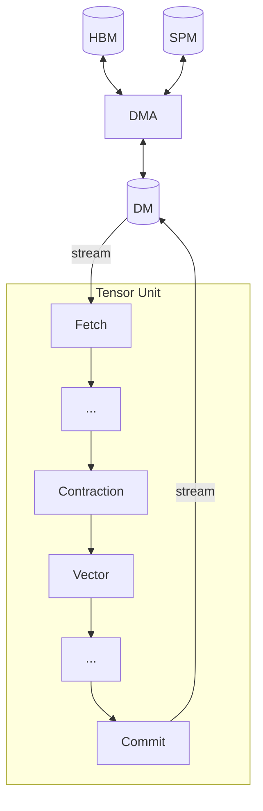

# Moving Tensors

This chapter explains the three engines that move tensor data between memory tiers (HBM, DM, SPM) and the Tensor Unit: the Fetch Engine (DM to pipeline), the Commit Engine (pipeline to DM), and the DMA Engine (HBM/SPM to DM).
Their APIs are designed around what you control: packet sizes, which engine moves each tensor, and how axes map to hardware dimensions.
The compiler translates these declarations into low-level hardware concerns such as memory bank scheduling, stride calculation, and access alignment.

Device memory has two primary levels: off-chip [HBM (High Bandwidth Memory)](./memory-performance.md#high-bandwidth-memory-hbm) for high-capacity storage, and on-chip SRAM for low-latency working memory.
SRAM is subdivided into [DM (Data Memory)](./memory-performance.md#data-memory-dm) (the primary working memory), [SPM (Scratchpad Memory)](./memory-performance.md#scratchpad-memory-spm) (a smaller high-speed buffer within each DM), TRF (Tensor Register File), and VRF (Vector Register File).
Tensors are stored in these tiers in storage-optimized layouts.
This chapter covers HBM, DM, and SPM (the tiers accessed by the DMA, Fetch, and Commit engines); TRF and VRF are loaded through the Tensor Unit pipeline and are covered in [Computing Tensors](../computing-tensors/index.md).

The [Fetch](./fetch-engine.md) engine converts DM storage layout into packet streams for the Tensor Unit; the [Commit](./commit-engine.md) engine performs the reverse; the [DMA](./dma-engine.md) engine converts between HBM and DM layouts.
All three engines rely on [Sequencers](./sequencer.md), a configuration abstraction that controls memory access patterns through nested-loop configurations, generating and consuming fixed-size packets for deterministic per-cycle transfers and aligned bank access.
[Memory Performance](./memory-performance.md) provides guidance on achieving optimal throughput.

Sequencers read DM at the Fetch Engine and write DM at the Commit Engine, converting between storage layout and stream format.
The DMA Engine is a separate pipeline that moves data between HBM/SPM and DM independently of the Tensor Unit.

