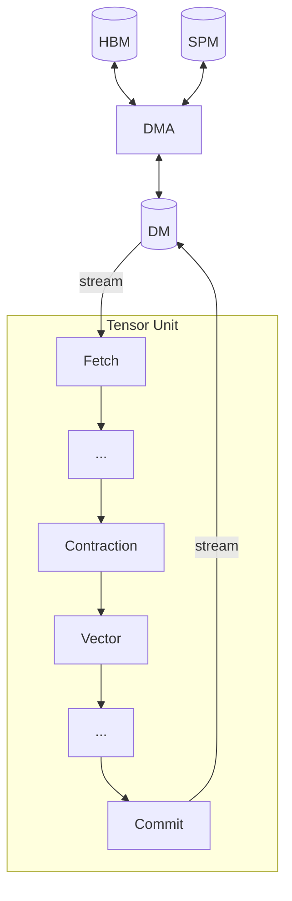

# Moving Tensors

[Quick Start](../quick-start.md#memory-tiers) introduced TCP's memory tiers.
This chapter covers how tensors move between three of them: HBM, DM, and SPM, through three dedicated engines:
- **[Fetch](./fetch-engine.md)**: DM → Tensor Unit stream
- **[Commit](./commit-engine.md)**: Tensor Unit stream → DM
- **[DMA](./dma-engine.md)**: any pair among DM, SPM, HBM

TRF and VRF are populated by Tensor Unit primitives rather than dedicated move engines, and are covered in [Computing Tensors](../computing-tensors/index.md).

Their APIs are designed around what the programmer controls: which engine moves each tensor and how axes map to hardware dimensions.
The compiler translates these declarations into low-level hardware concerns such as memory bank scheduling, stride calculation, and access alignment.

The [Sequencer](./sequencer.md) is the shared mechanism all three engines use to convert between memory buffers and packet streams.
[Memory Performance](./memory-performance.md) covers how the choice of engine and axis mapping affects bandwidth utilization.
