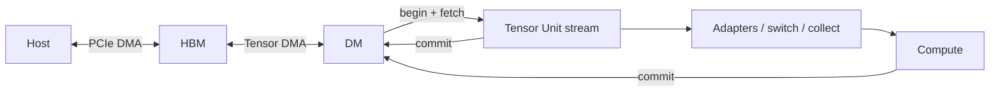

# Moving Tensors

Furiosa-opt kernels are Rust functions compiled for the Furiosa NPU.
This chapter explains how a kernel transfers tensor data between host memory, HBM, DM, and the Tensor Unit.
The [Quick Start kernel design](../quick-start/kernel-design.md#pattern-specific-mapping-and-memory) introduces these tiers in a complete kernel.
Choose the source and destination in the movement table before reading the worked transfer.
The [Sequencer](./sequencer.md) describes the common loop model.
The engine pages document each concrete boundary.

## Choose a movement route

The movement table selects operations from the current value to its destination.
It gives the operation and context for each public boundary.

| Current value | Destination | Operation and context |
| --- | --- | --- |
| `HostTensor` | `HbmTensor` | `HostTensor::to_hbm` with `Context::pdma` (async); see [DMA Engine](./dma-engine.md) |
| `HbmTensor` | `HostTensor` | `HbmTensor::to_host` with `Context::pdma` (async); see [DMA Engine](./dma-engine.md) |
| `HbmTensor` | `DmTensor` | `HbmTensor::to_dm` with `Context::tdma`; see [DMA Engine](./dma-engine.md) |
| `DmTensor` | `HbmTensor` | `DmTensor::to_hbm` with `Context::tdma`; see [DMA Engine](./dma-engine.md) |
| `HbmTensor` | `HbmTensor` | `HbmTensor::to_hbm` with the DMA context required by the call; see [DMA Engine](./dma-engine.md) |
| `DmTensor` | `DmTensor` | `DmTensor::to_dm` with `Context::tdma`, or `to_dm_pcopy` with the sub context; see [Collect Engine](../computing-tensors/collect-engine.md) |
| `DmTensorView` | Tensor Unit stream | `TuContext::begin`, then [`fetch`](./fetch-engine.md) |
| Tensor Unit stream | `DmTensor` | [`commit`](./commit-engine.md), or [`commit_view`](./commit-engine.md) for an existing mutable view |

## Copyable end-to-end transfer

This page defines movement boundaries, context ownership, and lifetime rules.
The worked transfer widens and reorders an HBM tensor before returning it to HBM.
The device function stages HBM into DM, fetches a stream, casts and collects it, commits to DM, and transfers the result back to HBM.
The host test awaits only host-to-HBM and HBM-to-host I/O and checks the reordered result.

Read and change the worked transfer in this order:

| Step | Declared choice |
| --- | --- |
| Input | `A = 4096`, `B = 8`, input element type `i8`, and input HBM mapping `m![1], m![A, B]`. |
| HBM→DM | The DM `Cluster` is `m![1 # 2]`, `Slice` is `m![A / 16]`, and `Element` is `m![A / 8 % 2, A % 8, B]`. |
| Fetch | `OutTime` is `m![A / 8 % 2]` and `OutPacket` is `m![A % 8, B]`. |
| Compute and Collect | The stream casts `i8` to `i32`, then Collect uses `m![A / 8 % 2, A % 8]` for `Time` and `m![B]` for `Packet`. |
| Commit→DM→HBM | `commit_trim::<m![B]>()` writes the DM tensor in `m![A, B]`; `to_hbm` then returns `HbmTensor<i32, m![1], m![B, A]>` through DMA relayout. |

Change only these declared axes, mappings, or element types while preserving the alignment assertions in the source.
The host test awaits `to_hbm` and `to_host` through `pdma`, then asserts the expected `B`-major result.

```rust,ignore
{{#include ../../../furiosa-opt-examples/src/fetch_commit.rs}}
```

```rust,ignore
{{#include ../../../furiosa-opt-examples/tests/fetch_commit_tests.rs}}
```

The included source is the complete example for the ordering and lifetime rules described below.
This chapter keeps that transfer as a readable HBM↔DM and lifetime tutorial; the linked Tensor Unit I/O pattern owns the detailed packet and performance comparisons.

The type-level `Chip`, `Cluster`, `Slice`, `Time`, and `Element` mappings define each value's storage and stream behavior.
A DMA call creates a destination with the mapping supplied by its type parameters.
It does not mutate the source.
Fetch and commit are the hand-off points into and out of the Tensor Unit pipeline.

For a first pipeline, stage an HBM input into DM, call `begin(...).fetch(...)`, run the compute stages, then commit the stream to DM and transfer the result back to HBM.
The [Case Study: Tensor Unit I/O](./tensor-unit-io.md) shows this order with concrete mappings and source code.

## Keep transfers ordered

`Context::acquire()` provides one process-wide context containing independent `main` and `sub` Tensor Unit contexts plus `tdma` and `pdma` DMA contexts.
Pass the matching mutable context to each operation.
Rust borrows enforce that a Tensor Unit stream keeps its source view alive.
`begin` borrows a `DmTensorView`, and the stream lifetime cannot outlive that view.
Fetch consumes the `BeginTensor` and produces a stream.
Adapters such as [`fetch_cast`](../computing-tensors/fetch-adapter.md) and [`collect`](../computing-tensors/collect-engine.md) consume and return the next stage.
Commit consumes the final stream, or consumes it while writing to a supplied `DmTensorViewMut`.

Host transfers `to_hbm` and `to_host` are async I/O and must be awaited.
Kernel-side `to_dm`, `to_hbm`, fetch, and commit operations enqueue device commands on their selected contexts.
Keep source and destination handles alive until the enclosing kernel or backend submission has completed.
Use a mutable view only when the destination region is intentionally overwritten.
Do not read a destination before its producing transfer or commit has completed, and do not overlap writes to aliased views without an ordering edge.

## Engine boundaries

* **[Fetch](./fetch-engine.md)** reads DM with one per-slice sequencer and emits a packet stream for the Tensor Unit.
  Its output mapping chooses the stream `Time` and `Packet` axes.
* **[Commit](./commit-engine.md)** writes a Tensor Unit stream to DM.
  Its `Element` mapping chooses the destination layout and can transpose stream axes during the write.
* **[DMA](./dma-engine.md)** pairs read and write sequencers for memory-to-memory movement.
  The supported public paths are HBM to HBM, HBM to DM, DM to HBM, and DM to DM.
  Indirect gather/scatter APIs have separate index-unit contracts: unscaled gather uses a `DmTensor` index with raw row positions, while unscaled scatter is currently unimplemented.
  SPM has no public tensor type.

The Tensor Unit pipeline is therefore:


```mermaid
flowchart LR
    H[Host] <-->|PCIe DMA| B[HBM]
    B <-->|Tensor DMA| D[DM]
    D -->|begin + fetch| F[Tensor Unit stream]
    F -->|commit| D
    F --> A[Adapters / switch / collect]
    A --> C[Compute]
    C -->|commit| D
```

Collect can place a stream operand in the TRF or VRF register files for Contraction or Vector work.
Those compute boundaries are covered in [Computing Tensors](../computing-tensors/index.md).

## Tune movement

Every movement is a mathematical tensor move: the logical values are preserved while the destination mapping may change.
The compiler derives sequencer strides from both mappings.
Respect the engine constraints before tuning performance: DM `Cluster` must be 1 or 2, DM `Slice` must be 64, 128, or 256, and DMA packet tails must satisfy the element-size alignment checked by the API.
Fetch and commit also validate their mapping-specific sequencer rules.
Invalid mappings fail during compilation or command verification.

Prefer contiguous packet layouts and mappings that distribute traffic across clusters, slices, DM banks, and HBM channels.
Small or strided packets increase the number of sequencer accesses.
Conflicting DM-bank patterns can starve DMA.
See [Memory Performance](./memory-performance.md) for the bank-starvation rule, HBM interleaving, and packet-size trade-offs.

For a complete end-to-end movement pattern, see [Case Study: Tensor Unit I/O](./tensor-unit-io.md).
For indirect HBM row movement, see [DMA gather and scatter](./dma-engine.md#scatter-and-gather).

## See also

The [furiosa-opt-std rustdoc](https://docs.rs/crate/furiosa-opt-std) documents the release API.
Use the engine pages above for operation-specific contracts and [Scheduling and Tuning](../scheduling/index.md) when a valid movement plan needs measured overlap or hazard diagnosis.
