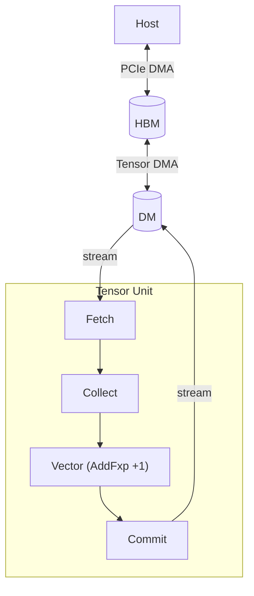
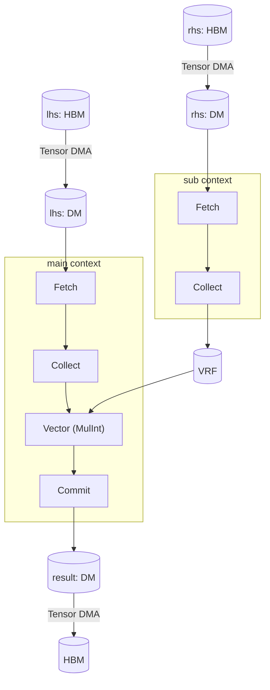

# Quick Start

This chapter explains TCP through five running examples, each introducing one new hardware concept.
The first two examples cover element-wise operations.
The remaining three cover tensor contractions (dot product, GEMV, and GEMM).

## Mathematical Background

TCP is a tensor-native processor built to accelerate tensor contraction.

### Tensor

A *tensor* is a mapping from a *tensor index* to a value, where the tensor's *shape* defines the valid indices.

A *shape* is an *unordered set* of named axes.
The shapes \\(\\{\texttt{N} = 4, \texttt{C} = 3\\}\\) and \\(\\{\texttt{C} = 3, \texttt{N} = 4\\}\\) identify the same tensor: axis names carry the meaning, not the position.
A *tensor index* is formed by specifying an index value for each axis.
For shape \\(\\{\texttt{N} = 4, \texttt{C} = 3\\}\\), the valid indices are \\(\\{\texttt{N}: 0, \texttt{C}: 0\\}\\), \\(\\{\texttt{N}: 0, \texttt{C}: 1\\}\\), \\(\\{\texttt{N}: 0, \texttt{C}: 2\\}\\), \\(\\{\texttt{N}: 1, \texttt{C}: 0\\}\\), and so on.

Once an axis ordering is chosen, a tensor behaves like a familiar multi-dimensional array, similar to NumPy's [`ndarray`](https://numpy.org/doc/stable/reference/generated/numpy.ndarray.html):
- 0D Tensor (Scalar): a single number like \\(5.2\\)
- 1D Tensor (Vector): a sequence like \\([1, 2, 3]\\) with one axis
- 2D Tensor (Matrix): a \\(2 \times 4\\) grid with two axes
- 4D Tensor: a batch of RGB images with shape \\(\\{\texttt{N} = 4, \texttt{C} = 3, \texttt{H} = 256, \texttt{W} = 512\\}\\)


### Tensor Contraction

A *tensor contraction* generalizes matrix multiplication to arbitrary tensors: two input tensors are multiplied element-wise and summed along their shared (contracted) axes.
Every contraction decomposes into three steps: Broadcast, Multiply, Reduce.
*Einsum notation* expresses contractions compactly: list each input tensor by its axis labels, output axes follow the `→` arrow, and any input axis absent from the output is contracted.

The following table shows three contractions, with their einsum notation and Broadcast-Multiply-Reduce decomposition:

| Operation | Einsum | Broadcast | Multiply | Reduce |
|-----------|--------|-----------|----------|--------|
| Dot product | \\(I, I \rightarrow 1\\) | none (axes match) | \\(x_i y_i\\) | \\(\sum_i x_i y_i\\) |
| GEMV | \\(IJ, J \rightarrow I\\) | \\(x\\) broadcasts across \\(I\\) | \\(A_{ij} x_j\\) | \\(y_i = \sum_j A_{ij} x_j\\) |
| GEMM | \\(IK, KJ \rightarrow IJ\\) | \\(A\\) across \\(J\\); \\(B\\) across \\(I\\) | \\(A_{ik} B_{kj}\\) | \\(C_{ij} = \sum_k A_{ik} B_{kj}\\) |

## Tensor Contraction Processor

### Hardware Hierarchy

A TCP device consists of four nested hardware levels:

| Level | Count (RNGD) | Role |
|-------|-------------|------|
| `Chip` | (system-dependent) | Top-level unit; holds HBM |
| `Cluster` | 2 per chip | Groups 256 slices |
| `Slice` | 256 per cluster | Runs one Tensor Unit |
| `Lane` | 8 per slice | One row of the Contraction Engine's MAC (multiply-accumulate) array |


### Tensor Unit

The Tensor Unit is a fixed pipeline: Fetch → Switch → Collect → Contraction → Vector → Cast → Transpose → Commit.
Most stages operate independently within each slice.
The Switch Engine is the exception, connecting slices to distribute data across the slice array.

See [Computing Tensors](./computing-tensors/index.md) for `.contract_outer()`, `.contract_packet()`, `.contract_time()`, `.contract_lane()`, `.cast()`, `.switch()`, `.vector_fxp()`, and each engine in the pipeline.

### Memory Tiers

| Type | Location | Capacity (RNGD) | Role |
|------|----------|-----------------|------|
| `HbmTensor` | On-package | 48 GB, 1.5 TB/s | Long-term weight and activation storage |
| `DmTensor` | On-chip SRAM | 256 MB total; 512 KB/slice | Primary working memory for computations |
| `SpmTensor` | On-chip SRAM | size TBD; 2 TB/s per chip | Temporary data and intermediate results with high temporal locality; compiler-managed |
| `TrfTensor` | On-chip SRAM | 8 KB / lane (8 lanes / slice) | TRF for the Contraction Engine |
| `VrfTensor` | On-chip SRAM | 8 KB / slice | Operand register file for Vector Engine |


See [Moving Tensors](./moving-tensors/index.md) for `.to_dm()`, `.to_hbm()`, `.fetch()`, `.commit()`, and the complete memory tier model.

### Tensor Mapping

TCP's Virtual ISA exposes the hardware hierarchy through its type system.
Each tensor type encodes the element type and how each logical axis distributes across the hardware hierarchy.

For example, `DmTensor<bf16, m![1], m![1 # 2], m![A / 8 # 256], m![A % 8]>` (with `axes![A = 2048]`) represents a `bf16` vector with the axis `A` on one chip (`m![1]`), one of two clusters (`m![1 # 2]`), distributed across 256 slices (`m![A / 8 # 256]`) with 8 elements per slice (`m![A % 8]`).
Each element of `A` therefore maps to a well-defined position within exactly one slice.

Three operators in `m![]` build this distribution:
- `/` splits by stride: `A / 8` gives 2048 / 8 = 256 slice indices.
- `%` gives the inner count: `A % 8` gives the 8 in-slice indices.
- `#` pads to the hardware unit count: `# 256` pads to 256 slices, with any excess slots holding arbitrary values.

TCP also introduces two parameters for tensors flowing through the Tensor Unit pipeline: `Time` indexes pipeline iterations; `Packet` indexes elements within each iteration.

See [Mapping Tensors](./mapping-tensors/index.md) for `axes![]`, `m![]`, `HbmTensor`, `DmTensor`, and the full mapping expression reference.

### Execution Contexts

Every device kernel has two execution contexts running concurrently on separate hardware resources: `ctx.main` and `ctx.sub`.
`main` runs the primary computation.
`sub` runs a concurrent pipeline, typically used to prefetch operands into TRF or VRF while `main` computes.
If `main` needs operands that `sub` is still fetching, `main` automatically waits for `sub`'s execution to ensure synchronization.

Both contexts share the same flat on-chip SRAM, so the programmer must explicitly assign DM addresses (e.g., the `addr` argument in `.to_dm()`, `.commit()`) to prevent tensors from overlapping.
Addresses must not collide, but they can be non-contiguous.

In type signatures, the const-generic `Tu` identifies which context a tensor flows through (`{ Tu::Main }` or `{ Tu::Sub }`).

See [Scheduler](./scheduler.md) for `ctx.main`, `ctx.sub`, `launch()`, and how operations are scheduled and run in parallel across contexts.

## Kernel Examples

### Constant Addition

The first kernel takes a vector of integers and adds the constant `1` to each element.
It uses one chip, one of two clusters, and all 256 slices in that cluster, with one 8-element group per slice.
Adding `1` to each element uses the [Vector Engine](./computing-tensors/vector-engine/index.md)'s fixed-point operation `vector_fxp(FxpBinaryOp::AddFxp, 1)`.



`to_dm` moves data from HBM to DM, splitting the flat tensor across 256 slices.
The `begin → fetch → collect → vector_init → vector_intra_slice_tag → vector_fxp → vector_final → commit` chain processes each slice in one pass.
`TagMode::Zero` configures the pipeline to execute on every cycle.

Kernel ([`src/kernel/constant_add_kernel.rs`](https://github.com/furiosa-ai/furiosa-opt/blob/main/base-template/src/kernel/constant_add_kernel.rs)):

```rust,ignore
{{#include ../../base-template/src/kernel/constant_add_kernel.rs}}
```

Host program ([`src/constant_add.rs`](https://github.com/furiosa-ai/furiosa-opt/blob/main/base-template/src/constant_add.rs)):

```rust,ignore
{{#include ../../base-template/src/constant_add.rs}}
```

### Elementwise Multiplication

The second kernel multiplies two same-shape vectors element-wise.
One operand flows through the pipeline.
The other is stored in the VRF (Vector Register File), a per-slice register file that the [Vector Engine](./computing-tensors/vector-engine/index.md) reads every cycle.



This example introduces the `sub` context, which preloads one operand into the VRF while the `main` context streams.
The `sub` context loads `rhs_dm` into the VRF through the Fetch → Collect → `.to_vrf(0)` pipeline.
`rhs_dm` is allocated at a different base address (`1 << 12`) to avoid overlapping with `lhs_dm`.
The `main` context then streams `lhs_dm` and multiplies each element by its VRF counterpart using `MulInt`.
The hardware runs both contexts concurrently where possible.

Kernel ([`src/kernel/elementwise_mul_kernel.rs`](https://github.com/furiosa-ai/furiosa-opt/blob/main/base-template/src/kernel/elementwise_mul_kernel.rs)):

```rust,ignore
{{#include ../../base-template/src/kernel/elementwise_mul_kernel.rs}}
```

Host program ([`src/elementwise_mul.rs`](https://github.com/furiosa-ai/furiosa-opt/blob/main/base-template/src/elementwise_mul.rs)):

```rust,ignore
{{#include ../../base-template/src/elementwise_mul.rs}}
```

### Dot Product

The dot product \\(I, I \rightarrow 1\\) reduces both operands along the same axis with no broadcast step.
As in the previous example, one operand flows through the pipeline.
The other is held stationary in the TRF (Tensor Register File), a per-slice register file that the [Contraction Engine](./computing-tensors/contraction-engine/index.md) reads each cycle.
The `sub` context loads `rhs` into the TRF via Fetch → Collect → `.to_trf()`.
`TrfAddress::Full` dedicates the entire TRF to this tensor.
`.contract_outer()` invokes the Contraction Engine's Stream Adapter and the TRF Sequencer.
The Stream Adapter pairs adjacent 32-byte flits into the Outer stage's 64-byte packet; the TRF Sequencer reads the stationary RHS.
Both feed the elementwise multiplier per lane.
`.contract_packet()` reduce-adds those products spatially via the hardware reduction tree.
`.contract_time::<m![1]>()` then accumulates temporally, producing a scalar per slice.
`.contract_lane()` folds the 8 lanes into the output (trivial fold here at `Lane = m![1]`).
`.cast()` converts the `f32` accumulator output back to `bf16`.


Kernel ([`src/kernel/dot_product_kernel.rs`](https://github.com/furiosa-ai/furiosa-opt/blob/main/base-template/src/kernel/dot_product_kernel.rs)):

```rust,ignore
{{#include ../../base-template/src/kernel/dot_product_kernel.rs}}
```

Host program ([`src/dot_product.rs`](https://github.com/furiosa-ai/furiosa-opt/blob/main/base-template/src/dot_product.rs)):

```rust,ignore
{{#include ../../base-template/src/dot_product.rs}}
```

### GEMV

GEMV \\(IJ, J \rightarrow I\\) distributes the output dimension `I` across slices: each slice computes one row \\(y_i = \sum_j A_{ij} x_j\\).
Unlike the dot product (where all slices reduce along the same axis and no redistribution is needed), here each slice needs the full vector to contract against its row, so data must be broadcast across slices before the contraction.

The [Switch Engine](./computing-tensors/switch-engine.md) performs that broadcast: `SwitchConfig::Broadcast01` distributes the vector to all `I` slices between Fetch and Collect, as shown in the pseudocode below.
Once the vector is broadcast, the contraction over `J` proceeds in tiles: `Time` indexes the tile iterations and `Packet` indexes elements within each tile.

```rust
# #![feature(adt_const_params)]
# extern crate furiosa_opt_std;
# use furiosa_opt_std::prelude::*;
axes![I = 256, J = 2048];

// GEMV: broadcast the vector across all I slices.
fn switch_gemv<'l, const T: Tu>(
    input: FetchTensor<'l, T, bf16, m![1], m![1], m![1 # 256], m![1], m![J]>,
) -> SwitchTensor<'l, T, bf16, m![1], m![1], m![I], m![1 # 256], m![J]> {
    input.switch(SwitchConfig::Broadcast01 {
        slice1: 256,
        slice0: 1,
        time0: 1,
    })
}
```

Kernel ([`src/kernel/gemv_kernel.rs`](https://github.com/furiosa-ai/furiosa-opt/blob/main/base-template/src/kernel/gemv_kernel.rs)):

```rust,ignore
{{#include ../../base-template/src/kernel/gemv_kernel.rs}}
```

Host program ([`src/gemv.rs`](https://github.com/furiosa-ai/furiosa-opt/blob/main/base-template/src/gemv.rs)):

```rust,ignore
{{#include ../../base-template/src/gemv.rs}}
```

### GEMM

GEMM \\(IK, JK \rightarrow IJ\\) adds a second output dimension: both \\(I\\) and \\(J\\) appear in the output \\(C_{ij} = \sum_k A_{ik} B_{jk}\\).
Each matrix broadcasts along its missing output dimension: \\(A\\) broadcasts across \\(J\\) and \\(B\\) broadcasts across \\(I\\).

The new concept is `type Slice = m![I / 32, J / 32]`, which jointly maps both output dimensions to `Slice` so each slice computes a 16 × 16 tile of the output matrix.
The Switch Engine moves each tile of `B` to the matching slice, so each slice sees only its portion of `J`.
`.contract_packet::<m![1]>()` reduces along `K` spatially.
`.contract_time::<m![I]>()` accumulates over time (preserving `I`), and `.contract_lane::<m![I], m![J # 8]>(LaneMode::Interleaved)` folds `Lane` into the output packet, preserving both `I` and `J` in the output.

Kernel ([`src/kernel/gemm_kernel.rs`](https://github.com/furiosa-ai/furiosa-opt/blob/main/base-template/src/kernel/gemm_kernel.rs)):

```rust,ignore
{{#include ../../base-template/src/kernel/gemm_kernel.rs}}
```

Host program ([`src/gemm.rs`](https://github.com/furiosa-ai/furiosa-opt/blob/main/base-template/src/gemm.rs)):

```rust,ignore
{{#include ../../base-template/src/gemm.rs}}
```


The examples above process tensors that fit in a single hardware pass.
Real workloads often require partitioning into tiles.
Two complementary strategies exist for workloads exceeding the 512 KB/slice DM capacity: temporal partitioning processes tiles sequentially over time, and spatial partitioning distributes tiles across parallel hardware units.

See [Kernel Examples](./kernel-examples/index.md) for end-to-end kernels that apply these strategies.
