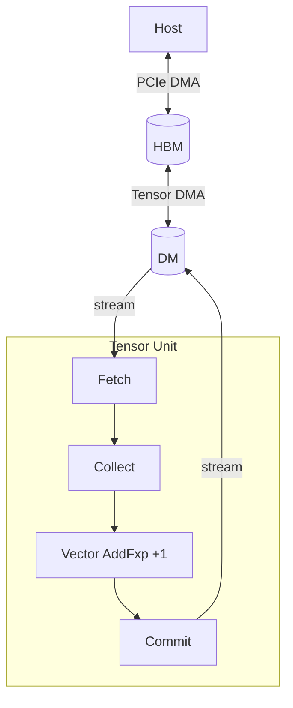
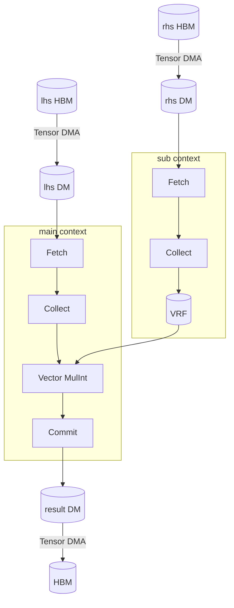

# Kernel Design

## First Vector Kernel
### Constant Addition

#### Goal

Compute \\(\text{out}[i] = \text{in}[i] + 1\\) for every element of a vector.
This pattern covers residual and bias addition.

#### Data Movement

Move the vector from HBM to DM, stream each DM slice through Fetch, Collect, the Vector Engine, and Commit, and move the result from DM back to HBM.



#### Device Source

The kernel uses one chip, one of two clusters, and all 256 slices in that cluster.
Each slice receives eight `i32` values.
`TagMode::Zero` executes the Vector Engine on every cycle.
`to_dm` distributes the vector across slices, and the `begin → fetch → collect → vector_init → vector_intra_slice_tag → vector_fxp → vector_final → commit` chain processes each slice in one pass.

Device source: `src/kernel/constant_add_kernel.rs`.

```rust,ignore
{{#include ../../../base-template/src/kernel/constant_add_kernel.rs}}
```

#### Host Program and Oracle

The host program creates input, uploads it to HBM, launches the device function, and compares the result with the host equation in its test.

Base-template host program and oracle: `src/constant_add.rs`.

```rust,ignore
{{#include ../../../base-template/src/constant_add.rs}}
```

#### Pattern-Specific Mapping and Memory

TCP has four nested hardware levels.

| Level | Count (RNGD) | Role |
|-------|--------------|------|
| `Chip` | System-dependent | Top-level unit that holds HBM. |
| `Cluster` | Two per chip | Group of 256 slices. |
| `Slice` | 256 per cluster | One Tensor Unit. |
| `Lane` | Eight per slice | One row of the Contraction Engine MAC array. |

A tensor type encodes its element type and the distribution of each logical axis across this hierarchy.
For example, `DmTensor<bf16, m![1], m![1 # 2], m![A / 8 # 256], m![A % 8]>` represents a `bf16` vector with axis `A` split across 256 slices with eight elements per slice.
Each element of `A` has one well-defined position in one slice.

Mapping operators describe where an axis goes.

- `/` splits an axis by stride.
- `%` gives the in-unit count.
- `#` pads a mapping to the hardware unit count.
- `=` reduces how much of an existing term a view covers, which is how a tile selects one piece of a tensor.

`%` and `=` both narrow an axis, so it is worth stating what separates them.
`%` introduces a new inner term: in `m![B / 2048, B % 2048]` the first term counts the 2048-element blocks of `B` and the second counts the positions inside one block.
`=` leaves the terms alone and shrinks the extent the view reads, so `m![B / 2048 = 1 # 2]` selects one of the two blocks, where `# 2` keeps the stride of the full axis rather than of the selection.
A tiled kernel uses them together, as in `m![B / 2048 = 1 # 2, B % 2048]`, which picks one block and covers every position within it.
See [Tiling](../mapping-tensors/mapping-expressions.md#tiling) for the general rule.

Tensor Unit tensors also use `Time` for pipeline iterations and `Packet` for elements within an iteration.
The Tensor Unit pipeline is Fetch → Switch → Collect → Contraction → Vector → Cast → Transpose → Commit.
The Switch Engine connects slices while most stages operate independently within a slice.

| Type | Location | Capacity (RNGD) | Role |
|------|----------|-----------------|------|
| `HbmTensor` | On-package | 48 GB and 1.5 TB/s | Long-term weight and activation storage. |
| `DmTensor` | On-chip SRAM | 256 MB total and 512 KB per slice | Primary working memory. |
| `TrfTensor` | On-chip SRAM | 8 KB per lane and eight lanes per slice | Contraction Engine register file. |
| `VrfTensor` | On-chip SRAM | 8 KB per slice | Vector Engine operand register file. |

These choices specialize the constant-add pattern.
See [Mapping Tensors](../mapping-tensors/index.md) for the complete mapping model, [Moving Tensors](../moving-tensors/index.md) for memory movement, and [Computing Tensors](../computing-tensors/index.md) for the pipeline APIs.

## Stationary Vector Operand
### Elementwise Multiplication

#### Goal

Compute \\(\text{out}[i] = \text{lhs}[i] \times \text{rhs}[i]\\).
This pattern covers gate scaling, GLU, and attention scaling.

#### Mapping and Data Movement

The `sub` context preloads `rhs` into the VRF while the `main` context streams `lhs` and reads the VRF on every Vector Engine cycle.
The two DM regions must not overlap.



Every device kernel has `ctx.main` and `ctx.sub` execution contexts on separate hardware resources.
`main` runs the primary computation while `sub` commonly prefetches operands.
`main` waits when it needs data that `sub` has not produced, and both contexts share the flat on-chip SRAM.

Omit DM addresses for automatic placement.
Use `_at` APIs only when an algorithm needs explicit non-overlapping addresses.
The `Tu` const generic identifies whether a tensor flows through `{ Tu::Main }` or `{ Tu::Sub }`.
The `sub` context loads `rhs_dm` through Fetch, Collect, and `.to_vrf()`, while `main` streams `lhs_dm` through `MulInt` with that stationary VRF operand.
The two contexts run concurrently when their resource dependencies allow it.

#### Device Source

Device source: `src/kernel/elementwise_mul_kernel.rs`.

```rust,ignore
{{#include ../../../base-template/src/kernel/elementwise_mul_kernel.rs}}
```

#### Host Program and Oracle

Base-template host program and oracle: `src/elementwise_mul.rs`.

```rust,ignore
{{#include ../../../base-template/src/elementwise_mul.rs}}
```

## Contraction Patterns
### Dot Product

#### Goal

Compute \\(\sum_i x_i y_i\\).
This pattern covers attention scores and similarity.

#### Mapping and Data Movement

One operand flows through the pipeline while the `sub` context stores the other operand in the TRF.
The `sub` context loads that operand through Fetch, Collect, and `.to_trf()`.

`.contract_outer()` pairs 32-byte flits into 64-byte packets and reads the stationary TRF operand.
The Stream Adapter performs the pairing and the TRF Sequencer reads the stationary operand.
Both operands feed the per-lane multiplier.
`.contract_packet()` reduces products spatially through the hardware reduction tree.
`.contract_time::<m![1]>()` accumulates across time and produces one scalar per slice.
`.contract_lane()` folds the lanes, which is trivial when `Lane = m![1]`.
`.cast()` converts the `f32` accumulator to `bf16`.

Contraction performs multiply-and-accumulate over many terms and needs a widened type.
Contraction widens `i4` and `i8` to `i32`, and it widens `fp8` and `bf16` to `f32`.
The annotations on `.align()` and `.contract()` select that widened type.

#### Device Source

Device source: `src/kernel/dot_product_kernel.rs`.

```rust,ignore
{{#include ../../../base-template/src/kernel/dot_product_kernel.rs}}
```

#### Host Program and Oracle

Base-template host program and oracle: `src/dot_product.rs`.

```rust,ignore
{{#include ../../../base-template/src/dot_product.rs}}
```

### GEMV

#### Goal

Compute \\(y_i = \sum_j A_{ij} x_j\\).
This pattern covers LLM decode.

#### Mapping and Data Movement

Map output dimension `I` across slices so each slice computes one row.
Broadcast the full vector `x` so every slice can contract it with its row.
Unlike dot product, the rows are independent but every row needs the same complete vector operand.

#### Device Source

Device source: `src/kernel/gemv_kernel.rs`.

```rust,ignore
{{#include ../../../base-template/src/kernel/gemv_kernel.rs}}
```

#### Host Program and Oracle

Base-template host program and oracle: `src/gemv.rs`.

```rust,ignore
{{#include ../../../base-template/src/gemv.rs}}
```

### GEMM

#### Goal

Compute \\(C_{ij} = \sum_k A_{ik} B_{kj}\\).
`A` broadcasts across `J`, and `B` broadcasts across `I`.

#### Mapping and Data Movement

Map both output dimensions with `type Slice = m![I / 32, J / 32]` so each slice computes a 16 × 16 output tile.
The Switch Engine routes each `B` tile to its matching slice, so each slice receives only the `J` portion that belongs to its output tile.
`.contract_packet::<m![1]>()` reduces along `K` spatially.
`.contract_time::<m![I]>()` accumulates over time while preserving `I`.
`.contract_lane::<m![I], m![J # 8]>(LaneMode::Interleaved)` preserves `I` and `J` in the output packet.

#### Device Source

Device source: `src/kernel/gemm_kernel.rs`.

```rust,ignore
{{#include ../../../base-template/src/kernel/gemm_kernel.rs}}
```

#### Host Program and Oracle

Base-template host program and oracle: `src/gemm.rs`.

```rust,ignore
{{#include ../../../base-template/src/gemm.rs}}
```

Blocked GEMM extends GEMM with tiling for matrices that exceed on-chip DM capacity.
It covers temporal partitioning over `K` and spatial partitioning of `I` and `J` across chips.
Flash Attention combines GEMM, Vector Engine softmax, and main/sub prefetch across a transformer attention head.
