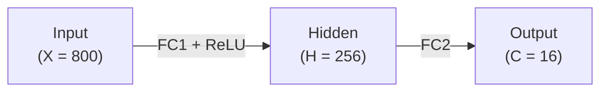

# Scheduling


The scheduler translates vISA programs into execution schedules from programmer input: the execution context selected for each operation, the written order of operations, and explicit memory address assignments.
The scheduler reduces execution cycles while preserving the exact same results as sequential execution.

## Basic Scheduling Rules

This chapter explains the basic scheduling rules with the MNIST vISA kernel in [`furiosa-opt-examples/src/mnist/mod.rs`](https://github.com/furiosa-ai/furiosa-opt/blob/main/furiosa-opt-examples/src/mnist/mod.rs).
Its schedule is visualized via the Schedule Viewer; see the [Schedule Viewer appendix](./appendix/schedule-viewer.md).

### MNIST kernel

The MNIST kernel is a two-layer MLP:



```rust,ignore
axes![X = 800, H = 256, C = 16];

type Chip = m![1];
type Cluster = m![1 # 2];

#[device(chip = 1)]
pub fn forward(
    ctx: &mut Context,
    input: &HbmTensor<bf16, Chip, m![X]>,
    fc1_weight: &HbmTensor<bf16, Chip, m![H, X]>,
    fc1_bias: &HbmTensor<bf16, Chip, m![H]>,
    fc2_weight: &HbmTensor<bf16, Chip, m![C, H]>,
    fc2_bias: &HbmTensor<bf16, Chip, m![C]>,
) -> HbmTensor<bf16, Chip, m![C]> {
    let hidden = fc1_relu(ctx, input, fc1_weight, fc1_bias);
    fc2(ctx, hidden, fc2_weight, fc2_bias)
}

fn fc1_relu(
    ctx: &mut Context,
    input: &HbmTensor<bf16, Chip, m![X]>,
    weight: &HbmTensor<bf16, Chip, m![H, X]>,
    bias: &HbmTensor<bf16, Chip, m![H]>,
) -> DmTensor<bf16, Chip, Cluster, m![H], m![1 # 4]> {
    let matmul = fc1_matmul(ctx, input, weight);
    let bias_dm_4 = fc1_bias_prepared(ctx, bias);

    // --snip--
    // return ReLU(matmul + bias_dm_4)
}

fn fc2(
    ctx: &mut Context,
    input: DmTensor<bf16, Chip, Cluster, m![H], m![1 # 4]>,
    weight: &HbmTensor<bf16, Chip, m![C, H]>,
    bias: &HbmTensor<bf16, Chip, m![C]>,
) -> HbmTensor<bf16, Chip, m![C]> {
    let matmul = fc2_matmul(ctx, input, weight);
    let bias_dm = fc2_bias_prepared(ctx, bias);

    // --snip--
    // return matmul + bias_dm
}
```

Each FC layer computes a matrix-vector multiplication and then adds a bias.
FC1 also applies ReLU in the same pass.

The full timeline of the MNIST kernel looks like this:


### Execution Contexts

The hardware exposes three [execution contexts](./computing-tensors/index.md#execution-context):

- **Main** context (`ctx.main`) drives the Tensor Unit pipeline for the main computation.
- **Sub** context (`ctx.sub`) drives a subset of the Tensor Unit pipeline, commonly used to preload operands into TRF / VRF.
- **DMA** context (`ctx.tdma`) drives the DMA Engine, moving tensors between HBM, DM, and other memory tiers.


Operations in the same context run sequentially, but operations in different contexts can run in parallel.
For example, the main context executes MNIST operations sequentially, while the DMA context loads data from memory concurrently.


However, reads and writes to the same memory address can create [memory dependencies](#memory-allocation), forcing dependent operations to wait.
In the image above, the DMA context reads a tensor produced by the main context, so the store can begin only after the main context finishes writing that tensor.

Different contexts also cannot use the same scheduling resource at the same time.
For example, if both main and sub need the [Vector Engine](./computing-tensors/vector-engine/index.md), one waits while the other uses it.

### Operation Order


Operations can be reordered if this yields a better execution schedule.
For example, unlike the written order in the vISA code, the bias transpose is performed before the matmul.

> [!NOTE]
> This occurs because fetching the input of size `H * X` takes the most time.
> By computing the bias first, the scheduler overlaps this operation with the input fetch, effectively reducing the initial idle wait time.
>
> 
>
> You can see the long input load in the DMA context is paired with the long FC2 bias preparation in the main context, reducing the idle wait time.

Operations are never reordered if doing so would violate a [memory dependency](#memory-allocation).

## Memory Allocation


The Tensor Unit cannot compute directly on tensors residing in HBM.
Instead, tensors must be explicitly moved up the [memory tiers](./quick-start.md#memory-tiers), which are shared across all contexts.

When writing in vISA, you should explicitly specify the target memory tier and exact address for every tensor movement.
The scheduler uses this information to track tensor lifetimes and to generate a precise schedule by reasoning about these memory dependency cases:

- **Read-after-write**: A consumer must wait until the producer has written the addressed tensor.
- **Write-after-read**: A subsequent write must not overwrite an address while an earlier reader still needs the old value.
- **Write-after-write**: Writes to overlapping addresses must follow the original program order to ensure the correct final value.


## Advanced Scheduling Rules


### Double-Buffering Pattern


Double-buffering splits the TRF into two halves so the sub context fills one half while the main context reads the other, and the kernel alternates which half each context targets across iterations.
This works because the TRF storage splits each bank into a `FirstHalf` and a `SecondHalf` (see [Register Files](./computing-tensors/register-files.md#double-buffering)), letting main and sub target different halves without contention.

The VRF does not enforce a halved split: each slice's 8 KB of VRF can be freely partitioned among multiple tensors, and double-buffering, when desired, is arranged by the kernel writer allocating disjoint regions rather than by hardware-enforced halves.

The kernel pattern is two passes per iteration, swapping `FirstHalf` and `SecondHalf` between them:

```rust,ignore
// Prime the first half before the loop.
let mut trf = ctx.sub
    .begin(weights[0].view())
    .fetch::<...>()
    .collect::<...>()
    .to_trf(TrfAddress::FirstHalf);

for i in 0..N {
    // While main reads the current half, sub preloads the next batch into the other half.
    let other_half = if i % 2 == 0 { TrfAddress::SecondHalf } else { TrfAddress::FirstHalf };
    let next_trf = (i + 1 < N).then(|| {
        ctx.sub
            .begin(weights[i + 1].view())
            .fetch::<...>()
            .collect::<...>()
            .to_trf(other_half)
    });

    ctx.main.begin(input[i].view()).contract_outer::<...>(&trf)...;

    if let Some(t) = next_trf {
        trf = t;
    }
}
```

The scheduler overlaps sub and main automatically because they hit different TRF halves (no WAR hazard) and different hardware resources (no resource conflict).
