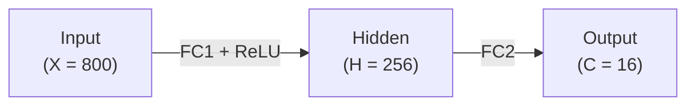

# Schedule

The scheduler uses contexts, source order, and memory locations to organize operations.
It preserves dependencies and resource constraints needed for sequentially equivalent results.

## Execution contexts

The public execution contexts are:

- **Main** (`ctx.main`): drives the main Tensor Unit pipeline.
- **Sub** (`ctx.sub`): drives the subset of the Tensor Unit pipeline used by operations such as register-file preloads.
- **DMA** (`ctx.tdma`): drives tensor movement between HBM, DM, and other memory tiers.

Operations in one context are ordered.
In the MNIST schedule, operations in different contexts overlap when they do not share a scheduling resource or violate a memory dependency.
For example, a DMA load overlaps main-context computation until the consumer needs the loaded value.

## Resource and bank contention

- **Scheduling model**: The scheduler uses context occupancy information: if operation A occupies a context (e.g., main-context), the next operation B using that context waits until A completes.
  Understanding which contexts operations occupy enables predicting parallel execution.
- **Compiler scheduling behavior**: When Tensor Unit operations would violate the 64-access limit, the compiler schedules them as if they occupy DMA, preventing concurrent DMA operations.
  This sacrifices the TCP architecture's inherent main/sub/DMA context parallelism where data preparation and computation occur in parallel, but avoids catastrophic hardware resets.
  Treat this as a hard constraint: never use patterns with 64+ consecutive same-bank accesses.
- **The 64-access limit details**:
  - The limit is cumulative: total accesses from all engines to the same bank must stay below 64, since even interleaved accesses across commands accumulate toward this total.
    For example, main: 30, sub: 20, DMA: 1 totals 51 (safe), but main: 30, sub: 35, DMA: 1 totals 66 (triggers starvation).
  - The compiler keeps each individual command below 64 consecutive same-bank accesses, but cannot prevent the total from reaching 64 when multiple commands run concurrently.
  - In practice, sub-context rarely accesses the same bank consecutively (`StoTrf`, `StoVrf` operations typically use sequential addresses and tiling prevents same-bank access).
  - Sub-context operations that would exceed the limit are also not scheduled concurrently with DMA.
- **Main/sub-context contention**: Main-context can starve sub-context, but this is less severe:
  - Unlike DMA starvation, sub-context starvation does not cause NoC timeout or hardware reset and only increases processing time.
  - Collision probability is lower: DMA Engine occupies 16 banks at once, while sub fetch/commit engines occupy only one bank.
  - Starvation does not occur between fetch and commit engines within the same context due to pipeline back-pressure.
  - **Performance impact example**: If main-context exec command continuously accesses a specific bank while sub-context stos command is scheduled, sub-context processing is delayed.
    Worst case: total time = main-context time + sub-context time.
    Ideal case: main and sub access different banks, achieving total time = max(main-context time, sub-context time).

## Operation order and dependencies


The scheduler may order independent operations to expose overlap.
A dependency prevents reordering when the changed order could alter a value.
Do not infer a performance improvement from written source order.
Inspect the emitted schedule and compare its makespan under the [tuning protocol](./tuning.md).

Tensor Unit operations cannot consume HBM tensors directly.
Data must move through the memory tiers described in [Quick Start](../quick-start/kernel-design.md#pattern-specific-mapping-and-memory).
Memory locations are shared by contexts, so the scheduler must preserve these hazards:

- **Read after write**: a consumer waits for the producer's write.
- **Write after read**: a later writer waits until earlier readers finish.
- **Write after write**: overlapping writes retain their program order.

These hazards explain why independent contexts sometimes wait even when their operation types differ.


Different contexts still serialize when they require the same scheduling resource.
For example, a main-context Vector Engine operation and a sub-context Vector Engine operation cannot occupy that resource simultaneously.
A diagnosis must distinguish this resource wait from a data dependency before choosing a tuning lever.

The [MNIST example](https://github.com/furiosa-ai/furiosa-opt/blob/main/furiosa-opt-examples/src/mnist/mod.rs) provides a schedule example for a two-layer MLP; its first layer applies ReLU.
Its schedule images show context overlap and waits:



The device function calls the two layers in source order.
Each layer prepares its operands in the memory tier required by its compute path:

```rust,ignore
axes![X = 800, H = 256, C = 16];

type Chip = m![1];
type Cluster = m![1 # 2];

#[device(chip = 1)]
pub fn forward(
    ctx: &mut Context,
    input: &HbmTensor<bf16, Chip, m![X]>,
    fc1_weight: &HbmTensor<bf16, Chip, m![H, X]>,
    fc1_bias: &HbmTensor<bf16, Chip, m![H]>,
    fc2_weight: &HbmTensor<bf16, Chip, m![C, H]>,
    fc2_bias: &HbmTensor<bf16, Chip, m![C]>,
) -> HbmTensor<bf16, Chip, m![C]> {
    let hidden = fc1_relu(ctx, input, fc1_weight, fc1_bias);
    fc2(ctx, hidden, fc2_weight, fc2_bias)
}
```

Each fully connected layer computes a matrix-vector product and adds a bias.
The first layer also applies ReLU in the same pass.

The complete schedule is shown here.
The following images zoom into its context and dependency behavior.


In the MNIST schedule, bias preparation can precede a matrix-vector operation while a long input fetch is in flight.


