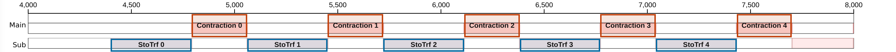
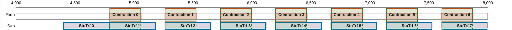
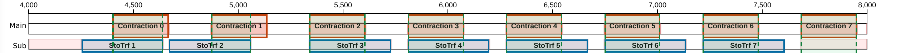

# Tuning

Tuning is a controlled experiment: preserve correctness, record a baseline, change one supported lever, and compare the same schedule metric before deciding whether to keep the change.


## Control the experiment

Follow this order for every candidate:

1. Run the type-checking path to validate mapping and shape constraints.
2. Run a CPU test with a host oracle, including the relevant boundary cases.
3. Compile the baseline and record its schedule makespan.
4. Change one lever while keeping release, shapes, data types, and mappings fixed.
5. Run the same checks and dump the candidate schedule.
6. Keep the change only if correctness still passes and the measured metric improves; otherwise restore the baseline.

Schedule makespan is the primary static metric in this chapter.
Do not report a throughput or cycle improvement without a reproducible schedule comparison or separately documented device evidence.

## Choose one lever

Choose a lever only after diagnosis names the dependency or resource it targets:

- change the execution-engine path when the current resource is the bottleneck;
- change a tile or split shape when the schedule exposes avoidable serial work or an ill-fitting reduction;
- change a mapping, padding, or transfer boundary when the limiting interval is movement or an address dependency.

The [Moving Tensors](../moving-tensors/index.md), [Computing Tensors](../computing-tensors/index.md), and [Mapping Tensors](../mapping-tensors/index.md) chapters define these choices.

## Unroll a loop

Use `#[unroll]` to expose every iteration of a small static loop to the scheduler.

```rust
# #![feature(proc_macro_hygiene, register_tool, stmt_expr_attributes)]
# #![register_tool(furiosa_opt)]
# extern crate furiosa_opt_std;
# extern crate tokio;
# use furiosa_opt_std::prelude::*;
# axes![Group = 4];
# fn consume(_: usize) {}
# #[device]
# fn example(_: &mut Device) {
#[unroll]
for group in 0..Group::SIZE {
    consume(group);
}
# }
# #[tokio::main]
# async fn main() {
#     let mut device = Device::new(example.topology()).unwrap();
#     launch(example, &mut device).await.unwrap();
# }
```

The kernel crate requires `#![feature(proc_macro_hygiene, stmt_expr_attributes)]`.
The trip count must be a compile-time constant.
The loop may be in a device entry point or a helper called by one.
Nested loops are not unrolled automatically.
To unroll every level, add `#[unroll]` to each loop.

The compiler checks for remaining loops after applying `#[unroll]`.
Register-file reuse is enabled only when no loop remains anywhere in the kernel.
Unrolling only some loops can still expose those iterations to scheduling, but a remaining outer or nested loop does not unlock loop-free optimizations.

## Double buffering

Double buffering can overlap staging the next weight group on `SubContext` with contracting the current group on `MainContext`.
The scheduler can consider this overlap only when both operations are visible in the same scheduling unit.
Use a manual two-stage loop or `#[unroll]` to create that opportunity.

The comparison uses 20 weight groups and the same schedule window for every case.

| Loop form | Groups visible per scheduling unit | Cross-iteration overlap | Makespan |
|---|---:|---:|---:|
| Ordinary rolled loop | 1 | No | 19,106 cycles |
| Manual two-stage software pipeline | 2 | Yes | 15,477 cycles |
| Full unrolling | 20 | Yes | 15,086 cycles |

`StoTrf` stages a weight group in the tensor register file (TRF).
The TRF can place one group in each half, but both halves share banks.
See [Register Files: Double Buffering](../computing-tensors/register-files.md#double-buffering) for capacity and address-mode details.
Use the [Schedule Viewer](../tools/schedule-viewer.md) to verify the resulting overlap.

Blue boxes mark `StoTrf`, orange boxes mark contraction, and green bands mark measured overlap.

### Ordinary rolled loop: 19,106 cycles

The scheduler builds one schedule for the rolled loop body and repeats that schedule for every iteration.
Therefore, `Contraction(i)` and `StoTrf(i + 1)` cannot overlap.

```rust
# #![allow(incomplete_features)]
# #![feature(adt_const_params, proc_macro_hygiene, register_tool)]
# #![register_tool(furiosa_opt)]
# extern crate furiosa_opt_std;
# extern crate tokio;
# use furiosa_opt_std::prelude::*;
# axes![Tok = 16, Red = 64, Out = 8, Group = 20];
{{#include ../../../furiosa-opt-examples/src/double_buffering/rolled_kernel.rs:2:}}
# #[tokio::main]
# async fn main() {
# let mut device = Device::new(rolled.topology()).unwrap();
# let activation = HbmTensor::<bf16, m![1], m![Tok, Red]>::new();
# let weight = HbmTensor::<bf16, m![1], m![Group, Out, Red]>::new();
# let _output = launch(rolled, (&mut device, &activation, &weight)).await.unwrap();
# }
```



### Manual two-stage software pipeline: 15,477 cycles

The manual pipeline places two groups in one loop body.
This makes `Contraction(first)` and `StoTrf(second)` available to the scheduler together.

```rust
# #![allow(incomplete_features)]
# #![feature(adt_const_params, proc_macro_hygiene, register_tool)]
# #![register_tool(furiosa_opt)]
# extern crate furiosa_opt_std;
# extern crate tokio;
# use furiosa_opt_std::prelude::*;
# axes![Tok = 16, Red = 64, Out = 8, Group = 20, Pairs = 10];
{{#include ../../../furiosa-opt-examples/src/double_buffering/software_pipelined_kernel.rs:2:}}
# #[tokio::main]
# async fn main() {
# let mut device = Device::new(software_pipelined.topology()).unwrap();
# let activation = HbmTensor::<bf16, m![1], m![Tok, Red]>::new();
# let weight = HbmTensor::<bf16, m![1], m![Group, Out, Red]>::new();
# let _output = launch(software_pipelined, (&mut device, &activation, &weight)).await.unwrap();
# }
```



### Full unrolling: 15,086 cycles

`#[unroll]` exposes all 20 groups without manually pairing them.

```rust
# #![allow(incomplete_features)]
# #![feature(adt_const_params, proc_macro_hygiene, register_tool)]
# #![register_tool(furiosa_opt)]
# extern crate furiosa_opt_std;
# extern crate tokio;
# use furiosa_opt_std::prelude::*;
# axes![Tok = 16, Red = 64, Out = 8, Group = 20];
{{#include ../../../furiosa-opt-examples/src/double_buffering/unrolled_kernel.rs:2:}}
# #[tokio::main]
# async fn main() {
# let mut device = Device::new(unrolled.topology()).unwrap();
# let activation = HbmTensor::<bf16, m![1], m![Tok, Red]>::new();
# let weight = HbmTensor::<bf16, m![1], m![Group, Out, Red]>::new();
# let _output = launch(unrolled, (&mut device, &activation, &weight)).await.unwrap();
# }
```



All captures show cycles 4,000 through 8,000.
