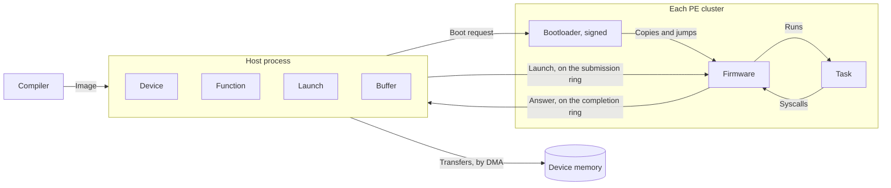
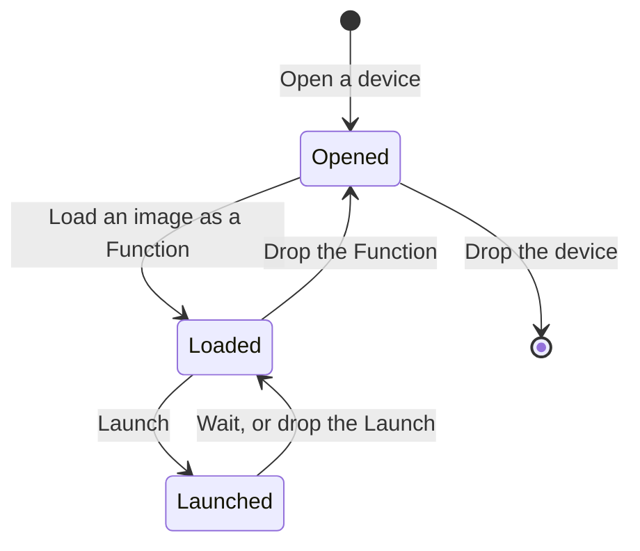
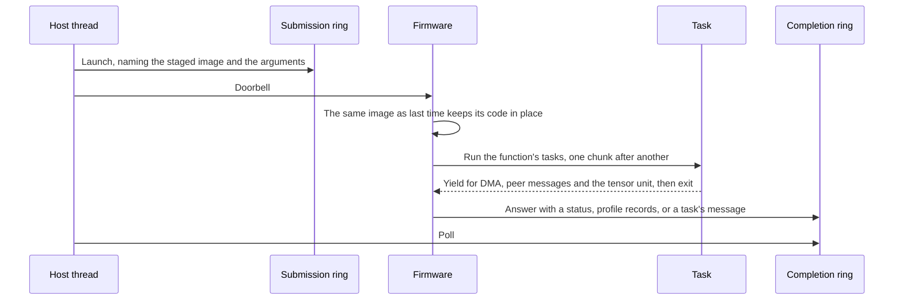

# About the runtime's design

A device function is a `#[device]` fn compiled to an image. `furiosa-opt-rt` runs such images on a
device: a host library opens its chips, loads the images and launches them, and a
firmware on each PE cluster receives the launches and runs them. This page states the principles
the design follows and the structure they produce. What each type does is in its rustdoc; how to
build and run is in the README.

## Principles, in the order they are traded against each other

1. **A launch costs what the hardware costs.** A model step is hundreds of launches of a few
   microseconds each, so the runtime's own cost per launch is the product's latency floor. Nothing
   stands between the caller and the device on the launch path, and nothing is redone that the
   previous launch already did.
2. **Every shared contract is small and explicit.** The compiler, the host, the bootloader and the
   firmware agree on two public contracts, the image and the wire, and nothing else. Each fact
   they share is stated once in `abi/` or `ipc/`.
3. **What goes wrong is visible.** A failed launch says why, a failing task says what, and the
   firmware speaks the host's logging vocabulary at the level the host allows.
4. **A function runs on any device of its shape.** Device memory is one address space per device,
   so an image compiled for `n` chips needs no patching to run on any free `n`. Two devices never
   share a chip.

## Structure

Two images run on a cluster so that the signed **bootloader** stays small: reset the core, answer
one request, authenticate and copy the firmware into the scratchpad, and jump. The bootloader
binds the digest of its firmware, so the two separately distributed images form one signed unit.
The **firmware** holds the runtime's device-side control plane. Its implementation is vendor-built
and distributed as a prebuilt image which the host crate embeds. Keeping these roles separate lets
the runtime evolve without enlarging the bootloader.

Control and data take different paths on purpose. A launch is a message on a cluster's rings,
answered on the same rings. Bulk data moves through the driver's DMA engine. The two are separate
queues, so a transfer may overlap a launch, and whether it does is the caller's choice, expressed
by what it awaits first.

## Lifecycle

Opening takes each cluster's PEs and boots it; a single-chip device leaves that chip's other PEs
to other devices. Loading places the image in every chip's memory once; the image says what each
argument must be, and a launch that does not satisfy it is refused before it reaches the device.
Launching returns as soon as every cluster has the request; a `Launch` keeps its arguments alive
until the device has answered, whether or not it is waited.

## One word per thing

The same concept has the same name on the host, on the wire and in the firmware.

| Word | Means |
|---|---|
| Chip | One NPU. |
| Device | The chips a process opens together; `Device` on the host. |
| Cluster | One, two or four fused PEs of a chip, one firmware instance on the lead PE. |
| Device function | A `#[device]` fn; `Function` once loaded on a device. |
| Image | A device function as the compiler emitted it. |
| Staged | An image placed in device memory, distinguishable from any earlier placement. |
| Launch | One run of a function on every cluster of its device. |
| Task | A function's code on one cluster. |
| Syscall | What a task asks of the firmware. |
| Link | The submission and completion rings between the host and one cluster. |
| Status | Why a launch stopped. |

Nothing here is called a kernel, a program or a chip.

## Trust and distribution

The public runtime distribution contains a vendor-built firmware image, not its source, and embeds
that image in the host binary.

Secure boot authenticates the bootloader, whose signed payload binds the digest of the embedded
firmware. The bootloader starts that firmware only after verifying it through the existing boot
protocol. Keeping the firmware implementation private changes its source distribution, not the
runtime's device access or reservation model.

## Non-goals

- Serving many processes from one device. A device belongs to one process; sharing is
  arbitrated by the device reservation, not by a daemon.
- Hiding the device. Memory placement, launch order and transfer order are the caller's decisions,
  not the runtime's.
- Deciding policy. Which chips may be used, what is logged and what is profiled are the caller's
  choices; the runtime makes none of them on its own.
